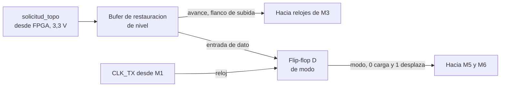
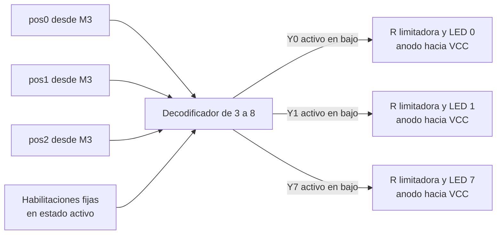
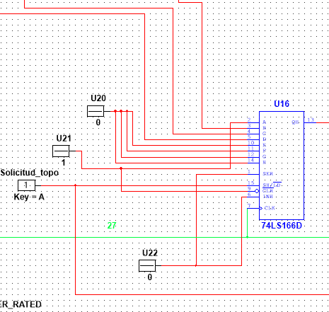

# Diagrama de cuarto nivel: subsistema discreto

## Módulos

- M1: Generador de reloj de baudios
- M2: Control de avance y modo
- M3: Generador pseudoaleatorio de posición
- M4: Decodificador de posición e indicadores
- M5: Registro de transmisión paralelo a serie
- M6: Acondicionamiento de la línea de transmisión

## Señales

- `CLK_TX`, reloj de baudios producido por M1
- `avance`, pulso que hace desplazar un estado al generador, producido por M2
- `modo`, selección entre carga y desplazamiento del registro, producida por M2
- `Q1` a `Q4`, salidas de las cuatro etapas del generador
- `pos[2:0]`, palabra de posición del topo, formada por `Q4`, `Q3` y `Q2`
- `solicitud_topo`, línea de solicitud proveniente de la FPGA
- `QH`, salida serie del registro de transmisión
- `TX`, línea serial hacia la FPGA

# M1: Generador de reloj de baudios

Corresponde al bloque de reloj interno del subsistema de transmisión del tercer nivel, donde aparece como la fuente de temporización del registro serial.

## f) Explicación de la relación con otros módulos

Este módulo no recibe señal de ningún otro y entrega su salida al registro de transmisión M5 y al control de avance y modo M2. La relación es unidireccional y de tipo control, ya que M1 impone el ritmo al que M5 desplaza sus bits y ninguno de los dos receptores puede modificarlo ni detenerlo. No tiene relación con M3, M4 ni M6, y tampoco comparte ninguna señal con la FPGA, tal como exige el enunciado cuando pide que ambos subsistemas operen con referencias de tiempo separadas.

## g) Explicación de funcionamiento

El temporizador opera en configuración astable. El capacitor de temporización se carga a través de las dos resistencias hasta alcanzar dos tercios de la alimentación. En ese instante el comparador de umbral conmuta el biestable interno, la salida cae a nivel bajo y el transistor de descarga entra en conducción, lo que permite que el capacitor se descargue a través de una sola de las resistencias hasta caer por debajo de un tercio de la alimentación, donde el ciclo se repite de forma indefinida. La asimetría del ciclo de trabajo proviene de que la carga recorre ambas resistencias mientras que la descarga recorre solo una.

## h) Diseño

Se requiere una señal periódica de frecuencia fija generada sin ningún dispositivo programable. El astable con temporizador integrado es la solución con menor cantidad de componentes que lo cumple, frente al oscilador de anillo con inversores, muy sensible a la alimentación y a la temperatura, y frente al oscilador de cristal con divisor, de mejor estabilidad pero con un encapsulado adicional y una red de división. La frecuencia queda determinada por la red resistiva y capacitiva externa. Se fija en 9600 Hz por ser una velocidad normalizada que el receptor de la FPGA reproduce dividiendo su reloj principal con error despreciable.

$$f = \frac{1{,}44}{(R_1 + 2R_2)\cdot C_1}$$

El factor 1,44 corresponde a $1/\ln(2)$ y proviene del carácter exponencial de la carga y la descarga del capacitor de temporización.

### Uso de módulos integrados

- Oscilador astable NE555

## i) Diagrama esquemático detallado

Oscilador astable construido alrededor del temporizador, con la red de temporización formada por las dos resistencias y el capacitor conectado al nodo de umbral y disparo. El capacitor del terminal de control desacopla el divisor interno de referencia. La salida entrega `CLK_TX` hacia M2 y M5.

# M2: Control de avance y modo

Corresponde al bloque de control del tercer nivel, ubicado en la entrada del subsistema, donde recibe la solicitud de la FPGA y la convierte en las señales internas que ordenan el resto de los módulos.

## f) Explicación de la relación con otros módulos

Este módulo es el único punto de entrada del subsistema discreto y traduce una petición externa en dos eventos internos ordenados en el tiempo. Recibe la línea de solicitud desde la FPGA y el reloj de baudios desde M1, entrega el pulso de avance al generador pseudoaleatorio M3 y entrega la señal de modo al registro de transmisión M5 y al acondicionamiento de línea M6. Al separar el avance del cambio de modo, este módulo garantiza que la posición ya esté actualizada cuando el registro la captura, lo que resuelve el orden entre generación y transmisión dentro de un mismo turno.

## g) Explicación de funcionamiento

La señal que llega de la FPGA se hace pasar primero por un búfer que restaura el nivel lógico del dominio de 3,3 V al de 5 V del protoboard. El flanco de subida de la señal así acondicionada ataca directamente el reloj del generador pseudoaleatorio, lo que produce exactamente un desplazamiento por cada solicitud recibida y elimina cualquier avance continuo. La misma señal alimenta además la entrada de dato de un flip-flop gobernado por el reloj de baudios, cuya salida es la señal de modo.

Ese flip-flop introduce un retardo deliberado de un tiempo de bit entre la llegada de la solicitud y el cambio de modo del registro. En el flanco de baudios en que el flip-flop captura la solicitud, el registro todavía está en modo de carga y toma la posición recién generada, y solo a partir del flanco siguiente comienza a desplazar. Sin ese retardo el registro habría cargado la posición anterior, porque la carga ocurre antes de que el generador avance.

## h) Diseño

El enunciado exige que el generador avance una única vez por cada solicitud recibida y no de forma continua, lo que descarta cualquier oscilador libre atacando el generador y obliga a derivar el avance de la propia solicitud. Como la solicitud proviene de una salida sincrónica de la FPGA y no de un contacto mecánico, el flanco llega limpio y no se requiere filtrado de rebotes, de modo que basta con acondicionar el nivel y usar el flanco directamente. El resto del módulo resuelve el orden entre los dos eventos, y para ello se emplea un solo flip-flop tipo D que retemporiza la solicitud con el reloj de baudios, alternativa preferida frente a una red de retardo con resistencia y capacitor porque el instante del cambio de modo queda determinado por el mismo reloj que gobierna el registro y no por una constante de tiempo sujeta a tolerancia.

### Secuencia de eventos por solicitud

| Instante | Evento | Efecto |
|---|---|---|
| Flanco de subida de la solicitud | Avance del generador | La posición cambia al siguiente estado del ciclo |
| Primer flanco de baudios posterior | Carga del registro y subida de modo | El registro captura la posición nueva |
| Flancos de baudios siguientes | Desplazamiento | La trama sale por la línea serial |
| Flanco de bajada de la solicitud | Bajada de modo | El registro vuelve a carga y la línea queda en reposo |

### Tabla de verdad del flip-flop de modo

| solicitud_topo | CLK_TX | modo siguiente |
|---|---|---|
| 0 | Flanco de subida | 0 |
| 1 | Flanco de subida | 1 |
| X | Sin flanco | Sin cambio |

### Uso de módulos integrados

- Búfer 74HCT125, un elemento de cuatro, para restaurar el nivel de la solicitud
- Flip-flop tipo D 74LS74, un elemento de dos, para la señal de modo

El 74HCT acepta umbrales de entrada compatibles con TTL y entrega salidas de 5 V plenos, que es lo que necesita el reloj del generador para conmutar con margen. El 74LS74 aporta el flip-flop tipo D disparado por flanco de subida que requiere la retemporización.

## i) Diagrama esquemático detallado

# M3: Generador pseudoaleatorio de posición

Corresponde al bloque LFSR del tercer nivel, que allí recibe el pulso de avance y entrega la palabra `pos[2:0]` hacia el decodificador y hacia el subsistema de transmisión.

## f) Explicación de la relación con otros módulos

Este módulo recibe su pulso de avance de M2 y entrega tres de sus cuatro salidas tanto al decodificador de posición M4 como a las entradas de carga paralela del registro de transmisión M5. Es la única fuente de datos del subsistema, ya que todo lo que se enciende en el tablero y todo lo que viaja por el enlace serial se origina aquí. Que ambos destinos partan de las mismas tres líneas es lo que garantiza que el LED encendido y la posición transmitida sean siempre el mismo número.

## g) Explicación de funcionamiento

El módulo es un registro de desplazamiento de cuatro etapas encadenadas que comparten el mismo reloj. En cada flanco de subida todo el contenido se desplaza una posición de forma simultánea, mientras la primera etapa carga el resultado de una compuerta de disparidad que combina las salidas de la tercera y de la cuarta. El registro recorre así una secuencia determinista que, sin conocer la estructura interna, aparenta ser aleatoria. Existe un estado del que el registro no puede salir, porque si las cuatro etapas valen cero la compuerta de disparidad entrega cero y el registro queda detenido de forma indefinida. Ese estado queda excluido del ciclo y obliga a garantizar una inicialización distinta de cero.

Como el único flanco que recibe proviene de la solicitud, el estado del registro permanece congelado durante todo el turno. Esa quietud es la que permite que el LED del topo activo se mantenga encendido sin parpadeo y que la trama transmitida corresponda a la posición que el jugador está viendo.

## h) Diseño

El registro de desplazamiento con realimentación lineal es la solución estándar para generar una secuencia pseudoaleatoria con lógica discreta, porque entrega una secuencia de longitud conocida y demostrable con la menor cantidad de componentes. La alternativa de un contador binario con lógica de dispersión se descarta porque no ofrece garantía formal de recorrido completo y resulta mucho más fácil de anticipar para un jugador. Se toman las etapas tres y cuatro como derivaciones de realimentación.

### Ecuación de realimentación

$$D_1 = Q_3 \oplus Q_4$$

Con estas derivaciones el registro recorre quince estados antes de repetirse, según se comprueba en la tabla de secuencia de esta misma sección.

### Tabla de verdad de la red de realimentación

| Q3 | Q4 | D1 |
|---|---|---|
| 0 | 0 | 0 |
| 0 | 1 | 1 |
| 1 | 0 | 1 |
| 1 | 1 | 0 |

### Ecuaciones de estado siguiente

El signo más indica estado siguiente. $Q_3$ es el valor que la etapa tiene en el momento actual y $Q_3^{+}$ es el que tendrá después del próximo flanco de reloj.

| Etapa | Ecuación |
|---|---|
| 1 | $Q_1^{+} = Q_3 \oplus Q_4$ |
| 2 | $Q_2^{+} = Q_1$ |
| 3 | $Q_3^{+} = Q_2$ |
| 4 | $Q_4^{+} = Q_3$ |

### Tabla de secuencia completa

Estados a partir de la semilla `1000`, con la posición decodificada como el número binario formado por Q4, Q3 y Q2 en ese orden de significancia.

| Paso | Q1 | Q2 | Q3 | Q4 | pos |
|---|---|---|---|---|---|
| 0 | 1 | 0 | 0 | 0 | 0 |
| 1 | 0 | 1 | 0 | 0 | 1 |
| 2 | 0 | 0 | 1 | 0 | 2 |
| 3 | 1 | 0 | 0 | 1 | 4 |
| 4 | 1 | 1 | 0 | 0 | 1 |
| 5 | 0 | 1 | 1 | 0 | 3 |
| 6 | 1 | 0 | 1 | 1 | 6 |
| 7 | 0 | 1 | 0 | 1 | 5 |
| 8 | 1 | 0 | 1 | 0 | 2 |
| 9 | 1 | 1 | 0 | 1 | 5 |
| 10 | 1 | 1 | 1 | 0 | 3 |
| 11 | 1 | 1 | 1 | 1 | 7 |
| 12 | 0 | 1 | 1 | 1 | 7 |
| 13 | 0 | 0 | 1 | 1 | 6 |
| 14 | 0 | 0 | 0 | 1 | 4 |
| 15 | 1 | 0 | 0 | 0 | se repite |

La posición cero aparece una sola vez por ciclo y las siete restantes aparecen dos veces, como consecuencia directa de que el estado nulo está excluido. La inicialización se resuelve con una red de encendido sobre el preset asíncrono de la primera etapa, que garantiza el estado inicial `1000`.

### Uso de módulos integrados

- Dos 74LS74 para las cuatro etapas del registro
- 74LS86 para la red de realimentación

El 74LS74 contiene dos flip-flops tipo D disparados por flanco de subida con preset y clear asíncronos independientes, que es lo que exige la topología.

## i) Diagrama esquemático detallado

Cadena de cuatro flip-flops tipo D con la compuerta XOR de realimentación cerrando el lazo desde las etapas tres y cuatro hacia la entrada de dato de la primera. Las cuatro etapas comparten la misma línea de reloj. Las salidas de las etapas dos, tres y cuatro forman `pos[2:0]` hacia M4 y M5.

# M4: Decodificador de posición e indicadores

Corresponde al bloque de indicación visual del tercer nivel, que allí recibe la palabra de posición y gobierna los ocho LEDs del tablero.

## f) Explicación de la relación con otros módulos

Este módulo recibe la palabra de posición de M3 y no entrega ninguna señal a otro módulo, ya que sus salidas terminan en los indicadores del tablero. Cuelga de las mismas tres líneas que alimentan al registro de transmisión M5, en paralelo con él y sin ninguna dependencia mutua, lo que hace que la indicación visual siga siendo correcta aunque el enlace serial falle. No tiene relación con M1, M2 ni M6.

## g) Explicación de funcionamiento

El decodificador interpreta sus tres entradas como un número binario y activa la salida cuya numeración coincide con ese valor, dejando las siete restantes inactivas. Sus salidas son activas en nivel bajo, de modo que cada LED se conecta con su ánodo hacia la alimentación a través de una resistencia limitadora y su cátodo a la salida correspondiente, con lo cual el LED conduce cuando su salida se activa y el integrado absorbe la corriente en lugar de entregarla.

Como el generador solo cambia de estado cuando llega una solicitud, la entrada del decodificador permanece fija durante todo el turno y el LED encendido no requiere ningún elemento de memoria adicional para mantenerse. El indicador se apaga y otro se enciende únicamente en el instante en que la FPGA pide un topo nuevo.

## h) Diseño

El requisito es activar una de ocho líneas a partir de una palabra binaria de tres bits, función que un decodificador integrado resuelve en un solo encapsulado frente a las ocho compuertas AND de tres entradas más los tres inversores que exigiría la implementación canónica, lo que ocuparía al menos cinco encapsulados. Las tres entradas de habilitación del integrado se atan de forma permanente al estado activo, ya que el bloque debe estar habilitado en todo momento, y se aprovecha la polaridad activa en bajo de las salidas para que el integrado absorba la corriente de los indicadores, régimen en el que la familia entrega mayor capacidad de manejo que en el de entrega.

### Tabla de verdad

| pos2 | pos1 | pos0 | Salida activa | LED encendido |
|---|---|---|---|---|
| 0 | 0 | 0 | Y0 | Posición 0 |
| 0 | 0 | 1 | Y1 | Posición 1 |
| 0 | 1 | 0 | Y2 | Posición 2 |
| 0 | 1 | 1 | Y3 | Posición 3 |
| 1 | 0 | 0 | Y4 | Posición 4 |
| 1 | 0 | 1 | Y5 | Posición 5 |
| 1 | 1 | 0 | Y6 | Posición 6 |
| 1 | 1 | 1 | Y7 | Posición 7 |

La resistencia limitadora de cada LED se dimensiona para que la corriente quede por debajo de la capacidad de absorción especificada para una salida del integrado, condición que también mantiene la tensión de salida en bajo dentro del margen garantizado.

### Uso de módulos integrados

- Decodificador 74LS138 de tres a ocho líneas
- Ocho LED individuales con su resistencia limitadora

## i) Diagrama esquemático detallado

# M5: Registro de transmisión paralelo a serie

Corresponde al bloque de registro del subsistema de transmisión en el tercer nivel, donde recibe la palabra de posición y el reloj de baudios y entrega la trama serial.

## f) Explicación de la relación con otros módulos

Este módulo es el punto de confluencia de los tres dominios del subsistema. Recibe de M3 los tres bits de posición que constituyen el dato a transmitir, de M1 el reloj de baudios que gobierna tanto la captura como el desplazamiento, y de M2 la señal de modo que decide entre una y otra operación. Entrega a M6 el flujo serial resultante, y comparte con ese módulo la señal de modo, de manera que M5 la usa para elegir entre carga y desplazamiento mientras que M6 la usa complementada para forzar el reposo de la línea física.

## g) Explicación de funcionamiento

El registro contiene ocho etapas encadenadas y opera en dos modos seleccionados por la entrada de modo. Con esa entrada en nivel bajo, cada flanco de subida carga simultáneamente en las ocho etapas los valores presentes en las entradas paralelas. Con la entrada en nivel alto, cada flanco desplaza el contenido una posición hacia la salida mientras por el extremo inicial ingresa el valor de la entrada serie. La salida corresponde siempre al contenido de la última etapa, que se carga desde la entrada paralela H, por lo que los desplazamientos sucesivos entregan G, F, E, D, C, B y finalmente A. El orden de emisión es entonces inverso al orden alfabético de las entradas paralelas, y ese detalle determina cómo debe cablearse cada bit de la trama.

## h) Diseño

La conversión de paralelo a serie con lógica discreta admite un registro de desplazamiento con carga paralela o un multiplexor de ocho a uno gobernado por un contador. Se elige el registro porque requiere un encapsulado frente a los dos que exige la segunda opción, más la lógica de sincronización entre ambos. Dentro de esa familia se prefiere el 74LS166 sobre el 74LS165 porque el primero realiza la carga paralela de forma síncrona, en el flanco de reloj, mientras que el segundo la realiza de forma asíncrona en cuanto la entrada de modo baja. La carga síncrona deja el instante de captura determinado por el mismo reloj que después gobierna el desplazamiento, y es lo que permite que el retardo introducido por M2 haga efecto.

### Tabla de función del integrado

| nCLR | nSH/LD | INH | CLK | Operación |
|---|---|---|---|---|
| 0 | X | X | X | Borrado asíncrono, todas las etapas a cero |
| 1 | 0 | 0 | Flanco de subida | Carga paralela de A a H |
| 1 | 1 | 0 | Flanco de subida | Desplazamiento de una posición, ingresa SER |
| 1 | X | 1 | Flanco de subida | Sin cambio, registro congelado |
| 1 | X | X | Sin flanco | Sin cambio |

### Asignación de entradas y trama resultante

| Entrada | Señal conectada | Tiempo de bit | Función en la trama |
|---|---|---|---|
| H | Nivel bajo | 1 | Bit de inicio |
| G | Nivel bajo | 2 | Dato |
| F | Nivel bajo | 3 | Dato |
| E | Nivel bajo | 4 | Dato |
| D | Q2, pos0 | 5 | Dato, bit menos significativo de la posición |
| C | Q3, pos1 | 6 | Dato, bit intermedio de la posición |
| B | Q4, pos2 | 7 | Dato, bit más significativo de la posición |
| A | Nivel alto | 8 | Bit de parada |
| SER | Nivel bajo | Posterior | Relleno tras agotarse la trama |
| INH | Nivel bajo | No aplica | Desplazamiento siempre habilitado |
| nCLR | Nivel alto | No aplica | Borrado nunca activo |
| nSH/LD | modo, desde M2 | No aplica | Selección entre carga y desplazamiento |

La trama ocupa ocho tiempos de bit y contiene un bit de inicio, seis de datos y un bit de parada. Este formato difiere del 8N1 del enunciado por una razón dimensional, ya que un registro de ocho etapas ofrece ocho tiempos de bit y la corrección requiere cascadear un segundo encapsulado idéntico, con lo cual se dispondría de dieciséis tiempos de bit para los diez de la trama y seis de reposo.

### Uso de módulos integrados

- Registro paralelo a serie 74LS166 de ocho etapas

## i) Diagrama esquemático detallado

Registro de ocho etapas con carga paralela síncrona. Las entradas B, C y D reciben los tres bits de posición, la entrada A queda en nivel alto para el bit de parada y las entradas E a H quedan en nivel bajo, con la H aportando el bit de inicio. La salida serie alimenta a M6.

# M6: Acondicionamiento de la línea de transmisión

Corresponde a la salida del subsistema de transmisión en el tercer nivel, en el punto donde la trama serial abandona el protoboard hacia la FPGA.

## f) Explicación de la relación con otros módulos

Este módulo recibe de M5 el flujo serial producido por el registro de desplazamiento, en relación de tipo dato, y de M2 la misma señal de modo que gobierna a M5, en relación de tipo control. Esa doble entrada es lo que permite que ambos actúen de forma coordinada, forzando el reposo mientras M5 carga y volviéndose transparente mientras M5 desplaza. Entrega a la FPGA la línea de transmisión del enlace, que es el punto de frontera eléctrica del subsistema, y no tiene relación con M1, M3 ni M4.

## g) Explicación de funcionamiento

El módulo está compuesto por un inversor y una compuerta OR de dos entradas en cascada. El inversor produce el complemento de la señal de modo y la compuerta OR lo combina con la salida serie del registro. Durante la carga, el complemento vale uno y la compuerta fuerza la salida a nivel alto sin importar el contenido del registro, dejando la línea en el estado de reposo que exige el protocolo. Durante el desplazamiento, el complemento vale cero y la compuerta reproduce fielmente el flujo serial. Sin esta lógica, la salida del registro presentaría el valor de la entrada paralela H, que está en nivel bajo, por lo que la línea quedaría en nivel bajo permanente entre trama y trama, condición que un receptor UART interpreta como ruptura del enlace y que además impediría detectar el flanco de inicio de la trama siguiente.

## h) Diseño

El requisito es forzar un nivel alto durante una condición determinada y dejar pasar la señal sin alterar durante la condición complementaria. La compuerta OR de dos entradas es la función mínima que lo cumple, porque su elemento neutro es el cero y su elemento absorbente es el uno, que coincide con el nivel de reposo requerido. La alternativa de una compuerta de tres estados, que dejaría la línea en alta impedancia durante la carga confiando el reposo a una resistencia de elevación, se descarta porque requiere igualmente un encapsulado y añade la dependencia de un componente pasivo. La adaptación entre el dominio de 5 V del protoboard y el de 3,3 V de la FPGA se resuelve con un divisor resistivo, obligatorio porque aplicar 5 V a una entrada de 3,3 V excede la tensión máxima especificada y puede dañar el pin de forma permanente.

### Ecuación y tabla de verdad

$$TX = QH \lor \overline{modo}$$

| modo | Complemento | QH | TX | Régimen |
|---|---|---|---|---|
| 0 | 1 | 0 | 1 | Carga, reposo forzado |
| 0 | 1 | 1 | 1 | Carga, reposo forzado |
| 1 | 0 | 0 | 0 | Transmisión, bit en cero |
| 1 | 0 | 1 | 1 | Transmisión, bit en uno |

### Uso de módulos integrados

- Inversor 74LS04, un elemento de seis
- Compuerta OR 74LS32, un elemento de cuatro

## i) Diagrama esquemático detallado

Inversor y compuerta OR en cascada. El inversor complementa la señal de modo y la compuerta fuerza el nivel alto de reposo mientras el registro carga, dejando pasar el flujo serial durante el desplazamiento. La salida entrega `TX` hacia la FPGA.
