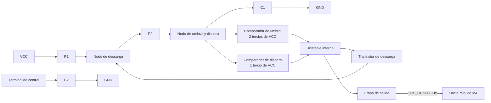
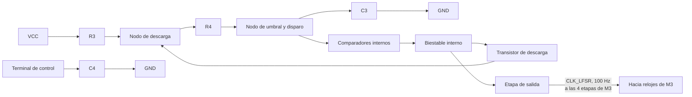
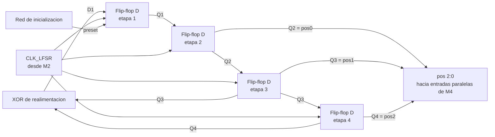
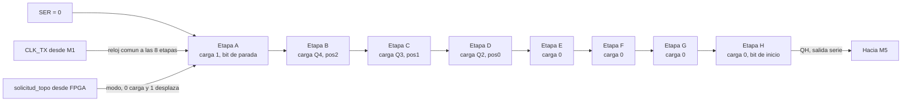
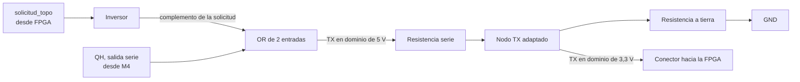

# Diagrama de cuarto nivel: subsistema discreto

Desarrollo individual de cada módulo del tercer nivel. Para cada uno se presentan los puntos f) a i) de la metodología de diseño modular.

## Índice de módulos

- M1: Generador de reloj de baudios
- M2: Generador de reloj del generador pseudoaleatorio
- M3: Generador pseudoaleatorio de posición
- M4: Registro de transmisión paralelo a serie
- M5: Acondicionamiento de la línea de transmisión

## Nombres de señales

- `CLK_TX`, reloj de baudios producido por M1
- `CLK_LFSR`, reloj del generador pseudoaleatorio producido por M2
- `Q1` a `Q4`, salidas de las cuatro etapas del generador
- `pos[2:0]`, palabra de posición del topo, formada por `Q4`, `Q3` y `Q2`
- `solicitud_topo`, línea de solicitud proveniente de la FPGA
- `QH`, salida serie del registro de transmisión
- `TX`, línea serial hacia la FPGA

# M1: Generador de reloj de baudios

Corresponde al bloque de reloj interno del subsistema de transmisión del tercer nivel, donde aparece como la fuente de temporización del registro serial.

## f) Explicación de la relación con otros módulos

Este módulo no recibe señal de ningún otro y su única salida ataca la entrada de reloj del registro de transmisión M4. La relación es unidireccional y de tipo control, ya que M1 impone el ritmo al que M4 desplaza sus bits y M4 no puede modificarlo ni detenerlo. No tiene relación con M2, M3 ni M5, y tampoco comparte ninguna señal con la FPGA, tal como exige el enunciado cuando pide que ambos subsistemas operen con referencias de tiempo separadas.

## g) Explicación de funcionamiento

El temporizador opera en configuración astable. El capacitor de temporización se carga a través de las dos resistencias hasta alcanzar dos tercios de la alimentación. En ese instante el comparador de umbral conmuta el biestable interno, la salida cae a nivel bajo y el transistor de descarga entra en conducción, lo que permite que el capacitor se descargue a través de una sola de las resistencias hasta caer por debajo de un tercio de la alimentación, donde el ciclo se repite de forma indefinida. La asimetría del ciclo de trabajo proviene de que la carga recorre ambas resistencias mientras que la descarga recorre solo una.

## h) Diseño

Se requiere una señal periódica de frecuencia fija generada sin ningún dispositivo programable. El astable con temporizador integrado es la solución con menor cantidad de componentes que lo cumple, frente al oscilador de anillo con inversores, muy sensible a la alimentación y a la temperatura, y frente al oscilador de cristal con divisor, de mejor estabilidad pero con un encapsulado adicional y una red de división. La frecuencia queda determinada por la red resistiva y capacitiva externa. Se fija en 9600 Hz por ser una velocidad normalizada que el receptor de la FPGA reproduce dividiendo su reloj principal con error despreciable.

$$f = \frac{1{,}44}{(R_1 + 2R_2)\cdot C_1}$$

El factor 1,44 corresponde a $1/\ln(2)$ y proviene del carácter exponencial de la carga y la descarga del capacitor de temporización.

### Uso de módulos integrados

- Oscilador astable NE555

## i) Diagrama esquemático detallado

# M2: Generador de reloj del generador pseudoaleatorio

Corresponde al bloque de reloj asociado al generador aleatorio en el tercer nivel, donde aparece como fuente de temporización propia, separada de la del camino serial.

## f) Explicación de la relación con otros módulos

Este módulo alimenta exclusivamente las entradas de reloj de las cuatro etapas del generador pseudoaleatorio M3 y no recibe señal de ningún otro. El subsistema discreto queda con dos dominios de temporización separados, ya que el generador de posición avanza a su propio ritmo mientras que la transmisión serial avanza al ritmo de M1. Ambos dominios se encuentran únicamente en las entradas de carga paralela de M4, donde los bits producidos por M3 son capturados en un instante determinado por M1.

## g) Explicación de funcionamiento

El circuito es un segundo temporizador en configuración astable, idéntico en topología al de M1 y diferente únicamente en el valor del capacitor de temporización. Su principio de operación es el mismo, con carga hasta dos tercios de la alimentación, conmutación del biestable interno, descarga hasta un tercio y repetición del ciclo. Su salida ataca simultáneamente los cuatro relojes del generador, de modo que todas las etapas comparten el mismo flanco y el generador se comporta como un circuito síncrono.

## h) Diseño

Se reutiliza la misma topología de M1 para no introducir un principio de funcionamiento distinto dentro del subsistema, ajustando únicamente la red de temporización para obtener una frecuencia del orden de 100 Hz. Ese valor responde a dos condiciones opuestas. Debe ser suficientemente bajo para que el estado del generador permanezca inmóvil durante toda la transmisión de una trama, y así evitar que el registro emita una posición que ya no es la vigente. Debe ser también suficientemente alto para que entre dos solicitudes consecutivas el generador avance un número impredecible de estados, que es lo que produce la sensación de aleatoriedad.

### Uso de módulos integrados

- Oscilador astable NE555

## i) Diagrama esquemático detallado

# M3: Generador pseudoaleatorio de posición

Corresponde al bloque LFSR del tercer nivel, que allí recibe el reloj del generador y entrega la palabra `pos[2:0]` hacia el subsistema de transmisión.

## f) Explicación de la relación con otros módulos

Este módulo recibe su temporización de M2 y entrega tres de sus cuatro salidas a las entradas de carga paralela del registro de transmisión M4. Es la única fuente de datos del subsistema, ya que todo lo que viaja por el enlace serial se origina aquí. La relación con M4 es de tipo dato y no existe entre ambos ningún elemento de sincronización, porque las tres salidas están permanentemente presentes en las entradas paralelas y es M4, gobernado por la línea de solicitud, el que decide en qué instante las captura.

## g) Explicación de funcionamiento

El módulo es un registro de desplazamiento de cuatro etapas encadenadas que comparten el mismo reloj. En cada flanco de subida todo el contenido se desplaza una posición de forma simultánea, mientras la primera etapa carga el resultado de una compuerta de disparidad que combina las salidas de la tercera y de la cuarta. El registro recorre así una secuencia determinista que, sin conocer la estructura interna, aparenta ser aleatoria. Existe un estado del que el registro no puede salir, porque si las cuatro etapas valen cero la compuerta de disparidad entrega cero y el registro queda detenido de forma indefinida. Ese estado queda excluido del ciclo y obliga a garantizar una inicialización distinta de cero.

## h) Diseño

El registro de desplazamiento con realimentación lineal es la solución estándar para generar una secuencia pseudoaleatoria con lógica discreta, porque entrega una secuencia de longitud conocida y demostrable con la menor cantidad de componentes. La alternativa de un contador binario con lógica de dispersión se descarta porque no ofrece garantía formal de recorrido completo y resulta mucho más fácil de anticipar para un jugador. Se toman las etapas tres y cuatro como derivaciones de realimentación, elección que garantiza que la secuencia recorra los quince estados posibles antes de repetirse.

### Ecuación de realimentación

$$D_1 = Q_3 \oplus Q_4$$

Con estas derivaciones el registro recorre quince estados antes de repetirse, según se comprueba en la tabla de secuencia de esta misma sección.

### Tabla de verdad de la red de realimentación

| Q3 | Q4 | D1 |
|---|---|---|
| 0 | 0 | 0 |
| 0 | 1 | 1 |
| 1 | 0 | 1 |
| 1 | 1 | 0 |

### Ecuaciones de estado siguiente

El signo más indica estado siguiente. $Q_3$ es el valor que la etapa tiene en el momento actual y $Q_3^{+}$ es el que tendrá después del próximo flanco de reloj.

| Etapa | Ecuación |
|---|---|
| 1 | $Q_1^{+} = Q_3 \oplus Q_4$ |
| 2 | $Q_2^{+} = Q_1$ |
| 3 | $Q_3^{+} = Q_2$ |
| 4 | $Q_4^{+} = Q_3$ |

### Tabla de secuencia completa

Estados a partir de la semilla `1000`, con la posición decodificada como el número binario formado por Q4, Q3 y Q2 en ese orden de significancia.

| Paso | Q1 | Q2 | Q3 | Q4 | pos |
|---|---|---|---|---|---|
| 0 | 1 | 0 | 0 | 0 | 0 |
| 1 | 0 | 1 | 0 | 0 | 1 |
| 2 | 0 | 0 | 1 | 0 | 2 |
| 3 | 1 | 0 | 0 | 1 | 4 |
| 4 | 1 | 1 | 0 | 0 | 1 |
| 5 | 0 | 1 | 1 | 0 | 3 |
| 6 | 1 | 0 | 1 | 1 | 6 |
| 7 | 0 | 1 | 0 | 1 | 5 |
| 8 | 1 | 0 | 1 | 0 | 2 |
| 9 | 1 | 1 | 0 | 1 | 5 |
| 10 | 1 | 1 | 1 | 0 | 3 |
| 11 | 1 | 1 | 1 | 1 | 7 |
| 12 | 0 | 1 | 1 | 1 | 7 |
| 13 | 0 | 0 | 1 | 1 | 6 |
| 14 | 0 | 0 | 0 | 1 | 4 |
| 15 | 1 | 0 | 0 | 0 | se repite |

La posición cero aparece una sola vez por ciclo y las siete restantes aparecen dos veces, como consecuencia directa de que el estado nulo está excluido. La inicialización se resuelve con una red de encendido sobre el preset asíncrono de la primera etapa, que garantiza el estado inicial `1000`.

### Uso de módulos integrados

- Dos 74LS74
- 74LS86 para la red de realimentación

El 74LS74 contiene dos flip-flops tipo D disparados por flanco de subida con preset y clear asíncronos independientes, que es lo que exige la topología.

## i) Diagrama esquemático detallado

# M4: Registro de transmisión paralelo a serie

Corresponde al bloque de registro del subsistema de transmisión en el tercer nivel, donde recibe la palabra de posición y el reloj de baudios y entrega la trama serial.

## f) Explicación de la relación con otros módulos

Este módulo es el punto de confluencia de los tres dominios del subsistema. Recibe de M3 los tres bits de posición que constituyen el dato a transmitir, de M1 el reloj de baudios que gobierna tanto la captura como el desplazamiento, y de la FPGA la línea de solicitud, que ataca la entrada de selección de modo y es la única señal que entra al subsistema discreto desde el exterior. Entrega a M5 el flujo serial resultante, y comparte con ese módulo la línea de solicitud, de manera que M4 la usa para elegir entre carga y desplazamiento mientras que M5 la usa complementada para forzar el reposo de la línea física.

## g) Explicación de funcionamiento

El registro contiene ocho etapas encadenadas y opera en dos modos seleccionados por la entrada de modo. Con esa entrada en nivel bajo, cada flanco de subida carga simultáneamente en las ocho etapas los valores presentes en las entradas paralelas. Con la entrada en nivel alto, cada flanco desplaza el contenido una posición hacia la salida mientras por el extremo inicial ingresa el valor de la entrada serie. La salida corresponde siempre al contenido de la última etapa, que se carga desde la entrada paralela H, por lo que los desplazamientos sucesivos entregan G, F, E, D, C, B y finalmente A. El orden de emisión es entonces inverso al orden alfabético de las entradas paralelas, y ese detalle determina cómo debe cablearse cada bit de la trama.

## h) Diseño

La conversión de paralelo a serie con lógica discreta admite un registro de desplazamiento con carga paralela o un multiplexor de ocho a uno gobernado por un contador. Se elige el registro porque requiere un encapsulado frente a los dos que exige la segunda opción, más la lógica de sincronización entre ambos. Dentro de esa familia se prefiere el 74LS166 sobre el 74LS165 porque el primero realiza la carga paralela de forma síncrona, en el flanco de reloj, mientras que el segundo la realiza de forma asíncrona en cuanto la entrada de modo baja. La carga síncrona deja el instante de captura determinado por el mismo reloj que después gobierna el desplazamiento.

### Tabla de función del integrado

| nCLR | nSH/LD | INH | CLK | Operación |
|---|---|---|---|---|
| 0 | X | X | X | Borrado asíncrono, todas las etapas a cero |
| 1 | 0 | 0 | Flanco de subida | Carga paralela de A a H |
| 1 | 1 | 0 | Flanco de subida | Desplazamiento de una posición, ingresa SER |
| 1 | X | 1 | Flanco de subida | Sin cambio, registro congelado |
| 1 | X | X | Sin flanco | Sin cambio |

### Asignación de entradas y trama resultante

| Entrada | Señal conectada | Tiempo de bit | Función en la trama |
|---|---|---|---|
| H | Nivel bajo | 1 | Bit de inicio |
| G | Nivel bajo | 2 | Dato |
| F | Nivel bajo | 3 | Dato |
| E | Nivel bajo | 4 | Dato |
| D | Q2, pos0 | 5 | Dato, bit menos significativo de la posición |
| C | Q3, pos1 | 6 | Dato, bit intermedio de la posición |
| B | Q4, pos2 | 7 | Dato, bit más significativo de la posición |
| A | Nivel alto | 8 | Bit de parada |
| SER | Nivel bajo | Posterior | Relleno tras agotarse la trama |
| INH | Nivel bajo | No aplica | Desplazamiento siempre habilitado |
| nCLR | Nivel alto | No aplica | Borrado nunca activo |
| nSH/LD | solicitud_topo | No aplica | Selección de modo |

La trama ocupa ocho tiempos de bit y contiene un bit de inicio, seis de datos y un bit de parada. Este formato difiere del 8N1 del enunciado por una razón dimensional, ya que un registro de ocho etapas ofrece ocho tiempos de bit y la corrección requiere cascadear un segundo encapsulado idéntico.

### Uso de módulos integrados

- 74LS166: registro paralelo a serie de 8 etapas

## i) Diagrama esquemático detallado

# M5: Acondicionamiento de la línea de transmisión

Corresponde a la salida del subsistema de transmisión en el tercer nivel, en el punto donde la trama serial abandona el protoboard hacia la FPGA.

## f) Explicación de la relación con otros módulos

Este módulo recibe de M4 el flujo serial producido por el registro de desplazamiento, en relación de tipo dato, y de la FPGA la misma línea de solicitud que gobierna a M4, en relación de tipo control. Esa doble entrada es lo que permite que ambos actúen de forma coordinada, forzando el reposo mientras M4 carga y volviéndose transparente mientras M4 desplaza. Entrega a la FPGA la línea de transmisión del enlace, que es el punto de frontera eléctrica del subsistema, y no tiene relación con M1, M2 ni M3.

## g) Explicación de funcionamiento

El módulo está compuesto por un inversor y una compuerta OR de dos entradas en cascada. El inversor produce el complemento de la línea de solicitud y la compuerta OR lo combina con la salida serie del registro. Durante la carga, el complemento vale uno y la compuerta fuerza la salida a nivel alto sin importar el contenido del registro, dejando la línea en el estado de reposo que exige el protocolo. Durante el desplazamiento, el complemento vale cero y la compuerta reproduce fielmente el flujo serial. Sin esta lógica, la salida del registro presentaría el valor de la entrada paralela H, que está en nivel bajo, por lo que la línea quedaría en nivel bajo permanente entre trama y trama, condición que un receptor UART interpreta como ruptura del enlace y que además impediría detectar el flanco de inicio de la trama siguiente.

## h) Diseño

El requisito es forzar un nivel alto durante una condición determinada y dejar pasar la señal sin alterar durante la condición complementaria. La compuerta OR de dos entradas es la función mínima que lo cumple, porque su elemento neutro es el cero y su elemento absorbente es el uno, que coincide con el nivel de reposo requerido. La alternativa de una compuerta de tres estados, que dejaría la línea en alta impedancia durante la carga confiando el reposo a una resistencia de elevación, se descarta porque requiere igualmente un encapsulado y añade la dependencia de un componente pasivo. La adaptación entre el dominio de 5 V del protoboard y el de 3,3 V de la FPGA se resuelve con un divisor resistivo, obligatorio porque aplicar 5 V a una entrada de 3,3 V excede la tensión máxima especificada y puede dañar el pin de forma permanente.

### Ecuación y tabla de verdad

$$TX = QH \lor \overline{solicitud\_topo}$$

| solicitud_topo | Complemento | QH | TX | Régimen |
|---|---|---|---|---|
| 0 | 1 | 0 | 1 | Carga, reposo forzado |
| 0 | 1 | 1 | 1 | Carga, reposo forzado |
| 1 | 0 | 0 | 0 | Transmisión, bit en cero |
| 1 | 0 | 1 | 1 | Transmisión, bit en uno |

### Uso de módulos integrados

- Inversor 74LS04
- Compuerta OR 74LS32

## i) Diagrama esquemático detallado

