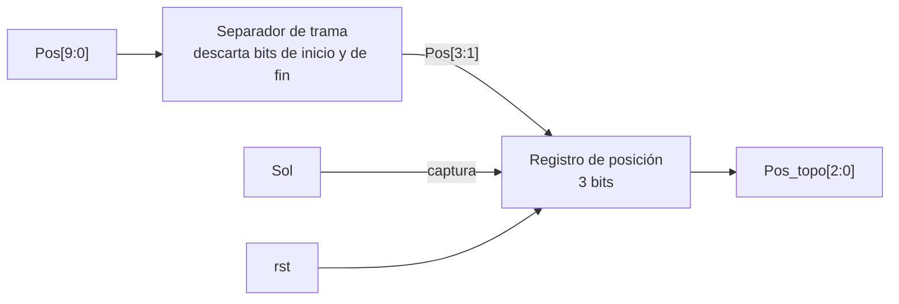

M1: Deco_UART

Objetivo:
- Decodificar la señal recibida por medio de la UART para entregarla a la FSM cuando esta la solicita.

Entradas:
- Pos[9:0]: Señal que proviene del subsistema discreto con la posición generada aleatoriamente por la LSFR, esta señal llega emapaquetada por medio del protoco UART que debe decodificarse para obtener la posición del topo
- Sol: Señal de solcitud de la posición de la FSM.
- rst: Señal de reinicio síncrono del sistema.
Salidas:
- Pos_topo [2:0]: Valor binario de 3-bits con la posición del topo.

Explicación General:
La señal Pos[9:0] ingresa al módulo desde el registro y se decodifica en la señal Pos_Topo[2:0] cuando recibe la solicitud ¨Sol¨ por parte de la FSM, y la envía a esta. Este módulo toma el bistream de 10 bits y mediante el protocolo UART toma los 3 bits que contienen la información de la posición generada por la LFSR, debe separar los bits de Inicio y Final del protocolo y tomar los 3-bits de información.

## f) Relación con otros módulos

El módulo recibe `Pos[9:0]` del subsistema discreto: un registro externo, alimentado por el receptor UART que ensambla en paralelo la trama serie generada a partir de la LFSR, y que se mantiene estable hasta que llega la siguiente trama. La FSM emite `Sol` al comienzo de cada turno, antes de emitir el pulso `inicio` hacia Time_Logic (M4), de modo que el tiempo que toma decodificar la trama no se descuenta de la ventana de juego, tal como se describe en la relación de M4 con este módulo. La salida `Pos_topo[2:0]` se entrega a la FSM, que la retiene durante todo el turno para compararla contra `btn_golpe[7:0]` y resolver hit o miss; Deco_UART no tiene relación directa con Hit_Counter, Fail_Counter ni Estado_Juego, ya que toda la coordinación entre módulos pasa por la FSM. La señal `rst` reinicia el registro de salida a un valor conocido tras un reinicio manual.

## g) Explicación de funcionamiento

`Pos[9:0]` es una trama UART 8-N-1 ya ensamblada en paralelo: el bit de inicio ocupa `Pos[0]`, el byte de datos ocupa `Pos[8:1]` y el bit de fin ocupa `Pos[9]`. De ese byte de datos solo los 3 bits menos significativos, `Pos[3:1]`, contienen la posición generada por la LFSR, ya que el subsistema discreto rellena con cero los 5 bits restantes del campo de datos. El módulo separa de forma combinacional el bit de inicio y el bit de fin del resto de la trama y aísla los 3 bits de datos útiles. Cuando la FSM activa `Sol` durante un ciclo de reloj, ese valor combinacional se captura en un registro de 3 bits que constituye `Pos_topo[2:0]`; fuera de ese ciclo el registro retiene el valor capturado en el turno anterior, de modo que la FSM dispone de una posición estable durante toda la ventana de juego aunque `Pos[9:0]` cambie mientras tanto para el siguiente turno. La señal `rst` tiene prioridad sobre la captura y pone el registro en cero.

## h) Diseño

Como `Pos[9:0]` llega ya ensamblado en paralelo desde el subsistema discreto y no bit a bit por una línea serie, Deco_UART no necesita un receptor con máquina de estados ni sobremuestreo de bit; basta con particionar la trama de forma combinacional, lo cual mantiene el módulo simple y libre de un reloj de bit propio. Se registra la salida en lugar de exponer directamente el corte combinacional para que `Pos_topo[2:0]` permanezca estable durante todo el turno, incluso si el subsistema discreto actualiza `Pos[9:0]` con una trama nueva antes de que la FSM inicie el turno siguiente. `Sol` actúa como habilitación de captura y no como reloj, con lo cual el registro permanece en el dominio del reloj principal de 100 MHz, igual que el resto de los módulos del sistema. No se valida el valor del bit de inicio ni del de fin porque la trama se genera y se consume dentro del mismo sistema, sin viajar por un enlace externo propenso a error, así que ambos bits se descartan sin comprobación, lo cual simplifica la lógica sin costo real de robustez.

| `Pos[9:0]` | Contenido |
|---|---|
| `Pos[0]` | bit de inicio, se descarta |
| `Pos[3:1]` | datos: `Pos_topo[2:0]` |
| `Pos[8:4]` | relleno fijo en 0, se descarta |
| `Pos[9]` | bit de fin, se descarta |

## i) Diagrama detallado del diseño

