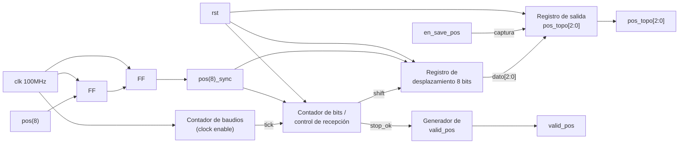

# M1: Receptor UART

## f) Relación con otros módulos

`pos(8)` proviene directamente del pin de GPIO conectado al registro de desplazamiento del subsistema discreto; al tratarse de una señal generada por un reloj independiente al de la FPGA, este módulo es responsable de resolver la metaestabilidad mediante un sincronizador de dos etapas antes de procesarla, tal como lo exige la sección 3.3 del enunciado. La FSM, al entrar al estado `001` (`en_numAleatorios`), emite hacia el subsistema discreto el pulso de solicitud de una nueva posición; ese pulso no forma parte de este módulo, ya que su generación corresponde a la lógica de control de la FSM y no a la recepción. Una vez que el subsistema discreto responde con la trama serial, este módulo la recibe de forma autónoma, sin esperar ninguna señal de la FSM, y levanta `valid_pos` en cuanto termina de decodificarla. La FSM permanece en el estado `010` monitoreando `valid_pos`; al recibirlo, activa `en_save_pos` para que la posición quede retenida en un registro estable, y transiciona hacia el estado de juego. `pos_topo[2:0]` se entrega tanto a la FSM (para comparar contra el botón presionado) como al módulo Show_Mole (M2), que la usa para encender el LED correspondiente. `rst` reinicia el registro de salida y la lógica de recepción a un estado conocido tras un reinicio manual.
 
## g) Explicación de funcionamiento
 
`pos(8)` ingresa primero a un sincronizador de dos etapas (dos flip-flops en cascada con el reloj de 100MHz) para eliminar el riesgo de metaestabilidad, dado que la señal proviene de un dominio de reloj propio del circuito discreto sin referencia compartida con la FPGA. La señal ya sincronizada alimenta un contador de baudios (`CLK_U`) que, a partir del reloj de 100MHz, genera los instantes de muestreo correspondientes a la velocidad de transmisión acordada por el grupo (9600 baudios en el diseño de referencia), sin necesidad de un reloj derivado adicional. Un contador de bits (`CON_U`) detecta el flanco de bajada del bit de inicio, espera medio período de bit para ubicarse en el centro de cada bit, y desde ahí muestrea los 8 bits de datos en los instantes sucesivos separados por un período de bit completo, desplazándolos hacia el registro `REG_U`. Al completar los 8 bits, el contador verifica la posición del bit de parada y, si el formato de trama es válido, transfiere los 3 bits menos significativos del byte recibido a la salida `pos_topo[2:0]` y genera un pulso en `valid_pos`. Si `en_save_pos` está activo en ese momento, el valor de `pos_topo[2:0]` se retiene en un registro de salida estable, de modo que la FSM dispone de una posición constante durante toda la ventana de juego del turno, aunque el subsistema discreto envíe una trama nueva antes de que inicie el siguiente turno.
 
## h) Diseño
 
Se optó por un sincronizador de dos etapas en lugar de uno de una sola etapa porque `pos(8)` es completamente asíncrona respecto al reloj de la FPGA y una sola etapa no ofrece un margen de resolución de metaestabilidad suficiente a 100MHz; esta decisión responde directamente al punto de investigación previa sobre sincronizadores de doble flip-flop. El muestreo se realiza en el centro de cada bit (medio período después del flanco de inicio) y no en el flanco mismo, para maximizar el margen de error tolerado entre el reloj de baudios del circuito discreto (generado con un oscilador 555) y el generado dentro de la FPGA, ya que ambos relojes son independientes y solo coinciden en la velocidad nominal acordada, no en fase. El generador de baudios se implementa mediante una habilitación de conteo derivada del reloj principal de 100MHz (clock enable), sin generar un reloj físico adicional, siguiendo la recomendación del enunciado sobre buenas prácticas de asignación de relojes en FPGA. No se valida el bit de paridad porque el formato acordado en la sección 3.2 es 8N1 (sin paridad); el bit de parada sí se verifica como comprobación mínima de integridad de trama, ya que a diferencia del diseño combinacional simplificado de una versión anterior de este módulo, aquí la trama efectivamente llega bit a bit y puede haber errores de sincronización de baudios. Se separa la señal de dato decodificado (`pos_topo[2:0]`, que se actualiza en cuanto llega una trama válida) del registro retenido que consume la FSM, habilitado por `en_save_pos`, para que la llegada asíncrona de una trama nueva del lado discreto nunca altere la posición vigente durante un turno en curso.
 
Tabla de estados del contador de recepción (`CON_U`), simplificada:
 
| Estado | Condición de entrada | Acción | Estado siguiente |
|---|---|---|---|
| `IDLE` | `pos(8)_sync` = 1 | esperar | `IDLE` |
| `IDLE` | `pos(8)_sync` = 0 (flanco de bajada) | iniciar conteo de medio bit | `START` |
| `START` | medio período de bit cumplido | confirmar bit de inicio válido | `DATO` |
| `DATO` | 8 bits muestreados | pasar a verificación de parada | `STOP` |
| `STOP` | bit de parada = 1 | `pos_topo` = dato[2:0], pulso `valid_pos` | `IDLE` |
| `STOP` | bit de parada = 0 | descartar trama, sin pulso `valid_pos` | `IDLE` |
 
## i) Diagrama esquemático detallado del diseño
 
