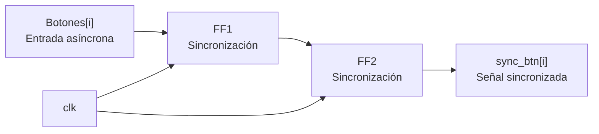
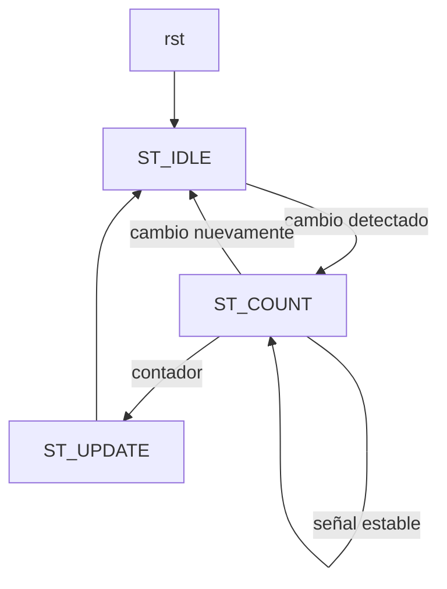
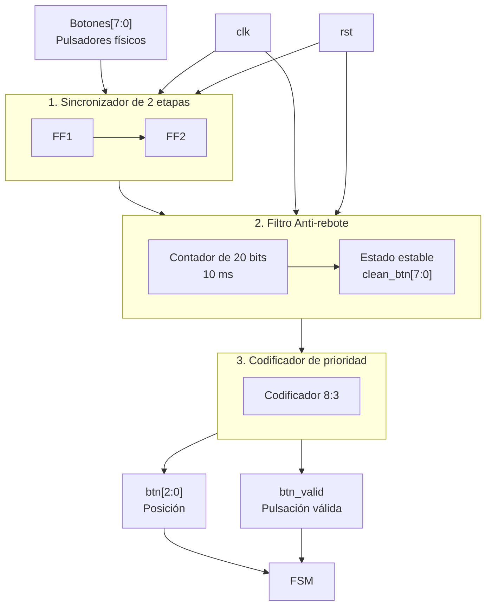

### M3: press_btn

## f) Relación con otros módulos

EEl módulo press_btn recibe las señales Botones[7:0] provenientes de los ocho pulsadores físicos. Estas señales son procesadas mediante un sincronizador de dos etapas y un filtro anti-rebote para eliminar cambios no deseados producidos por el funcionamiento mecánico de los pulsadores.
Una vez filtradas, las señales se envían a un codificador de prioridad, el cual genera la posición del botón presionado mediante btn[2:0]. La señal btn_valid indica a la FSM que existe una pulsación válida.
La FSM utiliza btn[2:0] para comparar la posición del botón presionado con la posición actual del topo pos_topo[2:0]. De esta comparación se determina si el jugador presionó el botón correspondiente durante el tiempo permitido por Time_Logic.

## g) Explicación de funcionamiento

El módulo press_btn procesa las ocho entradas físicas Botones[7:0] para obtener una pulsación confiable y sincronizada con el reloj del sistema.
Primero, cada entrada pasa por un sincronizador de dos etapas, encargado de reducir el riesgo de metaestabilidad debido a que los pulsadores son señales asíncronas respecto al reloj.
Posteriormente, cada señal sincronizada pasa por un filtro anti-rebote. Este filtro comprueba que el estado del pulsador permanezca estable durante aproximadamente 10 ms antes de aceptar el cambio como una pulsación válida.
Finalmente, las ocho señales filtradas son procesadas por un codificador de prioridad 8:3, que convierte la posición del botón activo en un código binario de 3 bits. La salida btn[2:0] representa la posición del botón presionado, mientras que btn_valid indica si existe una pulsación válida. En caso de que varios botones se encuentren activos simultáneamente, el codificador da prioridad al botón de mayor índice. La FSM utiliza las señales btn y btn_valid para determinar si la posición presionada coincide con la posición del topo y, de esta manera, validar el acierto del jugador.

## h) Diseño

Este módulo se segmenta en los siguientes bloques:

1. **Sincronizador de 2 Etapas**: Este bloque tiene como función principal mitigar la metaestabilidad de los botones.

2. **Filtro Anti-rebote:** Cada una de las líneas (filas) entra a una unidad individual de filtrado. Para esto se realiza un cálculo aproximado de referencia para la temporización. Se utiliza un clk de 100 MHz para facilitar los cálculos.

        Cuentas necesarias = 10 ms / 10 ns = 1e^6 ciclos 

        Ancho del contador = log_2(1e^6 ) = 20 bits

Se añade el diagrama de estados para este submódulo.

3. **Codificador de Prioridad:** toma el vector filtrado de 8 bits btn[7:0] (asumiendo lógica positiva donde '1' representa pulsador presionado) y genera la posición binaria btn[2:0]. Da prioridad al bit de mayor orden.

    **Tabla de Verdad (Prioridad al bit mayor):**

| `clean_btn[7]` | `clean_btn[6]` | `clean_btn[5]` | `clean_btn[4]` | `clean_btn[3]` | `clean_btn[2]` | `clean_btn[1]` | `clean_btn[0]` | `btn[2:0]` | `valid` |
| :---: | :---: | :---: | :---: | :---: | :---: | :---: | :---: | :---: | :---: |
| 0 | 0 | 0 | 0 | 0 | 0 | 0 | 0 | 3'b000 | 0 |
| 0 | 0 | 0 | 0 | 0 | 0 | 0 | **1** | 3'b000 | 1 |
| 0 | 0 | 0 | 0 | 0 | 0 | **1** | X | 3'b001 | 1 |
| 0 | 0 | 0 | 0 | 0 | **1** | X | X | 3'b010 | 1 |
| 0 | 0 | 0 | 0 | **1** | X | X | X | 3'b011 | 1 |
| 0 | 0 | 0 | **1** | X | X | X | X | 3'b100 | 1 |
| 0 | 0 | **1** | X | X | X | X | X | 3'b101 | 1 |
| 0 | **1** | X | X | X | X | X | X | 3'b110 | 1 |
| **1** | X | X | X | X | X | X | X | 3'b111 | 1 |

## i) Diagrama detallado del diseño

El diagrama muestra el funcionamiento interno del módulo press_btn. Las señales provenientes de los ocho pulsadores físicos Botones[7:0] ingresan primero al sincronizador de dos etapas, encargado de sincronizar las entradas asíncronas con el reloj del sistema. Luego, las señales pasan al filtro anti-rebote, que utiliza un contador para asegurar que cada cambio permanezca estable durante aproximadamente 10 ms antes de considerarlo válido.

Finalmente, las señales filtradas clean_btn[7:0] ingresan al codificador de prioridad 8:3, que determina la posición del botón presionado y genera btn[2:0]. La señal btn_valid indica a la FSM que existe una pulsación válida. Las señales clk y rst controlan los bloques secuenciales del módulo.