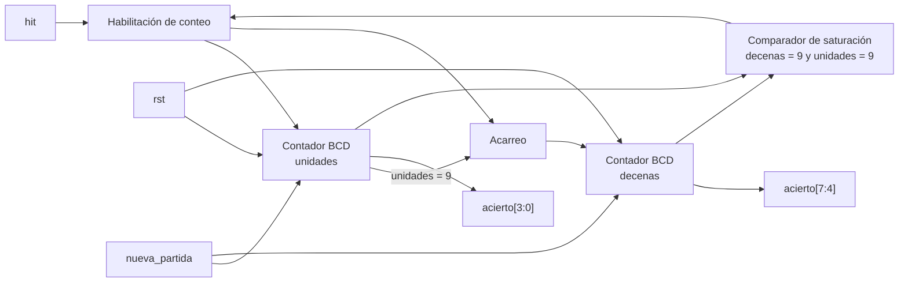

# M5: Hit_Counter

## f) Relación con otros módulos

El módulo recibe de la FSM el mismo pulso hit que consume Time_Logic para reducir la ventana y que Fail_Counter usa para reiniciar su cuenta de fallos consecutivos, de modo que las tres reacciones a un golpe correcto ocurren en el mismo ciclo de reloj y quedan consistentes entre sí. Su salida `acierto[7:0]` alimenta directamente los dos displays de aciertos del módulo Marcador, que solo debe decodificar cada dígito a siete segmentos y multiplexarlos. La FSM lo pone en cero con nueva_partida al iniciar una partida nueva luego del tercer fallo consecutivo, y el reinicio manual llega por rst.

## g) Explicación de funcionamiento

El módulo es un contador BCD de dos dígitos que avanza una única vez por cada pulso hit. El dígito de unidades, ubicado en `acierto[3:0]`, cuenta de cero a nueve y al desbordarse vuelve a cero y habilita el avance del dígito de decenas, ubicado en `acierto[7:4]`, de forma que la salida siempre representa un valor decimal válido. Al llegar a 99 el contador se satura y conserva su valor ante nuevos aciertos, con lo cual el marcador nunca despliega un valor fuera del ámbito especificado ni vuelve a cero a mitad de partida. Las entradas rst y nueva_partida tienen prioridad sobre el incremento y devuelven ambos dígitos a cero.

## h) Diseño

Se lleva la cuenta directamente en BCD y no en binario natural porque el destino del dato son dos displays de siete segmentos independientes, y un contador binario obligaría a intercalar un convertidor binario a decimal del tipo double dabble entre el contador y el marcador. Con la representación BCD cada dígito se resuelve con un contador de cuatro bits y un comparador con el valor nueve, y el acarreo entre dígitos es simplemente la coincidencia del dígito de unidades con ese valor durante un pulso hit. La saturación se implementa inhibiendo el incremento cuando ambos dígitos valen nueve, y el pulso hit actúa como habilitación y no como reloj, con lo cual el módulo permanece en el dominio del reloj principal y la lógica queda descrita sin ramas incompletas que infieran latches.

| acierto[7:4] | acierto[3:0] | Siguiente acierto[7:4] | Siguiente acierto[3:0] |
|---|---|---|---|
| 0 a 9 | 0 a 8 | sin cambio | acierto[3:0] + 1 |
| 0 a 8 | 9 | acierto[7:4] + 1 | 0 |
| 9 | 9 | 9 | 9 |

## i) Diagrama detallado del diseño

