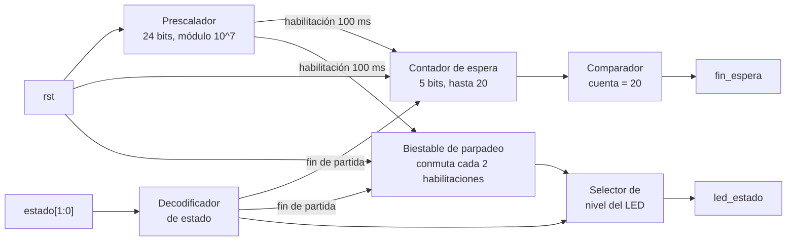

# M7: estado_juego

## f) Relación con otros módulos

El módulo recibe de la FSM la palabra `estado[1:0]`, que codifica en cuál de las situaciones de la partida se encuentra el sistema, y es el único bloque que traduce esa información a algo visible para el jugador por medio de `led_estado`. Como el estado de fin de partida debe sostenerse al menos 2 s antes del reinicio automático, el módulo mide ese intervalo con su propia base de tiempo y devuelve `fin_espera` a la FSM, que es la señal que habilita la transición hacia la partida nueva. No tiene relación directa con `time_logic`, `hit_counter` ni `fail_counter`, ya que toda la coordinación pasa por la FSM, y tampoco comparte líneas con el módulo `marcador` porque este atiende los displays de siete segmentos y no el LED de estado.

## g) Explicación de funcionamiento

El módulo decodifica `estado[1:0]` en tres condiciones visibles. Con la partida activa el LED permanece encendido de forma fija, con la partida terminada el LED parpadea, y en la condición de reposo posterior a un reinicio manual el LED permanece apagado, de modo que el jugador distingue sin ambigüedad si puede jugar o si la partida acaba de terminar. Al entrar en el estado de fin de partida arranca un contador que mide 2 s sobre la base de tiempo interna y al vencer activa `fin_espera` durante un ciclo de reloj, señal que la FSM usa para reiniciar el juego automáticamente, mientras que si la FSM abandona ese estado antes por un reinicio manual el contador se descarta. La misma base de tiempo genera el parpadeo, de forma que el LED cambia de nivel cada 200 ms y el jugador percibe una indicación claramente distinta del encendido fijo.

## h) Diseño

Se decide usar tres condiciones visibles y no dos porque un LED simplemente apagado se confunde con un sistema sin alimentación, mientras que el parpadeo identifica el fin de partida de forma inequívoca y cumple el requisito de que el estado sea claramente distinguible. La base de tiempo interna es una habilitación de reloj de 100 ms obtenida con un prescalador de 24 bits sobre el reloj de 100 MHz, igual que en `time_logic`, con lo cual no se generan relojes derivados. Esa resolución cubre las dos necesidades del módulo con un solo contador, ya que el intervalo de fin de partida corresponde a veinte habilitaciones y el semiperíodo del parpadeo a dos, de manera que basta un contador de cinco bits y un biestable de conmutación. Se decide medir los 2 s en este módulo y no en la FSM para que el control path no incorpore contadores largos, criterio que se aplicó también en `fail_counter`.

Decodificación de `estado[1:0]`:

| `estado[1:0]` | Condición | `led_estado` | Contador de 2 s |
|---|---|---|---|
| 00 | Reposo tras reinicio | 0 | detenido en cero |
| 01 | Partida activa | 1 | detenido en cero |
| 10 | Fin de partida | parpadeo a 2,5 Hz | habilitado |
| 11 | No utilizado | 0 | detenido en cero |

## i) Diagrama detallado del diseño

Tabla de verdad de la lógica de control, con prioridad de arriba hacia abajo:

| `rst` | `estado[1:0]` = fin de partida | habilitación 100 ms | Contador de espera | Contador siguiente | `fin_espera` | Biestable de parpadeo |
|---|---|---|---|---|---|---|
| 1 | X | X | X | 0 | 0 | 0 |
| 0 | 0 | X | X | 0 | 0 | 0 |
| 0 | 1 | 0 | X | sin cambio | 0 | sin cambio |
| 0 | 1 | 1 | < 20 | cuenta + 1 | 0 | conmuta cada 2 habilitaciones |
| 0 | 1 | 1 | 20 | sin cambio | 1 | conmuta cada 2 habilitaciones |

Si hay reset, el contador de espera y el parpadeo vuelven a cero. Si el estado no es de fin de partida, el contador se mantiene en cero y no pasa nada más. Si sí es fin de partida pero todavía no llega la habilitación de cada cien milisegundos, todo se queda igual. Cuando llega esa habilitación, el contador sube uno mientras no llegue a veinte, y el parpadeo sigue cambiando cada dos veces que llega la habilitación. Al llegar a veinte se activa la señal de fin de espera, que le avisa a la FSM que ya pasaron los dos segundos.
