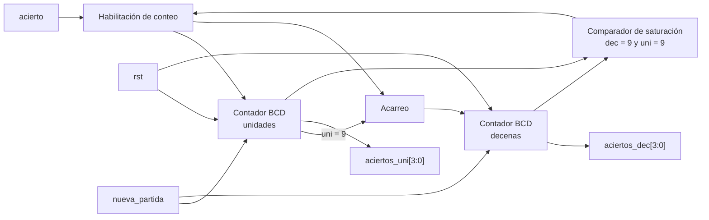

# M5: Hit_Counter

## f) Relación con otros módulos

El módulo recibe de la FSM el mismo pulso acierto que consume M4 para reducir la ventana y que M6 usa para reiniciar su cuenta de fallos consecutivos, de modo que las tres reacciones a un golpe correcto ocurren en el mismo ciclo de reloj y quedan consistentes entre sí. Sus dos salidas alimentan directamente los dos displays de aciertos del módulo Marcador, sin lógica intermedia. El módulo Estado de juego lo reinicia con nueva_partida cuando arranca una partida nueva tras el tercer fallo consecutivo.

## g) Explicación de funcionamiento

El módulo es un contador BCD de dos dígitos que avanza una única vez por cada pulso de acierto. El dígito de unidades cuenta de cero a nueve y al desbordarse vuelve a cero y habilita el avance del dígito de decenas, de forma que la pareja de salidas siempre representa un valor decimal válido. Al llegar a 99 el contador se satura y conserva su valor ante nuevos aciertos, con lo cual el marcador nunca despliega un valor fuera del ámbito especificado ni vuelve a cero a mitad de partida. Las entradas rst y nueva_partida tienen prioridad sobre el incremento y devuelven ambos dígitos a cero.

## h) Diseño

Se lleva la cuenta directamente en BCD y no en binario natural porque el destino del dato son dos displays de siete segmentos independientes, y un contador binario de siete bits obligaría a intercalar un convertidor binario a decimal del tipo double dabble entre el contador y el marcador. Con la representación BCD cada dígito se resuelve con un contador de cuatro bits y un comparador con el valor nueve, y el acarreo entre dígitos es simplemente la coincidencia del dígito de unidades con ese valor durante un pulso de acierto. La saturación se implementa inhibiendo el incremento cuando ambos dígitos valen nueve, y el pulso acierto actúa como habilitación y no como reloj, con lo cual el módulo permanece en el dominio del reloj principal y la lógica queda descrita sin ramas incompletas que infieran latches.

| aciertos_dec | aciertos_uni | Siguiente aciertos_dec | Siguiente aciertos_uni |
|---|---|---|---|
| 0 a 9 | 0 a 8 | sin cambio | aciertos_uni + 1 |
| 0 a 8 | 9 | aciertos_dec + 1 | 0 |
| 9 | 9 | 9 | 9 |

## i) Diagrama detallado del diseño

