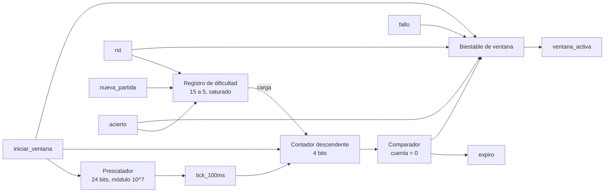

# M4: Time_Logic

## f) Relación con otros módulos

La FSM abre la ventana con iniciar_ventana una vez que M1 entregó la posición del topo, y la cierra devolviendo acierto o fallo según lo que reporte M3, de modo que M4 nunca evalúa pulsaciones por su cuenta sino que solo mide el tiempo disponible. La salida expiro es la que permite a la FSM resolver el turno como fallo cuando el jugador no responde, y por esa vía alimenta indirectamente a M6. El módulo Estado de juego consume tick_100ms para medir los 2 s del estado de fin de partida y devuelve nueva_partida para restablecer la dificultad, con lo cual existe una única base de tiempo en todo el subsistema.

## g) Explicación de funcionamiento

El módulo mantiene un registro de dificultad con la cantidad de intervalos de 100 ms que dura la ventana y un contador descendente que mide el turno en curso. Con el pulso iniciar_ventana el contador se carga con el valor del registro de dificultad, ventana_activa pasa a uno y el prescalador se reinicia para que el primer intervalo sea completo, luego de lo cual el contador descuenta una unidad por cada activación de tick_100ms. Al llegar a cero se emite expiro y ventana_activa vuelve a cero, y lo mismo ocurre antes de tiempo si llegan acierto o fallo, con la diferencia de que acierto además decrementa el registro de dificultad mientras este sea mayor que su valor mínimo. Solo rst y nueva_partida devuelven ese registro a su valor inicial, de manera que la dificultad se conserva dentro de la partida aunque el jugador falle.

## h) Diseño

Se escoge una resolución de 100 ms porque todas las duraciones exigidas son múltiplos exactos de ese valor, con lo cual la ventana completa se mide con un contador descendente de cuatro bits cargado entre 15 y 5 y no se acumula error de redondeo. El prescalador que genera tick_100ms queda fijado por la frecuencia de la tarjeta,

$$N_{presc} = 100 \times 10^6 \cdot 0{,}1 = 10^7, \qquad 2^{23} < 10^7 \le 2^{24}$$

por lo que se implementa con un contador de 24 bits que activa la habilitación durante un solo ciclo, lo cual evita generar relojes derivados. El registro de dificultad es un contador descendente saturado en 5, y como el enunciado establece que un fallo no devuelve la ventana a su valor inicial, la reducción resulta monótona dentro de la partida y la cuenta de aciertos consecutivos produce la misma secuencia que la de aciertos acumulados, así que un solo registro la representa.

| Aciertos consecutivos | Carga del contador | Duración de la ventana |
|---|---|---|
| 0 | 15 | 1500 ms |
| 1 | 14 | 1400 ms |
| 2 | 13 | 1300 ms |
| 3 | 12 | 1200 ms |
| 4 | 11 | 1100 ms |
| 5 | 10 | 1000 ms |
| 6 | 9 | 900 ms |
| 7 | 8 | 800 ms |
| 8 | 7 | 700 ms |
| 9 | 6 | 600 ms |
| 10 o más | 5 | 500 ms |

## i) Diagrama detallado del diseño

