# Nivel 1

## Objetivos

- Implementación del juego tipo _whack a mole_ con 8 posibles posiciones. En cada turno se seleccionará de forma pseudoaleatoria una posición activa y al jugador se le
dará una ventana de tiempo para reaccionar y presionar el botón correspondiente en la matriz de botones. Se llevará
el conteo de aciertos y fallos con el fin de que la dificultad pueda escalar de manera progresiva. La partida termina
una vez el jugador se equivoque tres veces consecutivas
- La ventana de tiempo arranca en 1.5 s y baja 100 ms por cada acierto consecutivo, con un piso de 500 ms. Un fallo no la devuelve a su valor inicial.
- Los contadores de aciertos y fallos van de 00 a 99 y se muestran al mismo tiempo.
- El jugador tiene 3 fallos consecutivos por partida. Un acierto reinicia esa cuenta.

## Descripciones

### Entradas

1. `clk` (100 MHz, viene de la tarjeta)
2. Pulsaciones de los 8 botones externos, uno por cada posición
3. `rst` (botón central de la tarjeta)

### Salidas

1. Posición del topo (en alguno de los 8 LEDs)
2. Marcador de aciertos y fallos (disp. 7 segmentos)
3. Estado de la partida (1 LED)

El jugador observa cuál de los 8 LEDs está encendido y tiene que presionar el botón asignado a esa posición antes
de que se acabe el tiempo en ese turno. Si el jugador acierta, sube el marcador **y** se reduce la ventana de tiempo para el turno siguiente.
En el caso de que el jugador falle o simplemente no haya ninguna pulsación a un botón, incrementa el contador de fallos.
Tres fallos consecutivos terminan la partida.

Se señalará que la partida está finalizada mediante un solo LED de estado y el juego se reiniciará automáticamente después
de un intervalo de tiempo.

En este nivel no se muestra nada de lo que pasa por dentro. Ni el enlace serial, ni la solicitud de topo,
ni las bases de tiempo internas aparecen acá, porque son parte de la solución y no de lo que el jugador ve.

### Diagrama

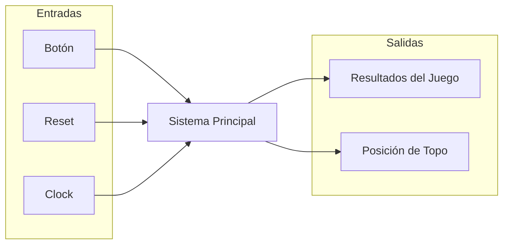

# Nivel 2

## Objetivos

- Subdividir el bloque único del primer nivel en los módulos generales que conforman la solución.
- Establecer que cada subsistema genera su propia base de tiempo.

### Bloque 1: Subsistema discreto

- Decidir de forma pseudoaleatoria cuál de las ocho posiciones corresponde al topo en cada turno.
- Indicar visualmente la posición generada.
- Transmitir dicha posición al subsistema de control mediante un enlace serial (TX).

### Bloque 2: Subsistema de control (FPGA)

- Administrar la lógica del juego como turnos, ventana de tiempo, dificultad progresiva, conteo de aciertos/fallos, vidas y reinicio.
- Desplegar el marcador.

### Diagrama

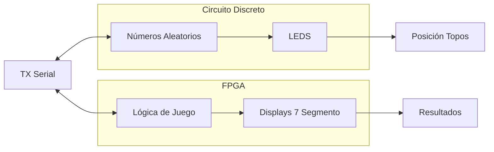

## Descripciones

### Bloque 1: Subsistema discreto
Genera una nueva posición pseudoaleatoria de 3 bits para cada solicitud recibida, la muestra
mediante un LED individual y la transmite en formato serial al subsistema de control.

**Entradas**

- `solicitud_topo`: Viene de FPGA; Pulso que ordena avanzar a una nueva posición.
- `VCC`: Viene de la fuente; Alimentación de 5 V de la fuente.

**Salidas**

- `pos_topo[7:0]`: Va al jugador; Son 8 bits porque son 8 LEDs. Un LED encendido significa que esa es la posición.
- `TX`: Va hacia la FPGA; Línea serial que contiene la posición generada.

`clk` NO aparece como una entrada porque el enunciado dice que no se pueden compartir relojes entre estos dos subsistemas.
El bloque tiene que avanzar una sola vez por cada solicitud y no de forma continua. Como la solicitud llega
asíncrona respecto a la base de tiempo local, hace falta lógica de control interna que la convierta en un
único evento de avance.

Una vez que se genera la posición, se entrega a dos lados. Por un lado a la indicación visual,
que enciende el LED que toca. Por el otro al transmisor serial, que la empaqueta en una trama y la manda a la FPGA.
El LED activo se queda encendido hasta que llegue la siguiente solicitud, así que siempre hay exactamente
una posición visible. El subsistema discreto nunca se entera de si el jugador acertó o falló, y tampoco lo necesita.

### Bloque 2: Subsistema de control (FPGA)

Implementa toda la lógica del juego a partir de la posición recibida y de las
pulsaciones del jugador, y presenta el marcador y el estado de la partida.

**Entradas**

- `clk`: Viene de la Tarjeta; Reloj único de 100 MHz, referencia de tiempo de todo el subsistema.
- `rst`: Viene del botón en la FPGA; Reinicia el juego de forma manual en cualquier momento.
- `btn_golpe[7:0]`: Viene del jugador; Son 8 bits porque son 8 pulsadores externos, uno por posición, conectados por GPIO en líneas independientes.
- `TX`: Viene de la protoboard; Línea serial que trae la posición del topo.

**Salidas**

- `solicitud_topo`: Va hacia la protoboard; Pulso que pide una nueva posición al inicio de cada turno.
- `display[3:0]`: Va hacia el jugador; Son 4 displays de 7 seg, dos dígitos para los aciertos acumulados y dos para los fallos acumulados. Debería de ir desde 0 a 99.
- `led_estado`: Va hacia el jugador; Indica si la partida está activa o terminada (1 bit).

Este subsistema es el que coordina la secuencia del juego. Ninguna otra parte decide cuándo pedir un topo
ni qué cuenta como acierto. Sus entradas externas, o sea los pulsadores y el botón de reinicio, vienen de
fuentes que no tienen relación con el reloj de 100 MHz, así que antes de usarlas hay que pasarlas por una
etapa de acondicionamiento que resuelva la metaestabilidad y los rebotes.

### Interfaz

- `TX`: Protoboard -> FPGA; Trama UART 8N1 de 1 bit de inicio, 8 bits de datos y 1 bit de parada. La posición del topo va en los 3 bits menos significativos y los 5 restantes se fijan en cero.
- `solicitud_topo`: FPGA -> Protoboard; Pulso simple en línea dedicada que indica el evento de siguiente topo. No es una trama serial.

El enlace serial no es como tal un tercer subsistema. El transmisor se implementa con lógica
discreta dentro del protoboard y el receptor se describe en SystemVerilog dentro de la FPGA.

# Nivel 3


# Subsistema FPGA

## Objetivo

 Se encarga de controlar la lógica del juego por medio de la máquima de estado para comunicar cada modulo entre sí.

## Entradas

- `clk`: frecuencia de reloj a 100MHz que controla los flancos de las señales que utiliza todo el sistema.
- `rst`: señal que reinicia la partida y la FSM, así como volver cada módulo a sus valores iniciales.
- `Botones[7:0]`: señal de los 8 botones físicos que actúan como pulsadores para golpear al topo.
- `pos_topo_lfsr[2:0]`: Señal paralela de 3 bits que proviene directamente del LFSR del subsistema discreto, la cual reemplaza a la entrada serial externa original debido a la inestabilidad del reloj 555 del protoboard[cite: 17, 21, 22].

## Salidas

- `LEDs topos [7:0]`: Muestra mediante la matriz LED 4x2 al topo en la posición indicada de acuerdo al número generado por la LSFR, muestra un LED encendido a la vez.
- `led_state`: Un LED que muestra el estado de la partida, si se encuentra en medio de un juego (encendido) o si finalizó la partida (parpadeando).
- `acierto[7:0]`: valor numérico de 0 a 99 en BCD que muestra la cantidad de veces que el jugador acertó, el cual va directamente a los displays.
- `fallo[7:0]`: valor numérico de 0 a 99 en BCD que acumula la cantidad de veces que el jugador falló, el cual va directamente a los displays.
- 
## Explicación General

La señal paralela `pos_topo_lfsr[2:0]` ingresa al módulo `t_uart` (M9) que la empaqueta y transmite como una trama serial en un *loopback* interno para evadir la inestabilidad del hardware discreto. Esta trama se recibe y decodifica por medio del módulo `Receptor_UART` (M1) en una señal retenida `pos_topo[2:0]`. La FSM verifica la posición y la muestra con LEDs mediante el módulo `Show_Mole`. La FSM en cada turno toma la señal de los botones mediante el módulo `Press_btn` y compara si se presionó el botón correcto dentro de la ventana de tiempo estipulada por el módulo `Time_Logic`. 

En caso de que sea correcto, la FSM emite `hit`, lo que hace que `Time_Logic` decrezca la ventana de tiempo en 100ms (hasta un piso de 500ms) y que `Hit_Counter` aumente el valor del contador mostrado. En caso de fallar o agotarse el tiempo, la FSM emite `miss`, lo que hace que `Fail_Counter` aumente el valor de fallos acumulados y evalúe internamente si se llegó a 3 fallos consecutivos para emitir `fin_partida`. Si ocurre un acierto, el contador interno de consecutivos se reinicia. 
Durante toda la partida, se muestra el estado de la misma con el módulo de Estado de juego (`State`), que indica si la partida está activa (`f_state_play`) o finalizada (`f_state_gameover`) con una ventana de 2 segundos de espera antes del reinicio automático.

## Módulos

- M1. Módulo Receptor_UART
- M2. Módulo Show_Mole
- M3. Módulo Press_btn
- M4. Módulo Time_Logic
- M5. Módulo Hit_Counter
- M6. Módulo Fail_Counter
- M7. Módulo State

## Diagrama de bloques

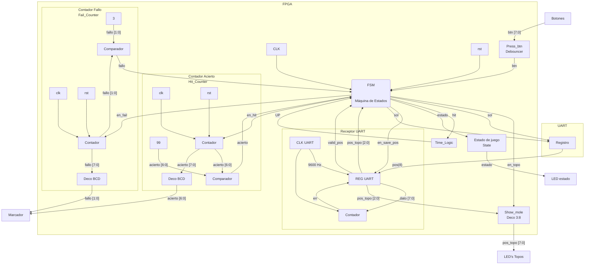

## Diagrama de Flujo


## Máquina de estados


### M1: Receptor UART
**a) Objetivo:** Recibir la trama serial interna enviada por `t_uart` para entregarla decodificada a la FSM y al visualizador cuando se solicita.
**b) Entradas:** `pos(8)_sync` / `rx` (Línea serial en loopback), `rst`, y `en_save_pos` (habilitador para retener la posición decodificada).
**c) Salidas:** `pos_topo[2:0]` (posición retenida) y `valid_pos` (pulso de confirmación de trama).
**d) Funcionamiento y Diseño:** Emplea un sincronizador de dos etapas y cuenta intervalos de baudios a partir del bit de inicio, capturando a la mitad del pulso (`N/2 - 1`) para evitar metaestabilidad. Si la trama 8N1 es válida, emite el pulso y guarda los 3 LSB.

### M2: Show_Mole
**a) Objetivo:** Mostrar en la matriz LED 4x2 al topo activo.
**b) Entradas:** `pos_topo[2:0]` (desde M1) y `en_topo` (habilitación de FSM).
**c) Salidas:** `leds_topo[7:0]` (señal one-hot física).
**d) Funcionamiento y Diseño:** Actúa como decodificador combinacional puro de 3 a 8 bits. Si `en_topo` es 0, todo se apaga.

### M3: press_btn
**a) Objetivo:** Filtrar rebotes de los pulsadores físicos y entregar la posición presionada para validarla.
**b) Entradas:** `Botones[7:0]`, `clk`, `rst`, y `pos_topo[2:0]`.
**c) Salidas:** `valid` (acierto) y `miss` (fallo).
**d) Funcionamiento y Diseño:** Pasa cada botón por un sincronizador de 2 etapas y un filtro anti-rebote (contador de ~10ms). Un codificador 8:3 de prioridad extrae la posición y la compara internamente con `pos_topo`.

### M4: Time_Logic
**a) Objetivo:** Controlar la cuenta regresiva del turno y reducir la ventana por cada acierto consecutivo.
**b) Entradas:** `clk`, `rst`, `inicio` (abre ventana), `hit` (reduce ventana), `rst_window`, `rst_dificulty`, `nueva_partida`.
**c) Salidas:** `UP` (bandera de expiración).
**d) Funcionamiento y Diseño:** Usa un prescalador a 100ms. La dificultad empieza en 1.5s y baja monótonamente hasta 500ms al recibir `hit`. Si llega a 0 emite `UP` durante un ciclo.

### M5: Hit_Counter
**a) Objetivo:** Contabilizar los aciertos acumulados en formato BCD.
**b) Entradas:** `clk`, `rst`, `hit`, y `nueva_partida`.
**c) Salidas:** `acierto[7:0]`.
**d) Funcionamiento y Diseño:** Contador de dos dígitos BCD que incrementa unidades y acarrea decenas al desbordarse en 9. Se satura en el tope configurado (ej. 99).

### M6: fail_counter
**a) Objetivo:** Contar los fallos para el marcador y evaluar la condición de fin de partida (3 consecutivos).
**b) Entradas:** `clk`, `rst`, `miss`, `hit`, `nueva_partida`.
**c) Salidas:** `fallo[7:0]` y `fin_partida`.
**d) Funcionamiento y Diseño:** Mantienen una cuenta BCD acumulada (que se incrementa con `miss`) y una cuenta binaria interna consecutiva. `fin_partida` es un cálculo combinacional que se activa asíncronamente al 3er fallo.

### M7: estado_juego
**a) Objetivo:** Indicar el estado visual y temporizar los 2 segundos de fin de partida.
**b) Entradas:** `clk`, `rst`, `f_state_play`, `f_state_gameover`.
**c) Salidas:** `led_state` y `fin_espera`.
**d) Funcionamiento y Diseño:** Si es *play*, LED fijo. Si es *gameover*, activa un prescalador de 100ms que hace parpadear el LED y cuenta hasta 20 (2 segundos) para emitir el pulso `fin_espera`.

### M8: Máquina de Estados FSM
**a) Objetivo:** Orquestar todos los módulos mediante una máquina de estados de Moore.
**b) Estados Principales:** 
- **INICIO (000):** Emite resets a tiempos y dificultades.
- **SOL_POS (001):** Dispara `en_numAleatorios` (para M9).
- **ESP_UART (010):** Espera trama; al recibirla activa `en_save_pos`.
- **JUGAR (011):** Emite `inicio`. Transita a ACIERTO si `valid`, o a FALLO si `miss`/`UP`.
- **ACIERTO (100):** Emite `hit`.
- **FALLO (101):** Emite `miss`. Evalúa si debe ir a FIN o retornar.
- **FIN (110):** Espera 2s (`fin_espera`) y emite `nueva_partida`.

### M9: t_uart (Transmisor interno)
**a) Objetivo:** Recibir los 3 bits paralelos del LFSR discreto y convertirlos en trama UART 8N1 emulando al hardware discreto inestable.
**b) Entradas:** `pos_topo_lfsr[2:0]`, `start`, `clk`, `rst`.
**c) Salidas:** `tx` (hacia `Receptor_UART`) y `busy`.
**d) Funcionamiento y Diseño:** Almacena la petición en un flip-flop de reserva (pending). Desplaza la trama (5 bits en 0 y 3 LSB de posición) a 9600 baudios usando una base de tiempo propia.

# Nivel 4

## Diagrama de cuarto nivel: subsistema discreto

### Módulos

- M1: Generador de reloj de baudios
- M2: Control de avance y modo
- M3: Generador pseudoaleatorio de posición
- M4: Decodificador de posición e indicadores
- M5: Acondicionamiento de la línea de transmisión

### Señales

- `CLK_TX`, reloj de baudios producido por M1
- `avance`, pulso que hace desplazar un estado al generador, producido por M2
- `modo`, selección entre carga y desplazamiento del registro, producida por M2
- `Q1` a `Q4`, salidas de las cuatro etapas del generador
- `pos[2:0]`, palabra de posición del topo, formada por `Q4`, `Q3` y `Q2`
- `solicitud_topo`, línea de solicitud proveniente de la FPGA
- `QH`, salida serie del registro de transmisión
- `TX`, línea serial hacia la FPGA


## M1: Generador de reloj de baudios

Corresponde al bloque de reloj interno del subsistema de transmisión del tercer nivel, donde aparece como la fuente de temporización del registro serial.

### f) Explicación de la relación con otros módulos

Este módulo no recibe señal de ningún otro y entrega su salida al registro de transmisión M5 y al control de avance y modo M2. La relación es unidireccional y de tipo control, ya que M1 impone el ritmo al que M5 desplaza sus bits y ninguno de los dos receptores puede modificarlo ni detenerlo. No tiene relación con M3, M4 ni M5, y tampoco comparte ninguna señal con la FPGA, tal como exige el enunciado cuando pide que ambos subsistemas operen con referencias de tiempo separadas.

### g) Explicación de funcionamiento

El temporizador opera en configuración astable. El capacitor de temporización se carga a través de las dos resistencias hasta alcanzar dos tercios de la alimentación. En ese instante el comparador de umbral conmuta el biestable interno, la salida cae a nivel bajo y el transistor de descarga entra en conducción, lo que permite que el capacitor se descargue a través de una sola de las resistencias hasta caer por debajo de un tercio de la alimentación, donde el ciclo se repite de forma indefinida. La asimetría del ciclo de trabajo proviene de que la carga recorre ambas resistencias mientras que la descarga recorre solo una.

### h) Diseño

Se requiere una señal periódica de frecuencia fija generada sin ningún dispositivo programable. El astable con temporizador integrado es la solución con menor cantidad de componentes que lo cumple, frente al oscilador de anillo con inversores, muy sensible a la alimentación y a la temperatura, y frente al oscilador de cristal con divisor, de mejor estabilidad pero con un encapsulado adicional y una red de división. La frecuencia queda determinada por la red resistiva y capacitiva externa. Se fija en 9600 baudios por ser una velocidad normalizada, lo suficientemente baja para generarse de forma confiable con un 555 y lo suficientemente rápida para no introducir una latencia perceptible entre la solicitud de topo y la recepción de la posición en la FPGA.

$$f = \frac{1{,}44}{(R_1 + 2R_2)\cdot C_1}$$

El factor 1,44 corresponde a $1/\ln(2)$ y proviene del carácter exponencial de la carga y la descarga del capacitor de temporización.

#### Justificación de la velocidad y tolerancia de error entre los dos relojes

Como el protoboard y la FPGA no comparten reloj, el receptor UART de la FPGA no conoce la fase del oscilador 555: solo detecta el flanco de bajada del bit de inicio y, a partir de ese instante, cuenta sus propios intervalos de bit (generados dividiendo su reloj de 100 MHz) para ubicar el centro de cada uno de los bits siguientes. Con una trama 8N1 (1 bit de inicio, 8 de datos, 1 de parada) el bit más alejado de esa referencia es el de parada, cuyo centro cae, en el reloj de la FPGA, a $9{,}5\,T$ del flanco detectado, con $T$ el período de bit nominal.

Si el oscilador del protoboard tiene un error relativo $\varepsilon$ respecto al valor nominal, la trama real que transmite dura $9{,}5\,T\,(1+\varepsilon)$ hasta el centro del bit de parada. La FPGA sigue muestreando en $9{,}5\,T$, de modo que el desfase acumulado en ese instante es

$$\Delta t = 9{,}5\,T\cdot\varepsilon$$

Para que la FPGA todavía muestree dentro del bit de parada y no se corra hacia el bit anterior o hacia un eventual bit de inicio siguiente, ese desfase debe mantenerse por debajo de medio período de bit, $T/2$. Esto acota el error tolerado del oscilador discreto:

$$|\varepsilon| < \frac{T/2}{9{,}5\,T} = \frac{1}{19} \approx 5{,}3\,\%$$

El reloj de 100 MHz de la FPGA proviene de un oscilador de cristal de la tarjeta (típicamente de algunas decenas de ppm de error), por lo que su aporte a $\varepsilon$ es despreciable frente al del 555; prácticamente todo el presupuesto de error lo consume el oscilador discreto. Por margen de diseño, se toma la mitad del límite teórico como tolerancia de trabajo, dejando reserva para la incertidumbre del propio cálculo y para la latencia de dos ciclos de reloj (20 ns, insignificante frente a los 104 µs de un bit) que introduce el sincronizador de dos etapas de la entrada RX:

$$|\varepsilon|_{\text{diseño}} < 2{,}5\,\%$$

Un 555 con resistencias de precisión al 1 % y un capacitor de baja deriva (poliéster o NPO, no electrolítico) mantiene la frecuencia dentro de ese 2,5 % sin necesidad de ajuste ni calibración, mientras que resistencias comerciales al 5 % agotarían casi todo el margen calculado y se descartan. Por esta razón el diseño exige tolerancia del 1 % en $R_1$ y $R_2$ como parte de la especificación de M1, no solo como recomendación.

| Parámetro | Valor / tolerancia | Aporte al error |
|---|---|---|
| Reloj FPGA (cristal de la tarjeta) | ~tens de ppm | despreciable |
| $R_1$, $R_2$ (especificados) | 1 % | domina $\varepsilon$ |
| $C_1$ (poliéster o NPO) | ~5 % típico, estable en temperatura | contribuye a $\varepsilon$ |
| Error total de diseño admitido | — | $< 2{,}5\,\%$ (límite teórico: $5{,}3\,\%$) |

#### Uso de módulos integrados

- Oscilador astable NE555

### i) Diagrama esquemático detallado

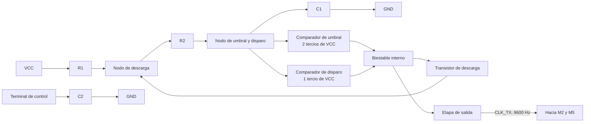

### j) Diagrama completo de conexiones eléctricas


Temporizador con la red de temporización formada por las dos resistencias y el capacitor conectado al nodo de umbral y disparo. El capacitor del terminal de control desacopla el divisor interno de referencia. La salida entrega `CLK_TX` hacia M2 y M5.


## M2: Control de avance y modo

Corresponde al bloque de control del tercer nivel, ubicado en la entrada del subsistema, donde recibe la solicitud de la FPGA y la convierte en las señales internas que ordenan el resto de los módulos.

### f) Explicación de la relación con otros módulos

Este módulo es el único punto de entrada del subsistema discreto y traduce una petición externa en dos eventos internos ordenados en el tiempo. Recibe la línea de solicitud desde la FPGA y el reloj de baudios desde M1, entrega el pulso de avance al generador pseudoaleatorio M3 y entrega la señal de modo al registro de transmisión M5 y al acondicionamiento de línea M5. Al separar el avance del cambio de modo, este módulo garantiza que la posición ya esté actualizada cuando el registro la captura, lo que resuelve el orden entre generación y transmisión dentro de un mismo turno.

### g) Explicación de funcionamiento

La señal que llega de la FPGA se hace pasar primero por un búfer que restaura el nivel lógico del dominio de 3,3 V al de 5 V del protoboard. El flanco de subida de la señal así acondicionada ataca directamente el reloj del generador pseudoaleatorio, lo que produce exactamente un desplazamiento por cada solicitud recibida y elimina cualquier avance continuo. La misma señal alimenta además la entrada de dato de un flip-flop gobernado por el reloj de baudios, cuya salida es la señal de modo.

Ese flip-flop introduce un retardo deliberado de un tiempo de bit entre la llegada de la solicitud y el cambio de modo del registro. En el flanco de baudios en que el flip-flop captura la solicitud, el registro todavía está en modo de carga y toma la posición recién generada, y solo a partir del flanco siguiente comienza a desplazar. Sin ese retardo el registro habría cargado la posición anterior, porque la carga ocurre antes de que el generador avance.

### h) Diseño

El enunciado exige que el generador avance una única vez por cada solicitud recibida y no de forma continua, lo que descarta cualquier oscilador libre atacando el generador y obliga a derivar el avance de la propia solicitud. Como la solicitud proviene de una salida sincrónica de la FPGA y no de un contacto mecánico, el flanco llega limpio y no se requiere filtrado de rebotes, de modo que basta con acondicionar el nivel y usar el flanco directamente. El resto del módulo resuelve el orden entre los dos eventos, y para ello se emplea un solo flip-flop tipo D que retemporiza la solicitud con el reloj de baudios, alternativa preferida frente a una red de retardo con resistencia y capacitor porque el instante del cambio de modo queda determinado por el mismo reloj que gobierna el registro y no por una constante de tiempo sujeta a tolerancia.

#### Secuencia de eventos por solicitud

| Instante | Evento | Efecto |
|---|---|---|
| Flanco de subida de la solicitud | Avance del generador | La posición cambia al siguiente estado del ciclo |
| Primer flanco de baudios posterior | Carga del registro y subida de modo | El registro captura la posición nueva |
| Flancos de baudios siguientes | Desplazamiento | La trama sale por la línea serial |
| Flanco de bajada de la solicitud | Bajada de modo | El registro vuelve a carga y la línea queda en reposo |

#### Tabla de verdad del flip-flop de modo

| solicitud_topo | CLK_TX | modo siguiente |
|---|---|---|
| 0 | Flanco de subida | 0 |
| 1 | Flanco de subida | 1 |
| X | Sin flanco | Sin cambio |

#### Uso de módulos integrados

- Búfer 74HCT125, un elemento de cuatro, para restaurar el nivel de la solicitud
- Flip-flop tipo D 74LS74, un elemento de dos, para la señal de modo

El 74HCT acepta umbrales de entrada compatibles con TTL y entrega salidas de 5 V plenos, que es lo que necesita el reloj del generador para conmutar con margen. El 74LS74 aporta el flip-flop tipo D disparado por flanco de subida que requiere la retemporización.

### i) Diagrama esquemático detallado

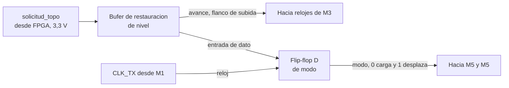

### j) Diagrama completo de conexiones eléctricas

Pendiente de incorporar al esquemático del quinto nivel.


## M3: Generador pseudoaleatorio de posición

Corresponde al bloque LFSR del tercer nivel, que allí recibe el pulso de avance y entrega la palabra `pos[2:0]` hacia el decodificador y hacia el subsistema de transmisión.

### f) Explicación de la relación con otros módulos

Este módulo recibe su pulso de avance de M2 y entrega tres de sus cuatro salidas tanto al decodificador de posición M4 como a las entradas de carga paralela del registro de transmisión M5. Es la única fuente de datos del subsistema, ya que todo lo que se enciende en el tablero y todo lo que viaja por el enlace serial se origina aquí. Que ambos destinos partan de las mismas tres líneas es lo que garantiza que el LED encendido y la posición transmitida sean siempre el mismo número.

### g) Explicación de funcionamiento

El módulo es un registro de desplazamiento de cuatro etapas encadenadas que comparten el mismo reloj. En cada flanco de subida todo el contenido se desplaza una posición de forma simultánea, mientras la primera etapa carga el resultado de una compuerta de disparidad que combina las salidas de la tercera y de la cuarta. El registro recorre así una secuencia determinista que, sin conocer la estructura interna, aparenta ser aleatoria. Existe un estado del que el registro no puede salir, porque si las cuatro etapas valen cero la compuerta de disparidad entrega cero y el registro queda detenido de forma indefinida. Ese estado queda excluido del ciclo y obliga a garantizar una inicialización distinta de cero.

Como el único flanco que recibe proviene de la solicitud, el estado del registro permanece congelado durante todo el turno. Esa quietud es la que permite que el LED del topo activo se mantenga encendido sin parpadeo y que la trama transmitida corresponda a la posición que el jugador está viendo.

### h) Diseño

El registro de desplazamiento con realimentación lineal es la solución estándar para generar una secuencia pseudoaleatoria con lógica discreta, porque entrega una secuencia de longitud conocida y demostrable con la menor cantidad de componentes. La alternativa de un contador binario con lógica de dispersión se descarta porque no ofrece garantía formal de recorrido completo y resulta mucho más fácil de anticipar para un jugador. Se toman las etapas tres y cuatro como derivaciones de realimentación.

#### Ecuación de realimentación

$$D_1 = Q_3 \oplus Q_4$$

Con estas derivaciones el registro recorre quince estados antes de repetirse, según se comprueba en la tabla de secuencia de esta misma sección.

#### Tabla de verdad de la red de realimentación

| Q3 | Q4 | D1 |
|---|---|---|
| 0 | 0 | 0 |
| 0 | 1 | 1 |
| 1 | 0 | 1 |
| 1 | 1 | 0 |

#### Ecuaciones de estado siguiente

El signo más indica estado siguiente. $Q_3$ es el valor que la etapa tiene en el momento actual y $Q_3^{+}$ es el que tendrá después del próximo flanco de reloj.

| Etapa | Ecuación |
|---|---|
| 1 | $Q_1^{+} = Q_3 \oplus Q_4$ |
| 2 | $Q_2^{+} = Q_1$ |
| 3 | $Q_3^{+} = Q_2$ |
| 4 | $Q_4^{+} = Q_3$ |

#### Tabla de secuencia completa

Estados a partir de la semilla `1000`, con la posición decodificada como el número binario formado por Q4, Q3 y Q2 en ese orden de significancia.

| Paso | Q1 | Q2 | Q3 | Q4 | pos |
|---|---|---|---|---|---|
| 0 | 1 | 0 | 0 | 0 | 0 |
| 1 | 0 | 1 | 0 | 0 | 1 |
| 2 | 0 | 0 | 1 | 0 | 2 |
| 3 | 1 | 0 | 0 | 1 | 4 |
| 4 | 1 | 1 | 0 | 0 | 1 |
| 5 | 0 | 1 | 1 | 0 | 3 |
| 6 | 1 | 0 | 1 | 1 | 6 |
| 7 | 0 | 1 | 0 | 1 | 5 |
| 8 | 1 | 0 | 1 | 0 | 2 |
| 9 | 1 | 1 | 0 | 1 | 5 |
| 10 | 1 | 1 | 1 | 0 | 3 |
| 11 | 1 | 1 | 1 | 1 | 7 |
| 12 | 0 | 1 | 1 | 1 | 7 |
| 13 | 0 | 0 | 1 | 1 | 6 |
| 14 | 0 | 0 | 0 | 1 | 4 |
| 15 | 1 | 0 | 0 | 0 | se repite |

La posición cero aparece una sola vez por ciclo y las siete restantes aparecen dos veces, como consecuencia directa de que el estado nulo está excluido. La inicialización se resuelve con una red de encendido sobre el preset asíncrono de la primera etapa, que garantiza el estado inicial `1000`.

#### Uso de módulos integrados

- Dos 74LS74 para las cuatro etapas del registro
- 74LS86 para la red de realimentación

El 74LS74 contiene dos flip-flops tipo D disparados por flanco de subida con preset y clear asíncronos independientes, que es lo que exige la topología.

### i) Diagrama esquemático detallado

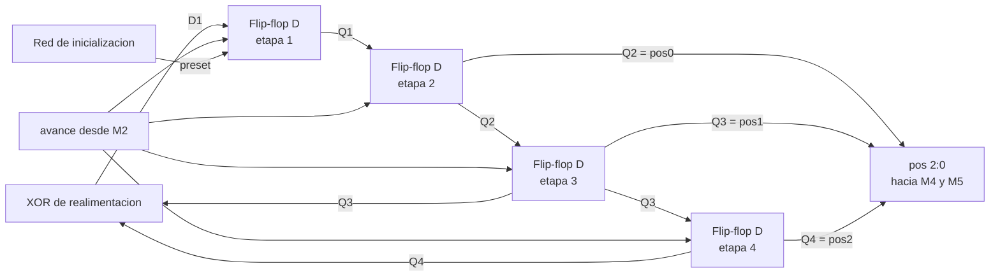

### j) Diagrama completo de conexiones eléctricas


Cadena de cuatro flip-flops tipo D con la compuerta XOR de realimentación cerrando el lazo desde las etapas tres y cuatro hacia la entrada de dato de la primera. Las cuatro etapas comparten la misma línea de reloj. Las salidas de las etapas dos, tres y cuatro forman `pos[2:0]` hacia M4 y M5.


## M4: Decodificador de posición e indicadores

Corresponde al bloque de indicación visual del tercer nivel, que allí recibe la palabra de posición y gobierna los ocho LEDs del tablero.

### f) Explicación de la relación con otros módulos

Este módulo recibe la palabra de posición de M3 y no entrega ninguna señal a otro módulo, ya que sus salidas terminan en los indicadores del tablero. Cuelga de las mismas tres líneas que alimentan al registro de transmisión M5, en paralelo con él y sin ninguna dependencia mutua, lo que hace que la indicación visual siga siendo correcta aunque el enlace serial falle. No tiene relación con M1, M2 ni M5.

### g) Explicación de funcionamiento

El decodificador interpreta sus tres entradas como un número binario y activa la salida cuya numeración coincide con ese valor, dejando las siete restantes inactivas. Sus salidas son activas en nivel bajo, de modo que cada LED se conecta con su ánodo hacia la alimentación a través de una resistencia limitadora y su cátodo a la salida correspondiente, con lo cual el LED conduce cuando su salida se activa y el integrado absorbe la corriente en lugar de entregarla.

Como el generador solo cambia de estado cuando llega una solicitud, la entrada del decodificador permanece fija durante todo el turno y el LED encendido no requiere ningún elemento de memoria adicional para mantenerse. El indicador se apaga y otro se enciende únicamente en el instante en que la FPGA pide un topo nuevo.

### h) Diseño

El requisito es activar una de ocho líneas a partir de una palabra binaria de tres bits, función que un decodificador integrado resuelve en un solo encapsulado frente a las ocho compuertas AND de tres entradas más los tres inversores que exigiría la implementación canónica, lo que ocuparía al menos cinco encapsulados. Las tres entradas de habilitación del integrado se atan de forma permanente al estado activo, ya que el bloque debe estar habilitado en todo momento, y se aprovecha la polaridad activa en bajo de las salidas para que el integrado absorba la corriente de los indicadores, régimen en el que la familia entrega mayor capacidad de manejo que en el de entrega.

#### Tabla de verdad

| pos2 | pos1 | pos0 | Salida activa | LED encendido |
|---|---|---|---|---|
| 0 | 0 | 0 | Y0 | Posición 0 |
| 0 | 0 | 1 | Y1 | Posición 1 |
| 0 | 1 | 0 | Y2 | Posición 2 |
| 0 | 1 | 1 | Y3 | Posición 3 |
| 1 | 0 | 0 | Y4 | Posición 4 |
| 1 | 0 | 1 | Y5 | Posición 5 |
| 1 | 1 | 0 | Y6 | Posición 6 |
| 1 | 1 | 1 | Y7 | Posición 7 |

La resistencia limitadora de cada LED se dimensiona para que la corriente quede por debajo de la capacidad de absorción especificada para una salida del integrado, condición que también mantiene la tensión de salida en bajo dentro del margen garantizado.

#### Uso de módulos integrados

- Decodificador 74LS138 de tres a ocho líneas
- Ocho LED individuales con su resistencia limitadora

### i) Diagrama esquemático detallado

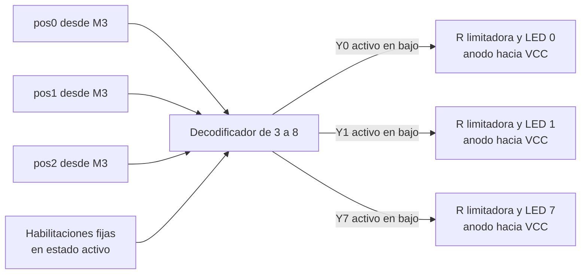

## j) Diagrama completo de conexiones eléctricas

Pendiente de incorporar al esquemático del quinto nivel.


## M5: Acondicionamiento de la línea de transmisión

Corresponde a la salida del subsistema de transmisión en el tercer nivel, en el punto donde la trama serial abandona el protoboard hacia la FPGA.

### f) Explicación de la relación con otros módulos

Este módulo recibe de M5 el flujo serial producido por el registro de desplazamiento, en relación de tipo dato, y de M2 la misma señal de modo que gobierna a M5, en relación de tipo control. Esa doble entrada es lo que permite que ambos actúen de forma coordinada, forzando el reposo mientras M5 carga y volviéndose transparente mientras M5 desplaza. Entrega a la FPGA la línea de transmisión del enlace, que es el punto de frontera eléctrica del subsistema, y no tiene relación con M1, M3 ni M4.

### g) Explicación de funcionamiento

El módulo está compuesto por un inversor y una compuerta OR de dos entradas en cascada. El inversor produce el complemento de la señal de modo y la compuerta OR lo combina con la salida serie del registro. Durante la carga, el complemento vale uno y la compuerta fuerza la salida a nivel alto sin importar el contenido del registro, dejando la línea en el estado de reposo que exige el protocolo. Durante el desplazamiento, el complemento vale cero y la compuerta reproduce fielmente el flujo serial. Sin esta lógica, la salida del registro presentaría el valor de la entrada paralela H, que está en nivel bajo, por lo que la línea quedaría en nivel bajo permanente entre trama y trama, condición que un receptor UART interpreta como ruptura del enlace y que además impediría detectar el flanco de inicio de la trama siguiente.

### h) Diseño

El requisito es forzar un nivel alto durante una condición determinada y dejar pasar la señal sin alterar durante la condición complementaria. La compuerta OR de dos entradas es la función mínima que lo cumple, porque su elemento neutro es el cero y su elemento absorbente es el uno, que coincide con el nivel de reposo requerido. La alternativa de una compuerta de tres estados, que dejaría la línea en alta impedancia durante la carga confiando el reposo a una resistencia de elevación, se descarta porque requiere igualmente un encapsulado y añade la dependencia de un componente pasivo. La adaptación entre el dominio de 5 V del protoboard y el de 3,3 V de la FPGA se resuelve con un divisor resistivo, obligatorio porque aplicar 5 V a una entrada de 3,3 V excede la tensión máxima especificada y puede dañar el pin de forma permanente.

#### Ecuación y tabla de verdad

$$TX = QH \lor \overline{modo}$$

| modo | Complemento | QH | TX | Régimen |
|---|---|---|---|---|
| 0 | 1 | 0 | 1 | Carga, reposo forzado |
| 0 | 1 | 1 | 1 | Carga, reposo forzado |
| 1 | 0 | 0 | 0 | Transmisión, bit en cero |
| 1 | 0 | 1 | 1 | Transmisión, bit en uno |

#### Uso de módulos integrados

- Inversor 74LS04, un elemento de seis
- Compuerta OR 74LS32, un elemento de cuatro

### i) Diagrama esquemático detallado

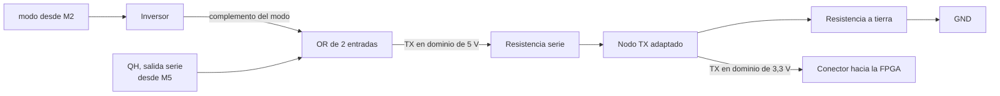

### j) Diagrama completo de conexiones eléctricas


Inversor y compuerta OR en cascada. El inversor complementa la señal de modo y la compuerta fuerza el nivel alto de reposo mientras el registro carga, dejando pasar el flujo serial durante el desplazamiento. La salida entrega `TX` hacia la FPGA.

## Diagrama de cuarto nivel: subsistema FPGA

### Módulos
  
- M1. Módulo Receptor_UART
- M2. Módulo Show_Mole
- M3. Módulo Press_btn
- M4. Módulo Time_Logic
- M5. Módulo Hit_Counter
- M6. Módulo Fail_Counter
- M7. Módulo State

# M1: Receptor UART

> **Nota de implementación (post-diseño):** el transmisor UART del subsistema discreto (74xx +
> reloj 555) no resultó confiable en la práctica. `pos(8)` descrito abajo ya no llega desde un pin
> externo de la FPGA: el LFSR discreto (funcional) se conecta directo a la FPGA por 3 líneas
> paralelas (`pos_topo_lfsr[2:0]`, puerto de `top`), y un nuevo módulo `t_uart` arma la trama 8N1
> dentro de la FPGA y la entrega en loopback interno a este receptor, que no cambió. El
> comportamiento y las tablas de este documento siguen aplicando tal cual para `r_uart`; ver
> `src/design/t_uart.sv` para el transmisor.

## f) Relación con otros módulos

`pos(8)` proviene del subsistema discreto, conectado por GPIO, y llega de forma serial siguiendo el protocolo UART. Al provenir de un reloj independiente al de la FPGA, este módulo resuelve primero la metaestabilidad mediante un sincronizador de dos etapas. La FSM general del sistema (M8), al entrar al estado `001` (`en_numAleatorios`), solicita al subsistema discreto una nueva posición; ese pulso de solicitud no forma parte de este módulo. Una vez que el subsistema discreto responde con la trama serial, este módulo la recibe y decodifica de forma autónoma, sin esperar ninguna señal de la FSM, y levanta `valid_pos` en cuanto detecta el bit de inicio, recibe los 8 bits de datos y confirma el bit de parada. La FSM permanece en el estado `010` monitoreando `valid_pos`; al recibirlo, activa `en_save_pos` para que la posición quede retenida en un registro estable, y transiciona hacia el estado de juego. `pos_topo[2:0]` se entrega tanto a la FSM (para comparar contra el botón presionado) como al módulo Show_Mole (M2), que la usa para encender el LED correspondiente. `rst` reinicia todos los elementos secuenciales del módulo a un estado conocido.

## g) Explicación de funcionamiento

`pos(8)` ingresa a un sincronizador de dos etapas para eliminar el riesgo de metaestabilidad. La señal ya sincronizada (`pos(8)_sync`) alimenta un detector de flanco de bajada, que compara el valor actual contra el valor del ciclo anterior y genera el pulso `start_bit` en el instante en que la línea pasa de `1` a `0`; ese pulso marca el inicio de una trama.

Un contador de tiempo descendente (`time_cntr`) es cargado por la FSM de control al detectar `start_bit`, con el valor `N/2 − 1` (donde `N = f_clk / baudrate` = 10417 para 9600 baudios y 100MHz de reloj), ubicándolo en el centro del bit de inicio. Al llegar a cero, la FSM evalúa `pos(8)_sync` en ese instante para confirmar que se trata de un bit de inicio válido y no de un glitch; de ser válido, recarga el contador con `N − 1` para ubicarse en el centro del primer bit de datos.

Desde ahí, cada vez que `time_cntr` vuelve a llegar a cero, se desplaza el bit muestreado de `pos(8)_sync` hacia un registro de desplazamiento de 8 bits y se incrementa un contador de bits, mientras el contador de tiempo se recarga con `N − 1` para el siguiente bit. Al completar el octavo bit, ese mismo tick recarga el contador de tiempo para medir el período del bit de parada. Al cumplirse ese último período, la FSM evalúa `pos(8)_sync`: si es `1`, la trama es válida, se transfieren los 3 bits menos significativos del registro de desplazamiento a `pos_topo[2:0]` y se genera el pulso `valid_pos`; si es `0`, la trama se descarta sin generar el pulso. En ambos casos el módulo regresa al estado de reposo. Si `en_save_pos` está activo en el ciclo en que se genera `valid_pos`, el valor de `pos_topo[2:0]` se retiene en un registro de salida estable, de modo que la FSM dispone de una posición constante durante toda la ventana de juego del turno.

## h) Diseño

Se optó por un sincronizador de dos etapas en lugar de uno de una sola etapa porque `pos(8)` es completamente asíncrona respecto al reloj de la FPGA y una sola etapa no ofrece un margen de resolución de metaestabilidad suficiente a 100MHz.

El muestreo se realiza mediante un único contador de tiempo descendente, recargable, que nace exactamente en el flanco de bajada detectado por `start_bit` y no corre de forma libre. Este contador se carga con dos posibles umbrales según el punto del proceso: `N/2 − 1` únicamente al confirmar el bit de inicio, y `N − 1` para cada bit subsiguiente, incluyendo el bit de parada. La selección de umbral se resuelve con un multiplexor 2:1 controlado combinacionalmente por el estado actual de la FSM, de modo que no se requiere ningún ciclo de reloj adicional para decidir el valor correcto. La señal `load`, generada por la lógica de siguiente estado, ordena al contador tomar ese valor en el ciclo correspondiente; se activa al detectar `start_bit`, al confirmar el bit de inicio, y en cada tick dentro del muestreo de datos, incluido el que completa el octavo bit. En los tres casos la transición de estado y la recarga del contador ocurren en el mismo flanco de reloj, sin ciclos de latencia adicionales, dado que la magnitud de un ciclo a 100MHz (10ns) es insignificante frente al período de bit (~104µs). Con este mecanismo el muestreo cae en el centro de cada bit por construcción, maximizando el margen de tolerancia entre el reloj del oscilador 555 del subsistema discreto y el reloj de la FPGA, ya que ambos relojes son independientes y solo coinciden en la velocidad nominal acordada, no en fase.

La detección de `start_bit` requiere un flip-flop adicional (`pos_sync_prev`) que retiene `pos(8)_sync` un ciclo de reloj, junto con una compuerta que compara el valor actual contra el retrasado. Sin este bloque no existe forma de que la FSM detecte el inicio de una trama.

No se valida el bit de paridad porque el formato acordado en la sección 3.2 es 8N1 (sin paridad); el bit de parada sí se verifica como comprobación mínima de integridad de trama. Se separa la señal de dato decodificado (`pos_topo[2:0]`, que se actualiza en cuanto llega una trama válida) del registro retenido que consume la FSM, habilitado por `en_save_pos`, para que la llegada asíncrona de una trama nueva del lado discreto nunca altere la posición vigente durante un turno en curso.

Al derivar las tablas de salida se observa que la habilitación del registro de desplazamiento y la habilitación del contador de bits resultan idénticas en todos los casos, por lo que se fusionan en una sola señal (`shift_en`) que habilita simultáneamente ambos bloques.

Tabla de estados del contador de recepción (`CON_U`), simplificada:

| Estado | Condición de entrada | Acción | Estado siguiente |
|---|---|---|---|
| `IDLE` | `start_bit` = 0 | esperar | `IDLE` |
| `IDLE` | `start_bit` = 1 (flanco de bajada) | cargar `time_cntr` con `N/2-1` | `START` |
| `START` | `flag_cont` = 1, `pos_sync` = 0 | confirmar bit de inicio válido, cargar `time_cntr` con `N-1` | `DATO` |
| `START` | `flag_cont` = 1, `pos_sync` = 1 | glitch, descartar | `IDLE` |
| `DATO` | `flag_cont` = 1, `cont_8` = 0 | shift + incremento, recargar `time_cntr` con `N-1` | `DATO` |
| `DATO` | `flag_cont` = 1, `cont_8` = 1 | octavo bit muestreado, recargar `time_cntr` con `N-1` | `STOP` |
| `STOP` | `flag_cont` = 1, `pos_sync` = 1 | bit de parada válido, `pos_topo` = dato[2:0], pulso `valid_pos` | `IDLE` |
| `STOP` | `flag_cont` = 1, `pos_sync` = 0 | bit de parada inválido, descartar trama, sin pulso `valid_pos` | `IDLE` |

Para llevar el control de recepción a una implementación directa en HDL se codifican sus 4 estados con 2 bits (`Q1 Q0`) y se derivan las tablas de verdad de siguiente estado y de salidas a partir de las señales de datapath: `pos(8)_sync` (línea ya sincronizada), `start_bit` (pulso de detección de flanco), `flag_cont` (pulso de expiración del contador de tiempo, uno por período de bit correspondiente) y `cont_8` (bandera del contador de bits de datos, en 1 cuando ya se muestrearon los 8 bits).

**Codificación de estados**

| Estado | `Q1` | `Q0` |
|---|---|---|
| `IDLE` | 0 | 0 |
| `START` | 0 | 1 |
| `DATO` | 1 | 0 |
| `STOP` | 1 | 1 |

**Tabla de verdad de siguiente estado**

| `Q1` | `Q0` | `start_bit` | `flag_cont` | `pos_sync` | `cont_8` | `Q1'` | `Q0'` | `load` | Comentario |
|---|---|---|---|---|---|---|---|---|---|
| 0 | 0 | 0 | X | X | X | 0 | 0 | 0 | sin flanco de inicio, permanece en `IDLE` |
| 0 | 0 | 1 | X | X | X | 0 | 1 | 1 | flanco de bajada detectado, pasa a `START`, carga `N/2-1` |
| 0 | 1 | X | 0 | X | X | 0 | 1 | 0 | espera a que `time_cntr` llegue a cero |
| 0 | 1 | X | 1 | 0 | X | 1 | 0 | 1 | bit de inicio confirmado en el centro del bit, pasa a `DATO`, carga `N-1` |
| 0 | 1 | X | 1 | 1 | X | 0 | 0 | 0 | glitch: la línea subió antes del muestreo, se descarta y regresa a `IDLE` |
| 1 | 0 | X | 0 | X | 0 | 1 | 0 | 0 | espera al siguiente tick para muestrear el bit de datos |
| 1 | 0 | X | 1 | X | 0 | 1 | 0 | 1 | se desplaza un bit de datos, aún no completa los 8, recarga `N-1` |
| 1 | 0 | X | 1 | X | 1 | 1 | 1 | 1 | octavo bit de datos muestreado, pasa a `STOP`, recarga `N-1` para el bit de parada |
| 1 | 1 | X | 0 | X | X | 1 | 1 | 0 | espera al tick del bit de parada |
| 1 | 1 | X | 1 | 1 | X | 0 | 0 | 0 | bit de parada válido, trama aceptada, regresa a `IDLE` |
| 1 | 1 | X | 1 | 0 | X | 0 | 0 | 0 | bit de parada inválido, trama descartada, regresa a `IDLE` |

**Tabla de verdad de salidas** (`shift_en` es de Moore, depende solo del estado y de `flag_cont`; `valid_pos` es de Mealy, depende también de `pos_sync` en el estado `STOP`, ya que indica si la trama fue válida)

| `Q1` | `Q0` | `flag_cont` | `pos_sync` | `shift_en` | `valid_pos` |
|---|---|---|---|---|---|
| 0 | 0 | X | X | 0 | 0 |
| 0 | 1 | X | X | 0 | 0 |
| 1 | 0 | 0 | X | 0 | 0 |
| 1 | 0 | 1 | X | 1 | 0 |
| 1 | 1 | 0 | X | 0 | 0 |
| 1 | 1 | 1 | 1 | 0 | 1 |
| 1 | 1 | 1 | 0 | 0 | 0 |

**Sincronizador de dos etapas** (cada etapa es un flip-flop tipo D, su tabla de verdad es la del flip-flop D estándar y no requiere lógica combinacional adicional):

| `D` | `Q` (estado actual) | `Q+` (siguiente flanco de `clk`) |
|---|---|---|
| 0 | X | 0 |
| 1 | X | 1 |

**Detector de flanco de bajada (`start_bit`)**, requiere un flip-flop adicional (`pos_sync_prev`) que retiene `pos(8)_sync` un ciclo, más una compuerta combinacional:

| `pos_sync_prev` | `pos_sync` (actual) | `start_bit` | Comentario |
|---|---|---|---|
| 0 | 0 | 0 | línea estable en 0 |
| 0 | 1 | 0 | flanco de subida, no interesa |
| 1 | 0 | 1 | flanco de bajada detectado |
| 1 | 1 | 0 | línea estable en 1 |

**Mux de umbral (selección del valor de carga del contador de tiempo)**, controlado combinacionalmente por el estado actual:

| `Q1 Q0` (estado actual) | `sel_umbral` | Umbral seleccionado |
|---|---|---|
| 00 (`IDLE`) | 0 | `N/2 − 1` |
| 01 (`START`) | 1 | `N − 1` |
| 10 (`DATO`) | 1 | `N − 1` |
| 11 (`STOP`) | 1 | `N − 1` (no se recarga dentro de este estado) |

**Contador de tiempo (`time_cntr`)**, descendente, con carga controlada por `load` y umbral seleccionado por el mux (`N = f_clk / baudrate` = 10417 para 9600 baudios y 100MHz):

| Condición | `time_cntr'` | `flag_cont` |
|---|---|---|
| `rst` = 1 | 0 | 0 |
| `load` = 1 | umbral seleccionado por el mux | 0 |
| `load` = 0, `time_cntr` > 0 | `time_cntr` − 1 | 0 |
| `load` = 0, `time_cntr` = 0 | sin cambio | 1 |

**Lógica de captura hacia el registro de salida** (combina `valid_pos` interno con `en_save_pos` externo, proveniente de la FSM del sistema M8):

| `valid_pos` | `en_save_pos` | captura hacia `pos_topo` (registro de salida) |
|---|---|---|
| 0 | X | 0 |
| 1 | 0 | 0 |
| 1 | 1 | 1 |

## i) Diagrama esquemático detallado del diseño

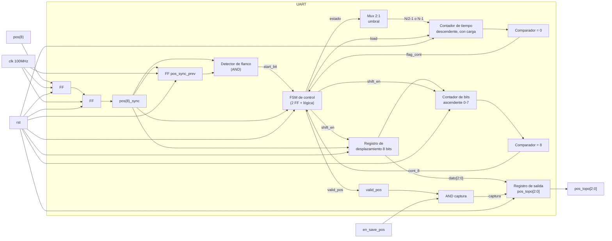

# M2: Show_Mole


## f) Relación con otros módulos

El módulo recibe la señal pos_topo[2:0] desde el registro UART despues de haber sido generado. Luego, la máquina de estados (FSM) se encarga de indicar cuando se puede encender la matriz de leds, mediante la señal en_topo. 

## g) Explicación de funcionamiento

El módulo Show_Mole opera como un decodificador combinacional de 3 a 8 bits con entrada de habilitación (Enable). Su función principal es traducir la posición codificada en binario pos_topo[2:0] a una representación en bus de 8 bits donde un solo bit se encuentra activo (one-hot), permitiendo encender un único LED de la matriz 4x2 a la vez.

## h) Diseño

El diseño de este módulo se puede subdividir fácilmente en una parte de control que activan o desactiva la matriz de leds que muestran la posición del topo, y por otro lado se tiene un decodificador 3 a 8 que convierte la información dada por pos_topo[2:0] en una señal que activa el led correspondiente. Los leds están distribuidos de la siguiente forma:


#### Mapeo Físico de la Matriz

| | Columna 0 | Columna 1 |
| :---: | :---: | :---: |
| **Fila 0** | **LED 0** (`000`) | **LED 1** (`001`) |
| **Fila 1** | **LED 2** (`010`) | **LED 3** (`011`) |
| **Fila 2** | **LED 4** (`100`) | **LED 5** (`101`) |
| **Fila 3** | **LED 6** (`110`) | **LED 7** (`111`) |

---


La siguiente tabla detalla la lógica de decodificación tipo one-hot con activación por señal de enable. 

**Nota:** L# indica el led que se enciende. 


| **en_topo** | **pos_topo[2]** | **pos_topo[1]** | **pos_topo[0]** | **L7** | **L6** | **L5**| **L4** | **L3** | **L2** | **L1** | **L0** | **Estado** |
| :---: | :---: | :---: | :---: | :---: | :---: | :---: | :---: | :---: | :---: | :---: | :---: | :--- |
| **0** | X | X | X | 0 | 0 | 0 | 0 | 0 | 0 | 0 | 0 | Apagados (Sin topo) |
| **1** | 0 | 0 | 0 | 0 | 0 | 0 | 0 | 0 | 0 | 0 | **1** | LED 0 encendido |
| **1** | 0 | 0 | 1 | 0 | 0 | 0 | 0 | 0 | 0 | **1** | 0 | LED 1 encendido |
| **1** | 0 | 1 | 0 | 0 | 0 | 0 | 0 | 0 | **1** | 0 | 0 | LED 2 encendido |
| **1** | 0 | 1 | 1 | 0 | 0 | 0 | 0 | **1** | 0 | 0 | 0 | LED 3 encendido |
| **1** | 1 | 0 | 0 | 0 | 0 | 0 | **1** | 0 | 0 | 0 | 0 | LED 4 encendido |
| **1** | 1 | 0 | 1 | 0 | 0 | **1** | 0 | 0 | 0 | 0 | 0 | LED 5 encendido |
| **1** | 1 | 1 | 0 | 0 | **1** | 0 | 0 | 0 | 0 | 0 | 0 | LED 6 encendido |
| **1** | 1 | 1 | 1 | **1** | 0 | 0 | 0 | 0 | 0 | 0 | 0 | LED 7 encendido |

## i) Diagrama detallado del diseño

```mermaid
flowchart LR
    %% Entradas
    pos["pos_topo[2:0]"]
    en["en_topo"]

    subgraph Logica_Combinacional ["Lógica Combinacional (always_comb)"]
        direction TB
        DEC["Decodificador 3 a 8 bits<br/>(One-Hot)"]
        DEFAULT["Asignación por defecto:<br/>leds = 8'b0000_0000"]
    end

    %% Salidas
    out_leds["leds_topo[7:0]"]

    %% Conexiones
    pos --> DEC
    en -->|Habilita (si es 1)| DEC
    en -->|Apaga (si es 0)| DEFAULT
    
    DEC --> out_leds
    DEFAULT --> out_leds
```

# M3: press_btn


## f) Relación con otros módulos

EEl módulo press_btn recibe las señales Botones[7:0] provenientes de los ocho pulsadores físicos. Estas señales son procesadas mediante un sincronizador de dos etapas y un filtro anti-rebote para eliminar cambios no deseados producidos por el funcionamiento mecánico de los pulsadores.
Una vez filtradas, las señales se envían a un codificador de prioridad, el cual genera la posición del botón presionado mediante btn[2:0]. La señal btn_valid indica a la FSM que existe una pulsación válida.
La FSM utiliza btn[2:0] para comparar la posición del botón presionado con la posición actual del topo pos_topo[2:0]. De esta comparación se determina si el jugador presionó el botón correspondiente durante el tiempo permitido por Time_Logic.

## g) Explicación de funcionamiento

El módulo press_btn procesa las ocho entradas físicas Botones[7:0] para obtener una pulsación confiable y sincronizada con el reloj del sistema.
Primero, cada entrada pasa por un sincronizador de dos etapas, encargado de reducir el riesgo de metaestabilidad debido a que los pulsadores son señales asíncronas respecto al reloj.
Posteriormente, cada señal sincronizada pasa por un filtro anti-rebote. Este filtro comprueba que el estado del pulsador permanezca estable durante aproximadamente 10 ms antes de aceptar el cambio como una pulsación válida.
Finalmente, las ocho señales filtradas son procesadas por un codificador de prioridad 8:3, que convierte la posición del botón activo en un código binario de 3 bits. La salida btn[2:0] representa la posición del botón presionado, mientras que btn_valid indica si existe una pulsación válida. En caso de que varios botones se encuentren activos simultáneamente, el codificador da prioridad al botón de mayor índice. La FSM utiliza las señales btn y btn_valid para determinar si la posición presionada coincide con la posición del topo y, de esta manera, validar el acierto del jugador.

## h) Diseño

Este módulo se segmenta en los siguientes bloques:

1. **Sincronizador de 2 Etapas**: Este bloque tiene como función principal mitigar la metaestabilidad de los botones.

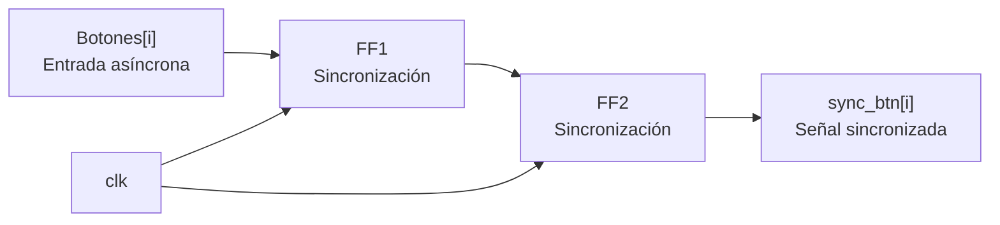

2. **Filtro Anti-rebote:** Cada una de las líneas (filas) entra a una unidad individual de filtrado. Para esto se realiza un cálculo aproximado de referencia para la temporización. Se utiliza un clk de 100 MHz para facilitar los cálculos.

        Cuentas necesarias = 10 ms / 10 ns = 1e^6 ciclos 

        Ancho del contador = log_2(1e^6 ) = 20 bits

Se añade el diagrama de estados para este submódulo.

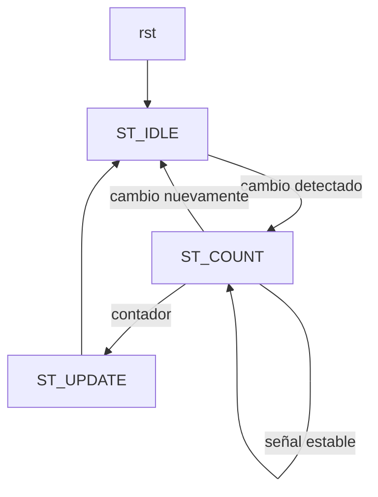

3. **Codificador de Prioridad:** toma el vector filtrado de 8 bits btn[7:0] (asumiendo lógica positiva donde '1' representa pulsador presionado) y genera la posición binaria btn[2:0]. Da prioridad al bit de mayor orden.

    **Tabla de Verdad (Prioridad al bit mayor):**

| `clean_btn[7]` | `clean_btn[6]` | `clean_btn[5]` | `clean_btn[4]` | `clean_btn[3]` | `clean_btn[2]` | `clean_btn[1]` | `clean_btn[0]` | `btn[2:0]` | `valid` |
| :---: | :---: | :---: | :---: | :---: | :---: | :---: | :---: | :---: | :---: |
| 0 | 0 | 0 | 0 | 0 | 0 | 0 | 0 | 3'b000 | 0 |
| 0 | 0 | 0 | 0 | 0 | 0 | 0 | **1** | 3'b000 | 1 |
| 0 | 0 | 0 | 0 | 0 | 0 | **1** | X | 3'b001 | 1 |
| 0 | 0 | 0 | 0 | 0 | **1** | X | X | 3'b010 | 1 |
| 0 | 0 | 0 | 0 | **1** | X | X | X | 3'b011 | 1 |
| 0 | 0 | 0 | **1** | X | X | X | X | 3'b100 | 1 |
| 0 | 0 | **1** | X | X | X | X | X | 3'b101 | 1 |
| 0 | **1** | X | X | X | X | X | X | 3'b110 | 1 |
| **1** | X | X | X | X | X | X | X | 3'b111 | 1 |


## i) Diagrama detallado del diseño

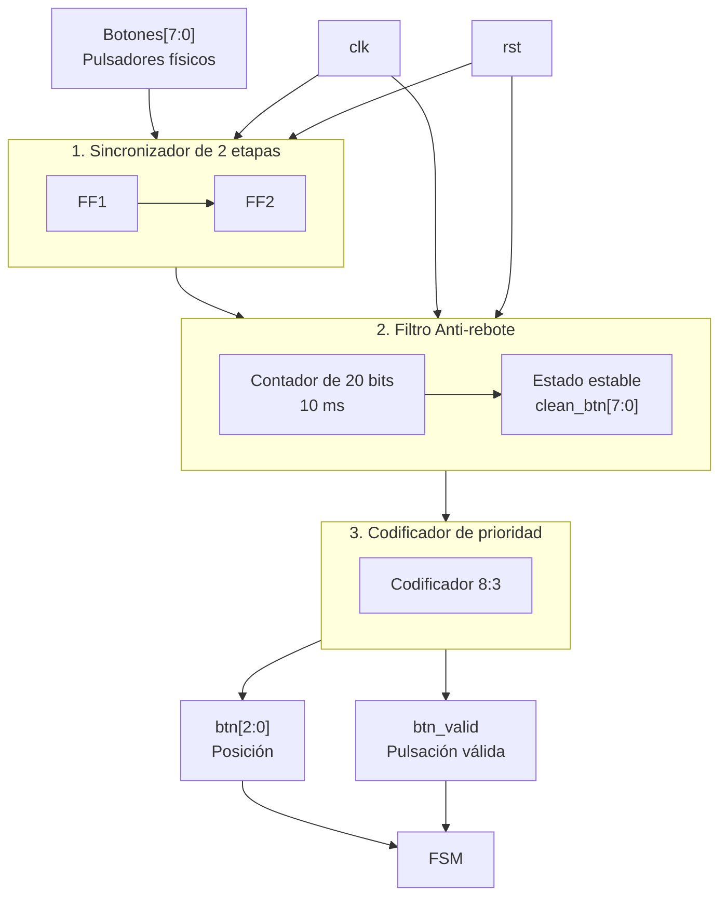

El diagrama muestra el funcionamiento interno del módulo press_btn. Las señales provenientes de los ocho pulsadores físicos Botones[7:0] ingresan primero al sincronizador de dos etapas, encargado de sincronizar las entradas asíncronas con el reloj del sistema. Luego, las señales pasan al filtro anti-rebote, que utiliza un contador para asegurar que cada cambio permanezca estable durante aproximadamente 10 ms antes de considerarlo válido.

Finalmente, las señales filtradas clean_btn[7:0] ingresan al codificador de prioridad 8:3, que determina la posición del botón presionado y genera btn[2:0]. La señal btn_valid indica a la FSM que existe una pulsación válida. Las señales clk y rst controlan los bloques secuenciales del módulo.

## # M4: Time_Logic

## f) Relación con otros módulos

La FSM abre la ventana con el pulso inicio una vez que el módulo receptor_uart entregó `pos_topo[2:0]` del turno,
de modo que el tiempo de la trama serial no se le descuenta al jugador. Durante la ventana la FSM es la que evalúa `btn_golpe[7:0]` contra `pos_topo[2:0]`, por lo que M4 nunca observa las pulsaciones y se limita a medir el tiempo disponible. La FSM devuelve el pulso hit cuando el golpe es correcto, con lo cual M4 cierra el turno y reduce la duración del siguiente, y M4 responde con UP cuando la ventana se agota sin acierto, señal que la FSM interpreta como fallo y propaga al Contador Fallo. La señal `rst_window` acompaña cada resolución de turno (tanto acierto como fallo) para limpiar el contador de ventana de cara a la siguiente ronda, mientras que `rst_dificulty` y `nueva_partida`, emitidas por la FSM únicamente al iniciar una partida, devuelven la dificultad a su valor inicial.

## g) Explicación de funcionamiento

El módulo mantiene un registro de dificultad con la cantidad de intervalos de 100 ms que dura la ventana y un contador descendente que mide el turno en curso. Con el pulso inicio el contador se carga con el valor del registro de dificultad y el prescalador interno se reinicia para que el primer intervalo sea completo, luego de lo cual el contador descuenta una unidad por cada habilitación de 100 ms. Al llegar a cero se emite UP durante un ciclo de reloj, y si en cambio llega hit antes de ese momento el conteo se detiene y el registro de dificultad se decrementa mientras sea mayor que su valor mínimo. Cuando la FSM resuelve el turno como fallo por botón incorrecto no se requiere ninguna señal adicional para el registro de dificultad, ya que el siguiente pulso inicio recarga el contador y descarta la cuenta anterior; `rst_window` es la señal que efectivamente limpia el contador de ventana en ese instante, mientras que `rst_dificulty` y `nueva_partida` son las únicas que devuelven el registro de dificultad a su valor inicial, de manera que la dificultad alcanzada se conserva dentro de la partida aunque el jugador falle.

## h) Diseño

Se escoge una resolución de 100 ms porque todas las duraciones exigidas son múltiplos exactos de ese valor, con lo cual la ventana completa se mide con un contador descendente de cuatro bits cargado entre 15 y 5 y no se acumula error de redondeo. La habilitación de 100 ms se genera con un prescalador cuyo módulo queda fijado por la frecuencia de la tarjeta,

$$N_{presc} = 100 \times 10^6 \cdot 0{,}1 = 10^7, \qquad 2^{23} < 10^7 \le 2^{24}$$

por lo que se implementa con un contador de 24 bits que activa la habilitación durante un solo ciclo, y de esta forma toda la temporización ocurre en el dominio del reloj de 100 MHz sin generar relojes derivados. El prescalador se reinicia ante `rst_dificulty`, `rst_window`, `nueva_partida` o `inicio`, además de reiniciarse solo al completar su propia vuelta; así el primer intervalo de 100 ms contado después de cualquiera de esos eventos es siempre completo y no arrastra una fracción de cuenta del ciclo anterior.

El registro de dificultad es un contador descendente saturado en 5, y como el enunciado establece que un fallo no devuelve la ventana a su valor inicial, la reducción resulta monótona dentro de la partida y la cuenta de aciertos consecutivos produce la misma secuencia que la de aciertos acumulados, así que un solo registro la representa. Por esa misma razón el registro de dificultad solo escucha `rst_dificulty` y `nueva_partida`: son las dos únicas condiciones asociadas al arranque de una partida nueva. El contador de ventana, en cambio, también debe limpiarse al cierre de cada turno individual (tanto en acierto como en fallo) para que la siguiente ronda no herede la cuenta anterior, y esa limpieza intermedia es exactamente lo que aporta `rst_window`, señal que la FSM activa en los estados `HIT` y `FAILURE` sin tocar la dificultad alcanzada.

| Aciertos consecutivos | Carga del contador | Duración de la ventana |
|---|---|---|
| 0 | 15 | 1500 ms |
| 1 | 14 | 1400 ms |
| 2 | 13 | 1300 ms |
| 3 | 12 | 1200 ms |
| 4 | 11 | 1100 ms |
| 5 | 10 | 1000 ms |
| 6 | 9 | 900 ms |
| 7 | 8 | 800 ms |
| 8 | 7 | 700 ms |
| 9 | 6 | 600 ms |
| 10 o más | 5 | 500 ms |

## i) Diagrama detallado del diseño

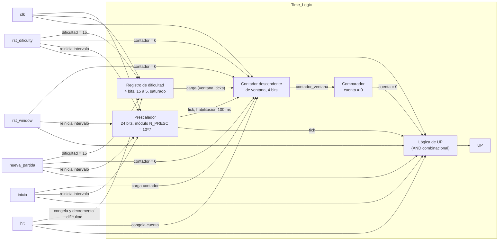

Tabla de verdad de la lógica de control, con prioridad de arriba hacia abajo:

| `rst_dificulty` o `nueva_partida` | `rst_window` | `inicio` | `hit` | habilitación 100 ms | cuenta actual | Contador siguiente | Registro de dificultad siguiente | `UP` |
|---|---|---|---|---|---|---|---|---|
| 1 | X | X | X | X | X | 0 | 15 | 0 |
| 0 | 1 | X | X | X | X | 0 | sin cambio | 0 |
| 0 | 0 | 1 | X | X | X | dificultad | sin cambio | 0 |
| 0 | 0 | 0 | 1 | X | X | sin cambio (se detiene) | dificultad − 1 si dificultad > 5, si no sin cambio | 0 |
| 0 | 0 | 0 | 0 | 1 | 0 | sin cambio | sin cambio | 1 |
| 0 | 0 | 0 | 0 | 1 | ≠ 0 | cuenta − 1 | sin cambio | 0 |
| 0 | 0 | 0 | 0 | 0 | X | sin cambio | sin cambio | 0 |

Si hay `rst_dificulty` o `nueva_partida`, todo se pone en su estado inicial y la dificultad vuelve a quince, como menciona el enunciado. Si en cambio solo llega `rst_window`, el contador de ventana se limpia entre rondas pero la dificultad alcanzada se conserva, ya que esta señal acompaña cada cierre de turno (acierto o fallo) sin implicar el fin de la partida. Si llega la señal de inicio, el contador se carga con el valor guardado de dificultad. Si llega un acierto, el conteo se detiene y la dificultad baja un paso, siempre que no esté ya en su valor mínimo. Si nada de eso pasa y llega la habilitación de cada cien milisegundos, el contador baja uno, y si ya estaba en cero se activa la señal UP para avisar que se acabó el tiempo. En cualquier otro caso todo se queda igual.
# M5: Hit_Counter

## f) Relación con otros módulos

El módulo recibe de la FSM el mismo pulso `hit` que consume Time_Logic para reducir la ventana y que Fail_Counter usa para reiniciar su cuenta de fallos consecutivos, de modo que las tres reacciones a un golpe correcto ocurren en el mismo ciclo de reloj y quedan consistentes entre sí. Su salida `acierto[7:0]` alimenta directamente los dos displays de aciertos del módulo Marcador, que decodifica cada dígito a siete segmentos y los multiplexa. El circuito es completamente síncrono y opera bajo el dominio del reloj principal (`clk`). La FSM puede reiniciar la cuenta con `nueva_partida` al iniciar una partida nueva luego del tercer fallo consecutivo, y el reinicio manual llega por `rst`.

## g) Explicación de funcionamiento

El módulo es un contador BCD de dos dígitos parametrizable (por defecto, avanza hasta 99) que se incrementa una única vez por cada pulso `hit`. El dígito de unidades, ubicado en `acierto[3:0]`, cuenta de cero al límite establecido por `MAX_UNIDADES` (típicamente nueve). Al desbordarse, vuelve a cero y habilita el acarreo para el dígito de decenas, ubicado en `acierto[7:4]`, de forma que la salida siempre representa un valor BCD válido. Al llegar al límite máximo definido por `MAX_ACIERTO`, el contador se satura y conserva su valor ante nuevos aciertos, garantizando que el marcador no despliegue valores fuera de rango ni se reinicie a mitad de partida. Las entradas `rst` y `nueva_partida` son síncronas, tienen prioridad sobre el incremento, y devuelven ambos dígitos a cero.

## h) Diseño

Se lleva la cuenta directamente en BCD utilizando parámetros dinámicos (`MAX_ACIERTO % 10` para unidades y `MAX_ACIERTO / 10` para decenas) para evitar el uso de convertidores binario-a-decimal (como el algoritmo double dabble) antes del marcador. Cada dígito se resuelve con un contador de cuatro bits. El acarreo entre dígitos ocurre mediante la coincidencia del dígito de unidades con su límite máximo durante un pulso `hit`, siempre y cuando las decenas aún no hayan alcanzado el tope. La saturación se implementa bloqueando el incremento cuando ambos dígitos alcanzan el valor máximo estipulado. El pulso `hit` actúa estrictamente como señal de habilitación (`enable`) dentro de un bloque secuencial comandado por el reloj, evitando la inferencia de *latches*.

| rst / nueva_partida | hit | unidades == MAX_UNIDADES | decenas == MAX_DECENAS | Acción |
|---|---|---|---|---|
| 1 | X | X | X | unidades <= 0, decenas <= 0 |
| 0 | 0 | X | X | Sin cambio |
| 0 | 1 | Sí | No | unidades <= 0, decenas <= decenas + 1 (Acarreo) |
| 0 | 1 | No | X | unidades <= unidades + 1 (Incremento normal) |
| 0 | 1 | Sí | Sí | Sin cambio (Saturación) |

## i) Diagrama detallado del diseño

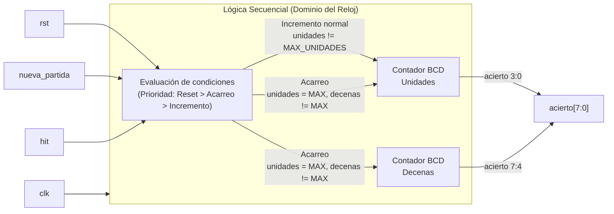
# M6: fail_counter

## f) Relación con otros módulos

El módulo recibe de la FSM el pulso `miss` cada vez que un turno se resuelve como fallo, ya sea por botón incorrecto o por agotamiento de la ventana de tiempo. También recibe el pulso `hit` de la FSM, con el cual pone en cero la cuenta de fallos consecutivos sin afectar el contador acumulado. El circuito es completamente síncrono y opera bajo el dominio del reloj principal (`clk`). Su salida `fallo[7:0]` alimenta directamente los dos displays de fallos del módulo `marcador`. Su salida `fin_partida` se genera de forma combinacional para avisar a la FSM en el mismo ciclo de reloj que se alcanzó el tercer fallo consecutivo. La FSM devuelve `nueva_partida` al arrancar un juego nuevo, lo cual pone en cero ambas cuentas, al igual que el reinicio manual por `rst`. 

## g) Explicación de funcionamiento

El módulo mantiene dos cuentas independientes comandadas por el reloj. La primera es un contador BCD parametrizable que acumula los fallos totales de la partida. El dígito de unidades ocupa `fallo[3:0]` y el de decenas `fallo[7:4]`, con un límite de saturación definido por los parámetros `MAX_UNIDADES` y `MAX_DECENAS` para evitar desplegar valores fuera de rango. La segunda cuenta es un registro interno de fallos consecutivos de dos bits que llega hasta tres. Esta cuenta se reinicia ante cualquier pulso `hit` o señal de nueva partida. 

La salida `fin_partida` se calcula asíncronamente (fuera del bloque secuencial) evaluando si ocurre un `miss` en el mismo momento en que la racha ya es de dos o tres fallos, garantizando que la señal esté lista en el ciclo exacto del fallo fatal y evitando que la FSM requiera un ciclo adicional o un cuarto fallo para transitar a fin de partida.

## h) Diseño

La cuenta acumulada se lleva directamente en BCD y su acarreo/saturación se evalúa dinámicamente frente a los topes paramétricos establecidos. El pulso `miss` habilita el incremento. Los pulsos `hit` y `miss` son mutuamente excluyentes en un turno, pero `hit`, `rst` y `nueva_partida` tienen prioridad absoluta para reiniciar los registros. Se separó el cálculo de `fin_partida` del bloque `always_ff` para eliminar la latencia de un ciclo de reloj detectada en versiones previas del diseño.

Lógica secuencial del contador de fallos consecutivos:

| rst / nueva_partida / hit | miss | consecutivos actuales | Siguiente consecutivos |
|---|---|---|---|
| 1 | X | X | 0 |
| 0 | 0 | X | Sin cambio |
| 0 | 1 | 0 o 1 | consecutivos + 1 |
| 0 | 1 | 2 o 3 | 3 |

Lógica combinacional de fin de partida:

| miss | consecutivos | fin_partida |
|---|---|---|
| 0 | X | 0 |
| 1 | 0 o 1 | 0 |
| 1 | 2 o 3 | 1 |

## i) Diagrama detallado del diseño

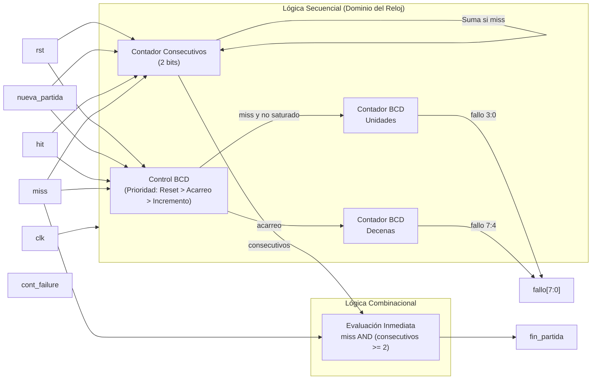

# M7: estado_juego

## f) Relación con otros módulos

El módulo recibe de la FSM las señales `f_state_play` y `f_state_gameover`, que indican respectivamente si la partida se encuentra activa y si la partida ha terminado; ambas señales son mutuamente excluyentes por diseño de la FSM. Es el único bloque que traduce esa información a una indicación visual para el jugador por medio de la salida `led_state`. Como el estado de fin de partida debe sostenerse al menos 2 s antes del reinicio automático, el módulo mide ese intervalo con su propia base de tiempo referenciada al reloj principal (`clk`) y devuelve un pulso `fin_espera` a la FSM para habilitar la transición hacia la nueva partida. No tiene relación directa con `time_logic`, `hit_counter` ni `fail_counter`, ya que toda la coordinación pasa por la FSM, y no comparte líneas con el módulo `marcador`.

## g) Explicación de funcionamiento

El módulo decodifica la pareja de señales `(f_state_play, f_state_gameover)` en tres condiciones. Con `f_state_play` en alto, el LED permanece encendido de forma fija. Con `f_state_gameover` en alto, el LED parpadea a 2,5 Hz. Con ambas señales en bajo (reposo), el LED permanece apagado. 

Al activarse `f_state_gameover`, un prescalador genera una habilitación (`tick`) cada 100 ms y arranca un contador que mide 20 ticks (2 segundos, ajustables por el parámetro `WAIT_COUNT`). Al vencerse, activa `fin_espera` durante un único ciclo de reloj para que la FSM reinicie el juego. Para garantizar que los 2 s sean exactos, el prescalador se mantiene forzado a cero durante la partida activa y el reposo, de modo que cada cuenta de fin de partida arranca su primer tick de 100 ms limpiamente desde cero. La combinación en la que `f_state_play` y `f_state_gameover` están ambas en alto se resuelve como una condición de apagado seguro.

## h) Diseño

La lógica utiliza parámetros adaptables (`N_PRESC` para la base de tiempo y `WAIT_COUNT` para el límite de espera). La decodificación se reduce a un selector combinacional de nivel del LED entre tres fuentes (fijo, parpadeo, apagado). La base de tiempo interna de 100 ms se obtiene con un prescalador de 24 bits sobre el reloj de 100 MHz, operando como señal de habilitación (`clock enable`) sin generar relojes derivados. Un contador de 5 bits maneja la espera, y un biestable con un divisor intermedio cambia el estado del parpadeo cada dos habilitaciones (200 ms) para generar el periodo de 400 ms. 

**Tabla de verdad de decodificación:**

| `f_state_play` | `f_state_gameover` | Condición | `led_state` | Contadores internos |
|---|---|---|---|---|
| 0 | 0 | Reposo tras reinicio | 0 | Forzados a cero |
| 1 | 0 | Partida activa | 1 | Forzados a cero |
| 0 | 1 | Fin de partida | Parpadeo a 2,5 Hz | Habilitados |
| 1 | 1 | Condición no válida | 0 (apagado seguro) | Forzados a cero |

**Tabla de verdad de la lógica de fin de espera**, sincronizada al reloj principal:

| `f_state_gameover` (y no play) | `tick_100ms` | Cuenta actual (`wait_cnt`) | Siguiente cuenta | `fin_espera` |
|---|---|---|---|---|
| 0 | X | X | 0 | 0 |
| 1 | 0 | < WAIT_COUNT | Sin cambio | 0 |
| 1 | 1 | < WAIT_COUNT | Cuenta + 1 | 0 |
| 1 | 0 | == WAIT_COUNT | Sin cambio | 0 |
| 1 | 1 | == WAIT_COUNT | Sin cambio | 1 (pulso de 1 ciclo) |

## i) Diagrama detallado del diseño

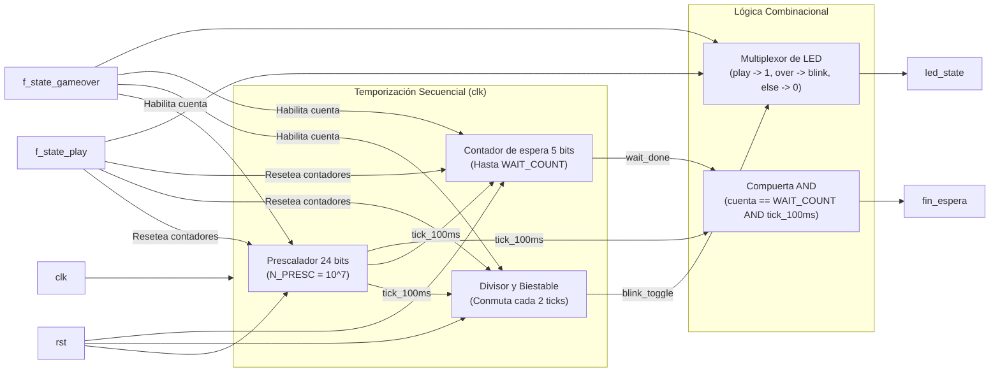

# M8: Máquina de Estados FSM

Objetivo: controlar el flujo de datos del sistema digital, entregando señales de control a los diferentes módulos dependiendo de las entradas que reciba el sistema.

## Entradas:
- reset: Reinicia el sistema al estado inicial.
- sol_pos: Solicitud de nueva posición del topo.
- valid_pos: Se recibe una nueva posición del topo.
- bot_pos: Señal que confirma que apretó el botón correspondiente a la posición del topo.
- window_exp: Señal que indica que expiró la ventana de tiempo.
- cont_fallo: Señal que indica que se llega al máximo de fallos (3 fallos).

## Salidas:
Estado 000

- rst_dificultad: Reinicia el nivel de dificultad del juego.
- rst_aciertos: Reinicia el contador de aciertos acumulados a cero.
- rst_fallos: Reinicia el contador de fallos a cero.
- rst_window: Reinicia la ventana de tiempo del juego. 
Estado 001

- en_numAleatorios: Permite activar el sistema de generación de posiciones aleatorios.
- 
Estado 010

- en_save_pos: Habilita registrar/guardar la posición del topo que se recibe vía UART.
- 
Estado 100

- add_acierto: Incrementa en +1 el contador de aciertos.
- rst_fallo: Reinicia el contador de fallos.
- inc_dificultad: Incrementa el nivel de dificultad, reduciendo la ventana de tiempo.
- 
Estado 101

- add fallo: Incrementa en +1 el contador de fallos.


## Descipción general:

Esta FSM actúa como el controlador central de un juego interactivo de velocidad y reacción con comunicación serial. Su diseño sigue una arquitectura de máquina de Moore, donde las salidas de control se activan en función del estado en el que se encuentre el sistema para gobernar la ruta de datos. El ciclo de la partida comienza en el estado de inicio, donde el controlador limpia los contadores de aciertos y fallos, restaura el nivel de dificultad base y reinicia el temporizador del sistema. A partir de ahí, la máquina avanza hacia la fase de generación del desafío: habilita un módulo que produce una nueva posición aleatoria y, tras enviar la solicitud, pasa a un estado de espera por la interfaz UART. En cuanto la posición es recibida y validada, habilita su guardado en memoria y transiciona inmediatamente al estado de juego. Durante la fase de juego, el controlador monitorea la respuesta del jugador. Si el usuario presiona la posición correcta a tiempo, el sistema avanza al estado de acierto, donde incrementa la puntuación, limpia los fallos acumulados, aumenta el nivel de dificultad para la siguiente ronda y regresa a generar un nuevo punto aleatorio. Por el contrario, si el jugador presiona un botón equivocado o si la ventana de tiempo expira, la FSM se mueve al estado de fallo e incrementa el contador de errores. En este punto de fallo, el sistema evalúa la condición de la partida: si el conteo de errores aún no alcanza el límite permitido, le da otra oportunidad al jugador retornando a la generación de posición. Sin embargo, si el contador sobrepasa el límite de errores, la máquina conmuta al estado final. En este último estado, el controlador bloquea la ejecución y detiene la partida a la espera de una señal de reinicio manual que restablezca todo el flujo desde el principio.


### Diagrama de Estados:


# M9: t_uart

## f) Relación con otros módulos

`pos_topo[2:0]` proviene del generador pseudoaleatorio del subsistema discreto, conectado por tres líneas paralelas directamente a la FPGA. Al provenir de un dominio de reloj independiente, este módulo resuelve primero la metaestabilidad mediante un sincronizador de dos etapas, igual en principio al de `r_uart`, pero aplicado a un bus de 3 bits en lugar de una sola línea serial. La FSM general del sistema (M8) dispara la transmisión con el mismo pulso que activa al circuito discreto (`en_numRandom`, estado `001`); ese pulso llega a este módulo como `start`. A partir de ahí, `t_uart` arma la trama 8N1 de forma autónoma y la entrega por `tx` en loopback interno hacia `r_uart` (M1), que la recibe sin ningún cambio respecto a su diseño original, ya que el formato de trama (8N1, 9600 baudios) se mantiene idéntico al acordado con el subsistema discreto. La salida `busy` indica que el módulo está armando o enviando una trama; no se conecta a ninguna otra señal de control en el sistema actual, aunque queda disponible para depuración o para una futura señal de bloqueo hacia la FSM. `rst` reinicia todos los elementos secuenciales del módulo a un estado conocido.

## g) Explicación de funcionamiento

`pos_topo[2:0]` ingresa a un sincronizador de dos etapas para eliminar el riesgo de metaestabilidad, igual que en `r_uart`, resultando en `pos_sync[2:0]`. Cuando llega `start`, el módulo no reacciona de inmediato: levanta un registro interno llamado `pending`, que retiene la solicitud hasta el instante en que realmente puede consumirse. Mientras el módulo está en `IDLE` y `pending` está en alto, se carga el registro de desplazamiento con la trama completa (`{5'b0, pos_sync}`, los 5 bits altos en cero y `pos_sync[2:0]` en los 3 bits bajos) y la máquina de estados pasa a `START`.

Un contador de baudios, libre dentro de cada estado de transmisión, cuenta `N` ciclos de reloj (`N = f_clk / baudrate` = 10417 para 9600 baudios y 100MHz) y genera un pulso `tick` al llegar al final de la cuenta; ese contador se reinicia a cero cada vez que el módulo está en `IDLE` y también cada vez que ocurre un `tick`, de modo que cada bit transmitido dura exactamente un período de baudio completo. Durante el estado `START`, `tx` se fuerza en `0` (el bit de inicio del protocolo); al cumplirse el `tick` de ese período, la máquina pasa a `DATA`. Durante `DATA`, `tx` reproduce el bit menos significativo del registro de desplazamiento (`shift_reg[0]`) y, en cada `tick`, el registro se desplaza un bit hacia la derecha mientras un contador de bits (0 a 7) avanza en paralelo; al completar el octavo bit la máquina pasa a `STOP`. En `STOP`, `tx` se mantiene en `1` (el bit de parada) durante un período de baudio completo, y al cumplirse ese `tick` la máquina regresa a `IDLE`, quedando lista para la siguiente solicitud. La señal `busy` es simplemente `1` en cualquier estado distinto de `IDLE`.

Si llega un nuevo `start` mientras el módulo todavía está armando o enviando la trama anterior, `pending` ya está en alto y permanece así; en cuanto la máquina regresa a `IDLE`, la nueva solicitud se consume de inmediato sin que la FSM del sistema tenga que reintentar ni esperar indefinidamente por `valid_pos`.

## h) Diseño

Se reutiliza el esquema de sincronizador de dos etapas de `r_uart` porque `pos_topo[2:0]` es asíncrona respecto al reloj de la FPGA por la misma razón: proviene de un dominio de reloj independiente (en este caso, el LFSR discreto en vez de la línea serial). La diferencia es que aquí se sincroniza un bus completo de 3 bits en lugar de una sola línea, y el valor de reposo tras `rst` se fija en `000` y no en `1`, porque no existe una convención de "línea en reposo" para un dato paralelo como sí la hay para una línea serial UART.

No se incluye ningún detector de flanco de bajada, a diferencia de `r_uart`, porque no hay ninguna señal externa cuyo flanco marque el inicio de una trama: es este mismo módulo el que decide cuándo empieza a transmitir, en el instante en que `pending` está en alto y el estado es `IDLE`.

El contador de tiempo tampoco necesita el multiplexor de dos umbrales (`N/2-1` para centrarse a mitad del bit de inicio, `N-1` para el resto) que tiene `r_uart`. Ese mecanismo existe en el receptor porque debe muestrear una señal ajena en el punto de máximo margen frente al desfase de fase entre relojes independientes. Un transmisor no muestrea nada: solo necesita sostener cada bit durante exactamente un período de baudio, así que basta un contador libre de `N` ciclos por bit, reiniciado a cero al entrar a `IDLE` y en cada `tick`, sin lógica de selección de umbral ni de recentrado.

El registro `pending` es el único bloque sin análogo directo en `r_uart`, y resuelve dos condiciones de carrera propias de ser un transmisor disparado por pulso:

1. **`start` puede llegar un ciclo después de liberar `rst`.** La FSM del sistema entra a `REQ_POS` inmediatamente tras el reset y activa `en_numRandom` (que llega aquí como `start`) casi de inmediato, antes de que el sincronizador de dos etapas haya tenido tiempo de reflejar el valor real de `pos_topo`. Al retener la solicitud en `pending` y consumirla solo cuando el estado es `IDLE`, `pos_sync` ya está asentado en el momento de la carga real del registro de desplazamiento.
2. **`start` puede llegar mientras el módulo todavía arma o envía la trama anterior.** En vez de perder ese pulso, `pending` lo conserva y la transmisión se dispara en cuanto el módulo regresa a `IDLE`, evitando que la FSM del sistema quede esperando `valid_pos` de forma indefinida.

La salida `tx` es de Moore en sentido estricto: depende únicamente del estado actual y, en `DATA`, del bit vigente del registro de desplazamiento, que es en sí mismo un elemento de estado. Esto contrasta con `valid_pos` en `r_uart`, que es de Mealy porque depende también de una entrada externa (`pos_sync`) evaluada en el estado `STOP`. La razón de esta diferencia es de fondo: un receptor debe decidir si una trama externa fue válida a partir de lo que observa en la línea, mientras que un transmisor conoce de antemano, por construcción, el contenido exacto de la trama que está armando.

Al derivar las tablas de siguiente estado se observa que la carga del registro de desplazamiento y la transición de `IDLE` a `START` comparten la misma condición (`pending` en alto durante `IDLE`), por lo que ambas ocurren en el mismo flanco de reloj sin ciclos de latencia adicionales, igual que ocurre con `load` en `r_uart`.

**Codificación de estados**

| Estado | `Q1` | `Q0` |
|---|---|---|
| `IDLE`  | 0 | 0 |
| `START` | 0 | 1 |
| `DATA`  | 1 | 0 |
| `STOP`  | 1 | 1 |

**Tabla de verdad de siguiente estado**

| `Q1` | `Q0` | `pending` | `tick` | `cont_8` | `Q1'` | `Q0'` | Comentario |
|---|---|---|---|---|---|---|---|
| 0 | 0 | 0 | X | X | 0 | 0 | sin solicitud pendiente, permanece en `IDLE` |
| 0 | 0 | 1 | X | X | 0 | 1 | solicitud pendiente, carga la trama y pasa a `START` |
| 0 | 1 | X | 0 | X | 0 | 1 | espera a que se cumpla el período del bit de inicio |
| 0 | 1 | X | 1 | X | 1 | 0 | expiró el bit de inicio, pasa a `DATA` |
| 1 | 0 | X | 0 | X | 1 | 0 | espera al siguiente tick para desplazar el próximo bit |
| 1 | 0 | X | 1 | 0 | 1 | 0 | se desplaza un bit de datos, aún no completa los 8 |
| 1 | 0 | X | 1 | 1 | 1 | 1 | octavo bit desplazado, pasa a `STOP` |
| 1 | 1 | X | 0 | X | 1 | 1 | espera al tick del bit de parada |
| 1 | 1 | X | 1 | X | 0 | 0 | expiró el bit de parada, regresa a `IDLE` |

**Tabla de verdad de salidas** (Moore puro: `tx` depende del estado y, en `DATA`, del bit vigente del registro de desplazamiento; `busy` depende solo del estado)

| `Q1` | `Q0` | Estado | `shift_reg[0]` | `tx` | `busy` |
|---|---|---|---|---|---|
| 0 | 0 | `IDLE`  | X | 1 | 0 |
| 0 | 1 | `START` | X | 0 | 1 |
| 1 | 0 | `DATA`  | 0 | 0 | 1 |
| 1 | 0 | `DATA`  | 1 | 1 | 1 |
| 1 | 1 | `STOP`  | X | 1 | 1 |

**Sincronizador de dos etapas** (bus de 3 bits; cada etapa es un banco de flip-flops tipo D, reposo en `000` porque no aplica la convención de línea serial en alto):

| `rst` | `D[2:0]` | `Q+[2:0]` (siguiente flanco de `clk`) |
|---|---|---|
| 1 | X | 000 |
| 0 | `pos_topo` / `pos_ff1` | `pos_ff1` / `pos_sync` |

**Registro `pending`**, con prioridad de arriba hacia abajo:

| `rst` | `start` | `state == IDLE && pending` | `pending'` | Comentario |
|---|---|---|---|---|
| 1 | X | X | 0 | reset |
| 0 | 1 | X | 1 | nueva solicitud levanta `pending` |
| 0 | 0 | 1 | 0 | la solicitud se consumió al salir de `IDLE` |
| 0 | 0 | 0 | sin cambio | ninguna condición aplica |

**Contador de baudios (`baud_cntr`) y `tick`**, libre dentro de cada bit, sin selección de umbral:

| `rst` | `state == IDLE` | `tick` | `baud_cntr'` |
|---|---|---|---|
| 1 | X | X | 0 |
| 0 | 1 | X | 0 |
| 0 | 0 | 1 | 0 |
| 0 | 0 | 0 | `baud_cntr` + 1 |

`tick = (baud_cntr == N - 1)`

**Contador de bits (`bit_cntr`)**, ascendente 0 a 7:

| `rst` | `state==START && next_state==DATA` | `state==DATA && tick` | `bit_cntr'` |
|---|---|---|---|
| 1 | X | X | 0 |
| 0 | 1 | X | 0 |
| 0 | 0 | 1 | `bit_cntr` + 1 |
| 0 | 0 | 0 | sin cambio |

**Registro de desplazamiento (`shift_reg`)**, carga paralela seguida de desplazamiento hacia la derecha, LSB primero:

| `rst` | `state==IDLE && pending` | `state==DATA && tick` | `shift_reg'` |
|---|---|---|---|
| 1 | X | X | `8'b0` |
| 0 | 1 | X | `{5'b0, pos_sync}` (carga) |
| 0 | 0 | 1 | `{1'b0, shift_reg[7:1]}` (desplaza) |
| 0 | 0 | 0 | sin cambio |

## i) Diagrama esquemático detallado del diseño

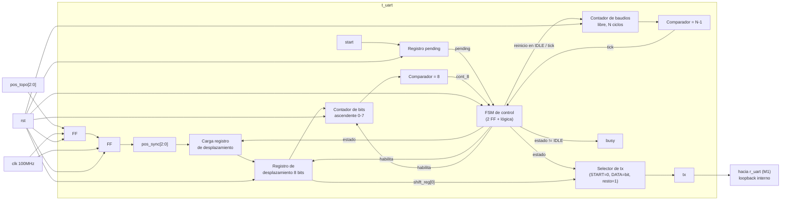


# Nivel 5

## Descripción general
El quinto nivel corresponde a la integración final del sistema híbrido. En este esquema global se conectan físicamente los bloques del subsistema discreto (protoboard con la red de alimentación, lógica de avance del LFSR y acondicionamiento de la transmisión) con la tarjeta de desarrollo FPGA (Basys 3) a través de los pines de GPIO (para los 8 botones externos), los PMODs y los puertos de alimentación. El diagrama refleja la implementación de la arquitectura completa que unifica el control secuencial y aritmético en SystemVerilog con el hardware discreto de soporte.

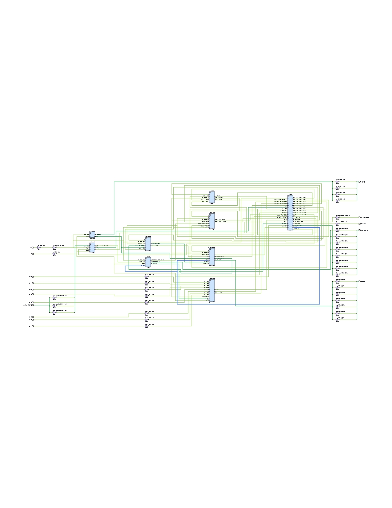