# Nivel 1

## Objetivos

- Implementación del juego tipo _whack a mole_ con 8 posibles posiciones. En cada turno se seleccionará de forma pseudoaleatoria una posición activa y al jugador se le
dará una ventana de tiempo para reaccionar y presionar el botón correspondiente en la matriz de botones. Se llevará
el conteo de aciertos y fallos con el fin de que la dificultad pueda escalar de manera progresiva. La partida termina
una vez el jugador se equivoque tres veces consecutivas
- La ventana de tiempo arranca en 1.5 s y baja 100 ms por cada acierto consecutivo, con un piso de 500 ms. Un fallo no la devuelve a su valor inicial.
- Los contadores de aciertos y fallos van de 00 a 99 y se muestran al mismo tiempo.
- El jugador tiene 3 fallos consecutivos por partida. Un acierto reinicia esa cuenta.

## Descripciones

### Entradas

1. `clk` (100 MHz, viene de la tarjeta)
2. Pulsaciones de los 8 botones externos, uno por cada posición
3. `rst` (botón central de la tarjeta)

### Salidas

1. Posición del topo (en alguno de los 8 LEDs)
2. Marcador de aciertos y fallos (disp. 7 segmentos)
3. Estado de la partida (1 LED)

El jugador observa cuál de los 8 LEDs está encendido y tiene que presionar el botón asignado a esa posición antes
de que se acabe el tiempo en ese turno. Si el jugador acierta, sube el marcador **y** se reduce la ventana de tiempo para el turno siguiente.
En el caso de que el jugador falle o simplemente no haya ninguna pulsación a un botón, incrementa el contador de fallos.
Tres fallos consecutivos terminan la partida.

Se señalará que la partida está finalizada mediante un solo LED de estado y el juego se reiniciará automáticamente después
de un intervalo de tiempo.

En este nivel no se muestra nada de lo que pasa por dentro. Ni el enlace serial, ni la solicitud de topo,
ni las bases de tiempo internas aparecen acá, porque son parte de la solución y no de lo que el jugador ve.

### Diagrama

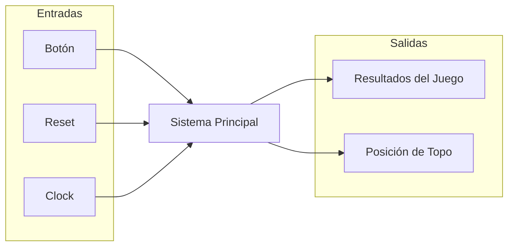

# Nivel 2

## Objetivos

- Subdividir el bloque único del primer nivel en los módulos generales que conforman la solución.
- Establecer que cada subsistema genera su propia base de tiempo.

### Bloque 1: Subsistema discreto

- Decidir de forma pseudoaleatoria cuál de las ocho posiciones corresponde al topo en cada turno.
- Indicar visualmente la posición generada.
- Transmitir dicha posición al subsistema de control mediante un enlace serial (TX).

### Bloque 2: Subsistema de control (FPGA)

- Administrar la lógica del juego como turnos, ventana de tiempo, dificultad progresiva, conteo de aciertos/fallos, vidas y reinicio.
- Desplegar el marcador.

### Diagrama

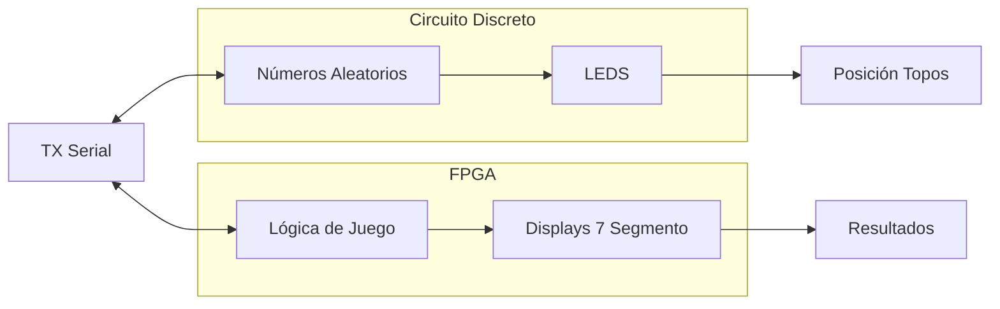

## Descripciones

### Bloque 1: Subsistema discreto
Genera una nueva posición pseudoaleatoria de 3 bits para cada solicitud recibida, la muestra
mediante un LED individual y la transmite en formato serial al subsistema de control.

**Entradas**

- `solicitud_topo`: Viene de FPGA; Pulso que ordena avanzar a una nueva posición.
- `VCC`: Viene de la fuente; Alimentación de 5 V de la fuente.

**Salidas**

- `pos_topo[7:0]`: Va al jugador; Son 8 bits porque son 8 LEDs. Un LED encendido significa que esa es la posición.
- `TX`: Va hacia la FPGA; Línea serial que contiene la posición generada.

`clk` NO aparece como una entrada porque el enunciado dice que no se pueden compartir relojes entre estos dos subsistemas.
El bloque tiene que avanzar una sola vez por cada solicitud y no de forma continua. Como la solicitud llega
asíncrona respecto a la base de tiempo local, hace falta lógica de control interna que la convierta en un
único evento de avance.

Una vez que se genera la posición, se entrega a dos lados. Por un lado a la indicación visual,
que enciende el LED que toca. Por el otro al transmisor serial, que la empaqueta en una trama y la manda a la FPGA.
El LED activo se queda encendido hasta que llegue la siguiente solicitud, así que siempre hay exactamente
una posición visible. El subsistema discreto nunca se entera de si el jugador acertó o falló, y tampoco lo necesita.

### Bloque 2: Subsistema de control (FPGA)

Implementa toda la lógica del juego a partir de la posición recibida y de las
pulsaciones del jugador, y presenta el marcador y el estado de la partida.

**Entradas**

- `clk`: Viene de la Tarjeta; Reloj único de 100 MHz, referencia de tiempo de todo el subsistema.
- `rst`: Viene del botón en la FPGA; Reinicia el juego de forma manual en cualquier momento.
- `btn_golpe[7:0]`: Viene del jugador; Son 8 bits porque son 8 pulsadores externos, uno por posición, conectados por GPIO en líneas independientes.
- `TX`: Viene de la protoboard; Línea serial que trae la posición del topo.

**Salidas**

- `solicitud_topo`: Va hacia la protoboard; Pulso que pide una nueva posición al inicio de cada turno.
- `display[3:0]`: Va hacia el jugador; Son 4 displays de 7 seg, dos dígitos para los aciertos acumulados y dos para los fallos acumulados. Debería de ir desde 0 a 99.
- `led_estado`: Va hacia el jugador; Indica si la partida está activa o terminada (1 bit).

Este subsistema es el que coordina la secuencia del juego. Ninguna otra parte decide cuándo pedir un topo
ni qué cuenta como acierto. Sus entradas externas, o sea los pulsadores y el botón de reinicio, vienen de
fuentes que no tienen relación con el reloj de 100 MHz, así que antes de usarlas hay que pasarlas por una
etapa de acondicionamiento que resuelva la metaestabilidad y los rebotes.

### Interfaz

- `TX`: Protoboard -> FPGA; Trama UART 8N1 de 1 bit de inicio, 8 bits de datos y 1 bit de parada. La posición del topo va en los 3 bits menos significativos y los 5 restantes se fijan en cero.
- `solicitud_topo`: FPGA -> Protoboard; Pulso simple en línea dedicada que indica el evento de siguiente topo. No es una trama serial.

El enlace serial no es como tal un tercer subsistema. El transmisor se implementa con lógica
discreta dentro del protoboard y el receptor se describe en SystemVerilog dentro de la FPGA.

# Nivel 3

## Objetivo

 Se encarga de controlar la lógica del juego por medio de la máquima de estado para comunicar cada modulo entre sí.

## Entradas

- clk: frecuencia de reloj a 100MHz que controla los flancos de las señales que utiliza todo el sistema
- rst: señal que reinicia la partida y la FSM, así como volver cada módulo a sus valores iniciales
- Botones[7:0]: señal de los 8 botones físicos que actuán como pulsadores para golpear al topo
- Pos(8): Señal que proviene del subsistema discreto con la posición generada aleatoriamente por la LSFR, esta señal llega emapaquetada por medio del protoco UART que debe decodificarse para obtener la posición del topo

## Salidas

- LED´s topos [7:0]: Muestra mediante la matriz LED 4x2 al topo en la posición indicada de acuerdo al número generado por la LSFR, muestra un LED encedido a la vez.
- LED estado: Un LED que muestra el estado de la partida, si se encuentra en medio de un juego o si finalizó la partida.
- Acierto [6:0]: valor númerico de 0 a 99 que muestra la cantidad de veces que el jugador acertó al presionar el botón correspondiente al topo dentro de la ventana de tiempo.
- Fallo[1:0]: Valor numérico de 0 a 3 que muestra la cantidad de veces que el jugador falló al presionar le botón del topo, ya sea por errar la posición o no acertar dentro de la ventada de tiempo.

## Explicación General

La señal Pos(8) se decodifica por medio del módulo Deco_UART en una señal Pos_Topo[2:0] que es solicitada por la FSM en cada turno, la FSM verifica la posición y la muestra con LED´s mediante el módulo Show_Mole. La FSM en cada turno toma la señal de los botones mediante el módulo Press_btn y compara si se presionó el botón correcto dentro de la ventada de tiempo estipulada por el módulo Time_Logic.
En caso de que ambos valores sean iguales, el módulo Time_Logic decrece la ventana de tiempo en 100ms hasta llegar a los 500ms de tiempo para acertar y el módulo Hit_Counter aunmenta el valor del contador que se muestra en el Marcador con la señal acierto[6:0]. En caso de fallar, el módulo Fail_Counter aumenta el valor con un límite de 3 equivocaciones y lo muestra en Marcador con fallo[1:0], si ocurre un acierto este contador se reinicia.
Durante toda la partida, se muestra el estado de la misma con el módulo Estado de juego (State), que muestra mediante un LED si se está en medio juego o si finalizó, con una ventada de 2 segundos entre una partida y otra que inicia automáticamente.

## Módulos

- M1. Módulo Receptor_UART
- M2. Módulo Show_Mole
- M3. Módulo Press_btn
- M4. Módulo Time_Logic
- M5. Módulo Hit_Counter
- M6. Módulo Fail_Counter
- M7. Módulo State

## Diagrama de bloques

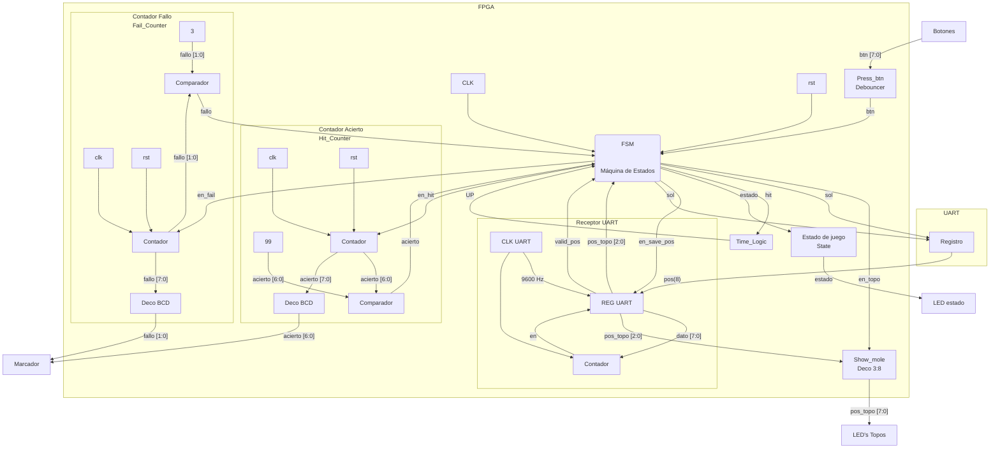

## Diagrama de Flujo

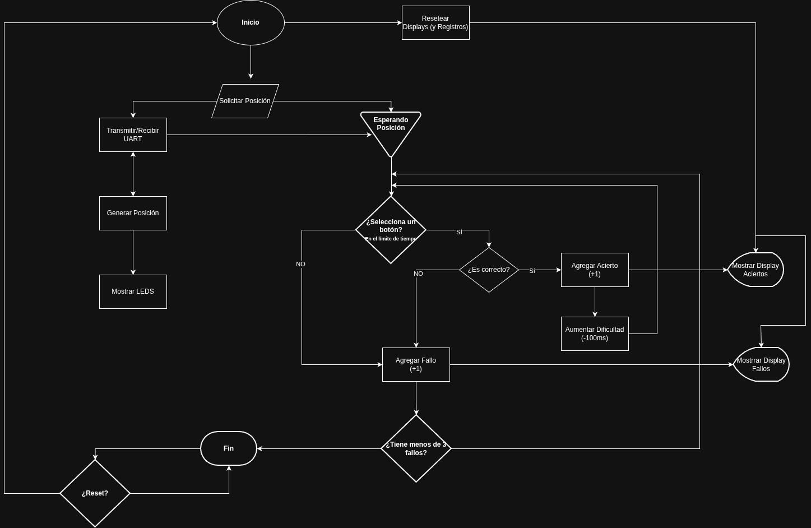

## Máquina de estados

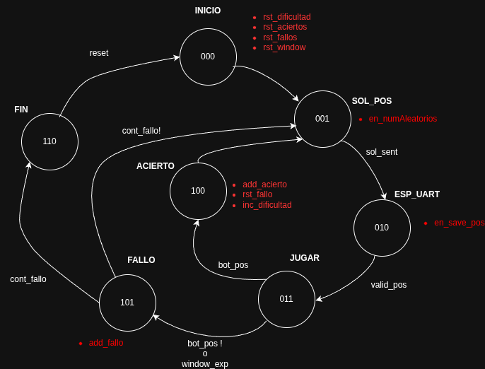

### M1: Receptor_UART

#### a) Objetivo

Recibir la señal recibida por medio de la UART para entregarla en el formato adecuado a la FSM cuando esta la solicita.

#### b) Entradas

- Pos(8): Señal que proviene del subsistema discreto con la posición generada aleatoriamente por la LSFR, esta señal llega emapaquetada por medio del protocolo UART que debe recibirse de manera serial y ser dado en formato paralelo para enviarselo al resto de modulos.
- rst: Señal de reinicio síncrono del sistema.
- `en_save_pos`: señal habilitadora proveniente de la FSM (estado `010`, `en_save_pos` en M8) que indica que la posición decodificada debe quedar disponible/retenida para el turno en curso.

#### c) Salidas

- `pos_topo[2:0]`: posición decodificada del topo, 3 bits menos significativos del byte de datos recibido.
- `valid_pos`: pulso hacia la FSM que indica que se completó la recepción y decodificación de una trama nueva.
  
#### d) Explicación General

La señal Pos(8) se recibe por medio de un registro, el cual a su vez es controlado por un contador que se asegura que solo se recibam los 8 bits de la UART. Y este registro es manejado por un reloj de aproximadamente 9600 Hz, que generan un baud rate de 9600 b/s. 

### M2: módulo Show_Mole

#### a) Objetivo

- Mostrar en la matriz LED 4x2 al topo generado en una posición aleatoria generada por la LFSR.

#### b) Entradas

- pos_topo[2:0]: posición del topo de 3 bits que proviene del registro del Receptor UART
- en_topo: señal enabler para encender el LED correspondiente

#### c) Salidas

- pos_topo[7:0]: es la señal que viaja a los LED´s para enceder el LED correspondiente

#### d) Explicación General
Este módulo recibe tanto la posición del topo pos_topo[2:0] del registro del Recptor UART, como una señal de control de la FSM. Este módulo se encarga de decodificar con un deco 3:8 para enceder el LED correspondiente al topo generado.
Este LED se activa cuando la FSM solicita al módulo la posición y lo autoriza a mostrarlo

### M3: Press_btn

#### a) Objetivo

Filtrar el rebote (bounce) de los 8 pulsadores físicos y sincronizarlos con el reloj del sistema, entregando a la FSM la posición del botón presionado durante el turno activo.

#### b) Entradas

- Botones[7:0]: señal cruda proveniente de los 8 pulsadores físicos conectados por GPIO, una línea por cada posición del topo.
- clk: reloj de sistema a 100MHz utilizado para el muestreo y el filtrado de rebotes.
- rst: señal de reinicio síncrono que limpia los registros internos del debouncer.

#### c) Salidas

- btn[2:0]: posición codificada del botón presionado, ya filtrada de rebotes y sincronizada, que se entrega a la FSM para comparar contra la posición activa del topo.

#### d) Explicación General

Cada una de las 8 líneas de Botones[7:0] se sincroniza primero mediante un sincronizador de dos etapas para evitar problemas de metaestabilidad, ya que la pulsación del usuario es asíncrona respecto al reloj de la FPGA. Posteriormente, cada línea sincronizada pasa por un filtro de rebotes basado en un contador temporizador: la salida solo se considera válida si el nivel de la señal se mantiene estable durante una ventana mínima de tiempo (por ejemplo, unos pocos milisegundos), descartando así los rebotes mecánicos del pulsador. Una vez filtradas las 8 líneas, un codificador de prioridad las convierte en la señal btn[2:0], que la FSM solicita en cada turno para verificar si el botón presionado coincide con la posición activa del topo dentro de la ventana de tiempo definida por Time_Logic.

#### M4: Time_Logic

#### a) Objetivo

- Controlar la ventana de tiempo durante la cual el topo activo puede ser golpeado, aplicando la reducción progresiva de dicha ventana conforme se acumulan aciertos consecutivos.

#### b) Entradas

- clk: reloj de sistema a 100MHz, base para la generación de los clock enables internos del temporizador.
- rst: señal de reinicio síncrono que restablece la ventana de tiempo a su valor inicial de 1,5s.
- hit: señal proveniente de la FSM que indica que el turno actual terminó en acierto, utilizada para reducir la ventana en 100ms de cara al siguiente turno.

#### c) Salidas

- UP: señal que indica a la FSM que la ventana de tiempo del turno actual expiró sin que el jugador presionara el botón correcto.

#### d) Explicación General

Time_Logic implementa un temporizador descendente mediante clock enables derivados del reloj principal de 100MHz, sin generar relojes derivados adicionales. Al iniciar cada turno, el módulo carga la duración vigente de la ventana (1,5s por defecto) y la decrementa hasta llegar a cero, momento en el cual activa la señal UP para notificar a la FSM que el turno se perdió por tiempo. Cada vez que la FSM señaliza hit (acierto dentro de la ventana), Time_Logic reduce en 100ms el valor que se cargará en el siguiente turno, hasta un mínimo de 500ms; alcanzado ese mínimo, la ventana se mantiene constante mientras el jugador continúe acertando. Un fallo no restablece la ventana a su valor inicial: la dificultad alcanzada se conserva mientras la partida continúe, y solo se reinicia a 1,5s ante un rst o el fin de partida.

### M5: Hit_Counter

#### a) Objetivo

- Contabilizar la cantidad de aciertos acumulados durante la partida y entregar dicho valor codificado en BCD para su despliegue en el Marcador.

#### b) Entradas

- clk: reloj de sistema a 100MHz.
- rst: señal de reinicio síncrono que pone en cero el contador de aciertos.
- en_hit: señal habilitadora proveniente de la FSM que indica que ocurrió un acierto y que el contador debe incrementarse.

#### c) Salidas

- acierto[6:0]: valor de 0 a 99 codificado en BCD (dos dígitos) que se envía al Marcador para su despliegue en los displays de 7 segmentos.
- acierto: bandera hacia la FSM que indica que el contador alcanzó su valor máximo (99), utilizada para detener el conteo y evitar el desbordamiento.

#### d) Explicación General

El bloque Contador es un contador binario que se incrementa en cada pulso de en_hit proveniente de la FSM. Un comparador contrasta permanentemente el valor del contador contra 99; al alcanzar dicho límite, genera la señal acierto hacia la FSM para que esta deje de habilitar nuevos incrementos, evitando que el contador se desborde. En paralelo, el bloque Deco_BCD traduce el valor binario del contador a su representación en BCD de dos dígitos, entregando la señal acierto[6:0] al Marcador para su despliegue continuo en los displays de 7 segmentos, independientemente del estado de la partida.

### M6: Fail_Counter

#### a) Objetivo

- Contabilizar los fallos del jugador, entregar dicho valor codificado en BCD al Marcador, y notificar a la FSM cuando se alcanza el límite de 3 fallos para finalizar la partida.

#### b) Entradas

- clk: reloj de sistema a 100MHz.
- rst: señal de reinicio síncrono que pone en cero el contador de fallos; también se activa ante cada acierto para reiniciar el conteo de fallos consecutivos.
- en_fail: señal habilitadora proveniente de la FSM que indica que ocurrió un fallo (botón incorrecto o ventana de tiempo expirada) y que el contador debe incrementarse.

#### c) Salidas

- fallo[1:0]: valor de 0 a 3 codificado en BCD que se envía al Marcador para su despliegue.
- fallo: bandera hacia la FSM que indica que el contador alcanzó el límite de 3 fallos, utilizada para finalizar la partida.

#### d) Explicación General

El bloque CONT es un contador binario que se incrementa en cada pulso de en_fail proveniente de la FSM. Un comparador contrasta el valor del contador contra 3; al alcanzarlo, genera la señal fallo hacia la FSM para que esta transicione al estado de fin de partida. A diferencia de Hit_Counter, este contador se reinicia cada vez que ocurre un acierto, de modo que solo cuenta fallos consecutivos y no un acumulado histórico de la partida. El bloque Decode BCD traduce el valor binario a BCD para su despliegue en el Marcador mediante la señal fallo[1:0].

### M7: Estado de juego

#### a) Objetivo

- Indicar visualmente, mediante un LED de la tarjeta, si la partida se encuentra en curso o si finalizó.

#### b) Entradas

- clk: reloj de sistema a 100MHz.
- rst: señal de reinicio síncrono que restablece el estado a "partida en curso".
- estado: señal proveniente de la FSM que indica el estado actual de la partida (en curso o finalizada).

#### c) Salidas

- LED estado: LED de la tarjeta que refleja el estado de la partida: una condición (por ejemplo, encendido fijo) mientras la partida está en curso, y otra claramente distinguible (por ejemplo, parpadeo o apagado) durante los 2s de estado de fin de partida antes del reinicio automático.

#### d) Explicación General

Este módulo traduce la señal de estado[código binario] entregada por la FSM en un patrón visual sobre el LED de estado de la tarjeta. Mientras la FSM permanece en el estado de juego activo, el LED se mantiene en una condición fija; al detectarse el tercer fallo consecutivo, la FSM transiciona al estado de fin de partida y actualiza la señal estado, lo que hace que este módulo cambie el patrón del LED (por ejemplo, a parpadeo) durante la ventana mínima de 2s antes de que la FSM reinicie automáticamente la partida con una nueva secuencia y los contadores en cero.

# Nivel 4

# Diagrama de cuarto nivel: subsistema discreto

## Módulos

- M1: Generador de reloj de baudios
- M2: Control de avance y modo
- M3: Generador pseudoaleatorio de posición
- M4: Decodificador de posición e indicadores
- M5: Acondicionamiento de la línea de transmisión

## Señales

- `CLK_TX`, reloj de baudios producido por M1
- `avance`, pulso que hace desplazar un estado al generador, producido por M2
- `modo`, selección entre carga y desplazamiento del registro, producida por M2
- `Q1` a `Q4`, salidas de las cuatro etapas del generador
- `pos[2:0]`, palabra de posición del topo, formada por `Q4`, `Q3` y `Q2`
- `solicitud_topo`, línea de solicitud proveniente de la FPGA
- `QH`, salida serie del registro de transmisión
- `TX`, línea serial hacia la FPGA

# M1: Generador de reloj de baudios

Corresponde al bloque de reloj interno del subsistema de transmisión del tercer nivel, donde aparece como la fuente de temporización del registro serial.

## f) Explicación de la relación con otros módulos

Este módulo no recibe señal de ningún otro y entrega su salida al registro de transmisión M5 y al control de avance y modo M2. La relación es unidireccional y de tipo control, ya que M1 impone el ritmo al que M5 desplaza sus bits y ninguno de los dos receptores puede modificarlo ni detenerlo. No tiene relación con M3, M4 ni M5, y tampoco comparte ninguna señal con la FPGA, tal como exige el enunciado cuando pide que ambos subsistemas operen con referencias de tiempo separadas.

## g) Explicación de funcionamiento

El temporizador opera en configuración astable. El capacitor de temporización se carga a través de las dos resistencias hasta alcanzar dos tercios de la alimentación. En ese instante el comparador de umbral conmuta el biestable interno, la salida cae a nivel bajo y el transistor de descarga entra en conducción, lo que permite que el capacitor se descargue a través de una sola de las resistencias hasta caer por debajo de un tercio de la alimentación, donde el ciclo se repite de forma indefinida. La asimetría del ciclo de trabajo proviene de que la carga recorre ambas resistencias mientras que la descarga recorre solo una.

## h) Diseño

Se requiere una señal periódica de frecuencia fija generada sin ningún dispositivo programable. El astable con temporizador integrado es la solución con menor cantidad de componentes que lo cumple, frente al oscilador de anillo con inversores, muy sensible a la alimentación y a la temperatura, y frente al oscilador de cristal con divisor, de mejor estabilidad pero con un encapsulado adicional y una red de división. La frecuencia queda determinada por la red resistiva y capacitiva externa. Se fija en 9600 baudios por ser una velocidad normalizada, lo suficientemente baja para generarse de forma confiable con un 555 y lo suficientemente rápida para no introducir una latencia perceptible entre la solicitud de topo y la recepción de la posición en la FPGA.

$$f = \frac{1{,}44}{(R_1 + 2R_2)\cdot C_1}$$

El factor 1,44 corresponde a $1/\ln(2)$ y proviene del carácter exponencial de la carga y la descarga del capacitor de temporización.

### Justificación de la velocidad y tolerancia de error entre los dos relojes

Como el protoboard y la FPGA no comparten reloj, el receptor UART de la FPGA no conoce la fase del oscilador 555: solo detecta el flanco de bajada del bit de inicio y, a partir de ese instante, cuenta sus propios intervalos de bit (generados dividiendo su reloj de 100 MHz) para ubicar el centro de cada uno de los bits siguientes. Con una trama 8N1 (1 bit de inicio, 8 de datos, 1 de parada) el bit más alejado de esa referencia es el de parada, cuyo centro cae, en el reloj de la FPGA, a $9{,}5\,T$ del flanco detectado, con $T$ el período de bit nominal.

Si el oscilador del protoboard tiene un error relativo $\varepsilon$ respecto al valor nominal, la trama real que transmite dura $9{,}5\,T\,(1+\varepsilon)$ hasta el centro del bit de parada. La FPGA sigue muestreando en $9{,}5\,T$, de modo que el desfase acumulado en ese instante es

$$\Delta t = 9{,}5\,T\cdot\varepsilon$$

Para que la FPGA todavía muestree dentro del bit de parada y no se corra hacia el bit anterior o hacia un eventual bit de inicio siguiente, ese desfase debe mantenerse por debajo de medio período de bit, $T/2$. Esto acota el error tolerado del oscilador discreto:

$$|\varepsilon| < \frac{T/2}{9{,}5\,T} = \frac{1}{19} \approx 5{,}3\,\%$$

El reloj de 100 MHz de la FPGA proviene de un oscilador de cristal de la tarjeta (típicamente de algunas decenas de ppm de error), por lo que su aporte a $\varepsilon$ es despreciable frente al del 555; prácticamente todo el presupuesto de error lo consume el oscilador discreto. Por margen de diseño, se toma la mitad del límite teórico como tolerancia de trabajo, dejando reserva para la incertidumbre del propio cálculo y para la latencia de dos ciclos de reloj (20 ns, insignificante frente a los 104 µs de un bit) que introduce el sincronizador de dos etapas de la entrada RX:

$$|\varepsilon|_{\text{diseño}} < 2{,}5\,\%$$

Un 555 con resistencias de precisión al 1 % y un capacitor de baja deriva (poliéster o NPO, no electrolítico) mantiene la frecuencia dentro de ese 2,5 % sin necesidad de ajuste ni calibración, mientras que resistencias comerciales al 5 % agotarían casi todo el margen calculado y se descartan. Por esta razón el diseño exige tolerancia del 1 % en $R_1$ y $R_2$ como parte de la especificación de M1, no solo como recomendación.

| Parámetro | Valor / tolerancia | Aporte al error |
|---|---|---|
| Reloj FPGA (cristal de la tarjeta) | ~tens de ppm | despreciable |
| $R_1$, $R_2$ (especificados) | 1 % | domina $\varepsilon$ |
| $C_1$ (poliéster o NPO) | ~5 % típico, estable en temperatura | contribuye a $\varepsilon$ |
| Error total de diseño admitido | — | $< 2{,}5\,\%$ (límite teórico: $5{,}3\,\%$) |

### Uso de módulos integrados

- Oscilador astable NE555

## i) Diagrama esquemático detallado

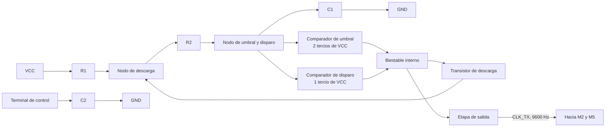

## j) Diagrama completo de conexiones eléctricas

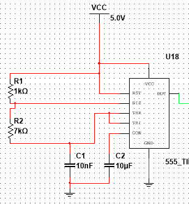

Temporizador con la red de temporización formada por las dos resistencias y el capacitor conectado al nodo de umbral y disparo. El capacitor del terminal de control desacopla el divisor interno de referencia. La salida entrega `CLK_TX` hacia M2 y M5.

# M2: Control de avance y modo

Corresponde al bloque de control del tercer nivel, ubicado en la entrada del subsistema, donde recibe la solicitud de la FPGA y la convierte en las señales internas que ordenan el resto de los módulos.

## f) Explicación de la relación con otros módulos

Este módulo es el único punto de entrada del subsistema discreto y traduce una petición externa en dos eventos internos ordenados en el tiempo. Recibe la línea de solicitud desde la FPGA y el reloj de baudios desde M1, entrega el pulso de avance al generador pseudoaleatorio M3 y entrega la señal de modo al registro de transmisión M5 y al acondicionamiento de línea M5. Al separar el avance del cambio de modo, este módulo garantiza que la posición ya esté actualizada cuando el registro la captura, lo que resuelve el orden entre generación y transmisión dentro de un mismo turno.

## g) Explicación de funcionamiento

La señal que llega de la FPGA se hace pasar primero por un búfer que restaura el nivel lógico del dominio de 3,3 V al de 5 V del protoboard. El flanco de subida de la señal así acondicionada ataca directamente el reloj del generador pseudoaleatorio, lo que produce exactamente un desplazamiento por cada solicitud recibida y elimina cualquier avance continuo. La misma señal alimenta además la entrada de dato de un flip-flop gobernado por el reloj de baudios, cuya salida es la señal de modo.

Ese flip-flop introduce un retardo deliberado de un tiempo de bit entre la llegada de la solicitud y el cambio de modo del registro. En el flanco de baudios en que el flip-flop captura la solicitud, el registro todavía está en modo de carga y toma la posición recién generada, y solo a partir del flanco siguiente comienza a desplazar. Sin ese retardo el registro habría cargado la posición anterior, porque la carga ocurre antes de que el generador avance.

## h) Diseño

El enunciado exige que el generador avance una única vez por cada solicitud recibida y no de forma continua, lo que descarta cualquier oscilador libre atacando el generador y obliga a derivar el avance de la propia solicitud. Como la solicitud proviene de una salida sincrónica de la FPGA y no de un contacto mecánico, el flanco llega limpio y no se requiere filtrado de rebotes, de modo que basta con acondicionar el nivel y usar el flanco directamente. El resto del módulo resuelve el orden entre los dos eventos, y para ello se emplea un solo flip-flop tipo D que retemporiza la solicitud con el reloj de baudios, alternativa preferida frente a una red de retardo con resistencia y capacitor porque el instante del cambio de modo queda determinado por el mismo reloj que gobierna el registro y no por una constante de tiempo sujeta a tolerancia.

### Secuencia de eventos por solicitud

| Instante | Evento | Efecto |
|---|---|---|
| Flanco de subida de la solicitud | Avance del generador | La posición cambia al siguiente estado del ciclo |
| Primer flanco de baudios posterior | Carga del registro y subida de modo | El registro captura la posición nueva |
| Flancos de baudios siguientes | Desplazamiento | La trama sale por la línea serial |
| Flanco de bajada de la solicitud | Bajada de modo | El registro vuelve a carga y la línea queda en reposo |

### Tabla de verdad del flip-flop de modo

| solicitud_topo | CLK_TX | modo siguiente |
|---|---|---|
| 0 | Flanco de subida | 0 |
| 1 | Flanco de subida | 1 |
| X | Sin flanco | Sin cambio |

### Uso de módulos integrados

- Búfer 74HCT125, un elemento de cuatro, para restaurar el nivel de la solicitud
- Flip-flop tipo D 74LS74, un elemento de dos, para la señal de modo

El 74HCT acepta umbrales de entrada compatibles con TTL y entrega salidas de 5 V plenos, que es lo que necesita el reloj del generador para conmutar con margen. El 74LS74 aporta el flip-flop tipo D disparado por flanco de subida que requiere la retemporización.

## i) Diagrama esquemático detallado

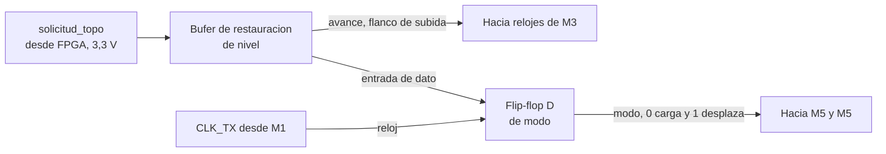

## j) Diagrama completo de conexiones eléctricas

Pendiente de incorporar al esquemático del quinto nivel.

# M3: Generador pseudoaleatorio de posición

Corresponde al bloque LFSR del tercer nivel, que allí recibe el pulso de avance y entrega la palabra `pos[2:0]` hacia el decodificador y hacia el subsistema de transmisión.

## f) Explicación de la relación con otros módulos

Este módulo recibe su pulso de avance de M2 y entrega tres de sus cuatro salidas tanto al decodificador de posición M4 como a las entradas de carga paralela del registro de transmisión M5. Es la única fuente de datos del subsistema, ya que todo lo que se enciende en el tablero y todo lo que viaja por el enlace serial se origina aquí. Que ambos destinos partan de las mismas tres líneas es lo que garantiza que el LED encendido y la posición transmitida sean siempre el mismo número.

## g) Explicación de funcionamiento

El módulo es un registro de desplazamiento de cuatro etapas encadenadas que comparten el mismo reloj. En cada flanco de subida todo el contenido se desplaza una posición de forma simultánea, mientras la primera etapa carga el resultado de una compuerta de disparidad que combina las salidas de la tercera y de la cuarta. El registro recorre así una secuencia determinista que, sin conocer la estructura interna, aparenta ser aleatoria. Existe un estado del que el registro no puede salir, porque si las cuatro etapas valen cero la compuerta de disparidad entrega cero y el registro queda detenido de forma indefinida. Ese estado queda excluido del ciclo y obliga a garantizar una inicialización distinta de cero.

Como el único flanco que recibe proviene de la solicitud, el estado del registro permanece congelado durante todo el turno. Esa quietud es la que permite que el LED del topo activo se mantenga encendido sin parpadeo y que la trama transmitida corresponda a la posición que el jugador está viendo.

## h) Diseño

El registro de desplazamiento con realimentación lineal es la solución estándar para generar una secuencia pseudoaleatoria con lógica discreta, porque entrega una secuencia de longitud conocida y demostrable con la menor cantidad de componentes. La alternativa de un contador binario con lógica de dispersión se descarta porque no ofrece garantía formal de recorrido completo y resulta mucho más fácil de anticipar para un jugador. Se toman las etapas tres y cuatro como derivaciones de realimentación.

### Ecuación de realimentación

$$D_1 = Q_3 \oplus Q_4$$

Con estas derivaciones el registro recorre quince estados antes de repetirse, según se comprueba en la tabla de secuencia de esta misma sección.

### Tabla de verdad de la red de realimentación

| Q3 | Q4 | D1 |
|---|---|---|
| 0 | 0 | 0 |
| 0 | 1 | 1 |
| 1 | 0 | 1 |
| 1 | 1 | 0 |

### Ecuaciones de estado siguiente

El signo más indica estado siguiente. $Q_3$ es el valor que la etapa tiene en el momento actual y $Q_3^{+}$ es el que tendrá después del próximo flanco de reloj.

| Etapa | Ecuación |
|---|---|
| 1 | $Q_1^{+} = Q_3 \oplus Q_4$ |
| 2 | $Q_2^{+} = Q_1$ |
| 3 | $Q_3^{+} = Q_2$ |
| 4 | $Q_4^{+} = Q_3$ |

### Tabla de secuencia completa

Estados a partir de la semilla `1000`, con la posición decodificada como el número binario formado por Q4, Q3 y Q2 en ese orden de significancia.

| Paso | Q1 | Q2 | Q3 | Q4 | pos |
|---|---|---|---|---|---|
| 0 | 1 | 0 | 0 | 0 | 0 |
| 1 | 0 | 1 | 0 | 0 | 1 |
| 2 | 0 | 0 | 1 | 0 | 2 |
| 3 | 1 | 0 | 0 | 1 | 4 |
| 4 | 1 | 1 | 0 | 0 | 1 |
| 5 | 0 | 1 | 1 | 0 | 3 |
| 6 | 1 | 0 | 1 | 1 | 6 |
| 7 | 0 | 1 | 0 | 1 | 5 |
| 8 | 1 | 0 | 1 | 0 | 2 |
| 9 | 1 | 1 | 0 | 1 | 5 |
| 10 | 1 | 1 | 1 | 0 | 3 |
| 11 | 1 | 1 | 1 | 1 | 7 |
| 12 | 0 | 1 | 1 | 1 | 7 |
| 13 | 0 | 0 | 1 | 1 | 6 |
| 14 | 0 | 0 | 0 | 1 | 4 |
| 15 | 1 | 0 | 0 | 0 | se repite |

La posición cero aparece una sola vez por ciclo y las siete restantes aparecen dos veces, como consecuencia directa de que el estado nulo está excluido. La inicialización se resuelve con una red de encendido sobre el preset asíncrono de la primera etapa, que garantiza el estado inicial `1000`.

### Uso de módulos integrados

- Dos 74LS74 para las cuatro etapas del registro
- 74LS86 para la red de realimentación

El 74LS74 contiene dos flip-flops tipo D disparados por flanco de subida con preset y clear asíncronos independientes, que es lo que exige la topología.

## i) Diagrama esquemático detallado

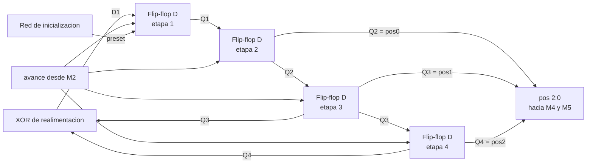

## j) Diagrama completo de conexiones eléctricas

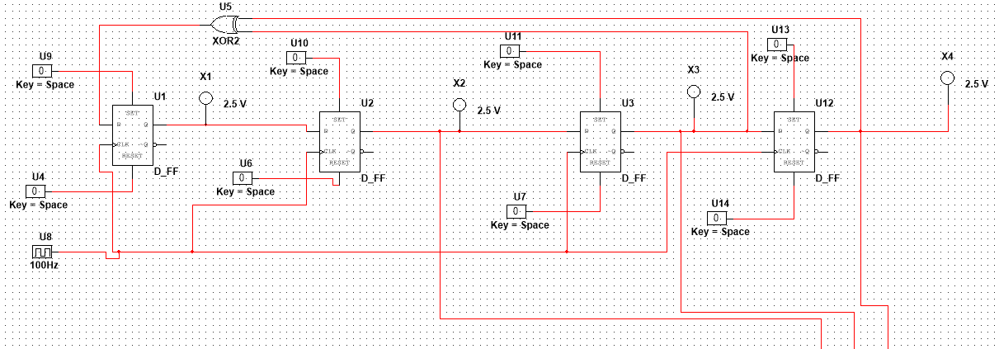

Cadena de cuatro flip-flops tipo D con la compuerta XOR de realimentación cerrando el lazo desde las etapas tres y cuatro hacia la entrada de dato de la primera. Las cuatro etapas comparten la misma línea de reloj. Las salidas de las etapas dos, tres y cuatro forman `pos[2:0]` hacia M4 y M5.

# M4: Decodificador de posición e indicadores

Corresponde al bloque de indicación visual del tercer nivel, que allí recibe la palabra de posición y gobierna los ocho LEDs del tablero.

## f) Explicación de la relación con otros módulos

Este módulo recibe la palabra de posición de M3 y no entrega ninguna señal a otro módulo, ya que sus salidas terminan en los indicadores del tablero. Cuelga de las mismas tres líneas que alimentan al registro de transmisión M5, en paralelo con él y sin ninguna dependencia mutua, lo que hace que la indicación visual siga siendo correcta aunque el enlace serial falle. No tiene relación con M1, M2 ni M5.

## g) Explicación de funcionamiento

El decodificador interpreta sus tres entradas como un número binario y activa la salida cuya numeración coincide con ese valor, dejando las siete restantes inactivas. Sus salidas son activas en nivel bajo, de modo que cada LED se conecta con su ánodo hacia la alimentación a través de una resistencia limitadora y su cátodo a la salida correspondiente, con lo cual el LED conduce cuando su salida se activa y el integrado absorbe la corriente en lugar de entregarla.

Como el generador solo cambia de estado cuando llega una solicitud, la entrada del decodificador permanece fija durante todo el turno y el LED encendido no requiere ningún elemento de memoria adicional para mantenerse. El indicador se apaga y otro se enciende únicamente en el instante en que la FPGA pide un topo nuevo.

## h) Diseño

El requisito es activar una de ocho líneas a partir de una palabra binaria de tres bits, función que un decodificador integrado resuelve en un solo encapsulado frente a las ocho compuertas AND de tres entradas más los tres inversores que exigiría la implementación canónica, lo que ocuparía al menos cinco encapsulados. Las tres entradas de habilitación del integrado se atan de forma permanente al estado activo, ya que el bloque debe estar habilitado en todo momento, y se aprovecha la polaridad activa en bajo de las salidas para que el integrado absorba la corriente de los indicadores, régimen en el que la familia entrega mayor capacidad de manejo que en el de entrega.

### Tabla de verdad

| pos2 | pos1 | pos0 | Salida activa | LED encendido |
|---|---|---|---|---|
| 0 | 0 | 0 | Y0 | Posición 0 |
| 0 | 0 | 1 | Y1 | Posición 1 |
| 0 | 1 | 0 | Y2 | Posición 2 |
| 0 | 1 | 1 | Y3 | Posición 3 |
| 1 | 0 | 0 | Y4 | Posición 4 |
| 1 | 0 | 1 | Y5 | Posición 5 |
| 1 | 1 | 0 | Y6 | Posición 6 |
| 1 | 1 | 1 | Y7 | Posición 7 |

La resistencia limitadora de cada LED se dimensiona para que la corriente quede por debajo de la capacidad de absorción especificada para una salida del integrado, condición que también mantiene la tensión de salida en bajo dentro del margen garantizado.

### Uso de módulos integrados

- Decodificador 74LS138 de tres a ocho líneas
- Ocho LED individuales con su resistencia limitadora

## i) Diagrama esquemático detallado

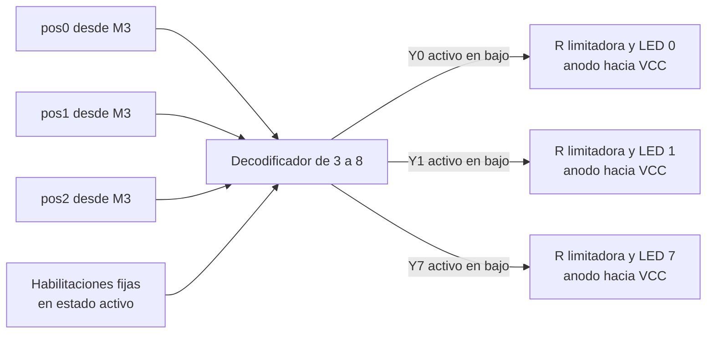

## j) Diagrama completo de conexiones eléctricas

Pendiente de incorporar al esquemático del quinto nivel.

# M5: Acondicionamiento de la línea de transmisión

Corresponde a la salida del subsistema de transmisión en el tercer nivel, en el punto donde la trama serial abandona el protoboard hacia la FPGA.

## f) Explicación de la relación con otros módulos

Este módulo recibe de M5 el flujo serial producido por el registro de desplazamiento, en relación de tipo dato, y de M2 la misma señal de modo que gobierna a M5, en relación de tipo control. Esa doble entrada es lo que permite que ambos actúen de forma coordinada, forzando el reposo mientras M5 carga y volviéndose transparente mientras M5 desplaza. Entrega a la FPGA la línea de transmisión del enlace, que es el punto de frontera eléctrica del subsistema, y no tiene relación con M1, M3 ni M4.

## g) Explicación de funcionamiento

El módulo está compuesto por un inversor y una compuerta OR de dos entradas en cascada. El inversor produce el complemento de la señal de modo y la compuerta OR lo combina con la salida serie del registro. Durante la carga, el complemento vale uno y la compuerta fuerza la salida a nivel alto sin importar el contenido del registro, dejando la línea en el estado de reposo que exige el protocolo. Durante el desplazamiento, el complemento vale cero y la compuerta reproduce fielmente el flujo serial. Sin esta lógica, la salida del registro presentaría el valor de la entrada paralela H, que está en nivel bajo, por lo que la línea quedaría en nivel bajo permanente entre trama y trama, condición que un receptor UART interpreta como ruptura del enlace y que además impediría detectar el flanco de inicio de la trama siguiente.

## h) Diseño

El requisito es forzar un nivel alto durante una condición determinada y dejar pasar la señal sin alterar durante la condición complementaria. La compuerta OR de dos entradas es la función mínima que lo cumple, porque su elemento neutro es el cero y su elemento absorbente es el uno, que coincide con el nivel de reposo requerido. La alternativa de una compuerta de tres estados, que dejaría la línea en alta impedancia durante la carga confiando el reposo a una resistencia de elevación, se descarta porque requiere igualmente un encapsulado y añade la dependencia de un componente pasivo. La adaptación entre el dominio de 5 V del protoboard y el de 3,3 V de la FPGA se resuelve con un divisor resistivo, obligatorio porque aplicar 5 V a una entrada de 3,3 V excede la tensión máxima especificada y puede dañar el pin de forma permanente.

### Ecuación y tabla de verdad

$$TX = QH \lor \overline{modo}$$

| modo | Complemento | QH | TX | Régimen |
|---|---|---|---|---|
| 0 | 1 | 0 | 1 | Carga, reposo forzado |
| 0 | 1 | 1 | 1 | Carga, reposo forzado |
| 1 | 0 | 0 | 0 | Transmisión, bit en cero |
| 1 | 0 | 1 | 1 | Transmisión, bit en uno |

### Uso de módulos integrados

- Inversor 74LS04, un elemento de seis
- Compuerta OR 74LS32, un elemento de cuatro

## i) Diagrama esquemático detallado

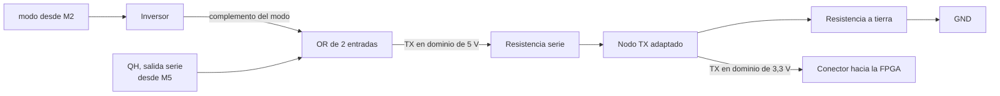

## j) Diagrama completo de conexiones eléctricas

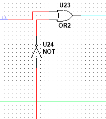

Inversor y compuerta OR en cascada. El inversor complementa la señal de modo y la compuerta fuerza el nivel alto de reposo mientras el registro carga, dejando pasar el flujo serial durante el desplazamiento. La salida entrega `TX` hacia la FPGA.

# Diagrama de cuarto nivel: subsistema FPGA

## Módulos
  
- M1. Módulo Receptor_UART
- M2. Módulo Show_Mole
- M3. Módulo Press_btn
- M4. Módulo Time_Logic
- M5. Módulo Hit_Counter
- M6. Módulo Fail_Counter
- M7. Módulo State

# M1: Receptor UART

## f) Relación con otros módulos

`pos(8)` proviene directamente del pin de GPIO conectado al registro de desplazamiento del subsistema discreto; al tratarse de una señal generada por un reloj independiente al de la FPGA, este módulo es responsable de resolver la metaestabilidad mediante un sincronizador de dos etapas antes de procesarla, tal como lo exige la sección 3.3 del enunciado. La FSM, al entrar al estado `001` (`en_numAleatorios`), emite hacia el subsistema discreto el pulso de solicitud de una nueva posición; ese pulso no forma parte de este módulo, ya que su generación corresponde a la lógica de control de la FSM y no a la recepción. Una vez que el subsistema discreto responde con la trama serial, este módulo la recibe de forma autónoma, sin esperar ninguna señal de la FSM, y levanta `valid_pos` en cuanto termina de decodificarla. La FSM permanece en el estado `010` monitoreando `valid_pos`; al recibirlo, activa `en_save_pos` para que la posición quede retenida en un registro estable, y transiciona hacia el estado de juego. `pos_topo[2:0]` se entrega tanto a la FSM (para comparar contra el botón presionado) como al módulo Show_Mole (M2), que la usa para encender el LED correspondiente. `rst` reinicia el registro de salida y la lógica de recepción a un estado conocido tras un reinicio manual.
 
## g) Explicación de funcionamiento
 
`pos(8)` ingresa primero a un sincronizador de dos etapas (dos flip-flops en cascada con el reloj de 100MHz) para eliminar el riesgo de metaestabilidad, dado que la señal proviene de un dominio de reloj propio del circuito discreto sin referencia compartida con la FPGA. La señal ya sincronizada alimenta un contador de baudios (`CLK_U`) que, a partir del reloj de 100MHz, genera los instantes de muestreo correspondientes a la velocidad de transmisión acordada por el grupo (9600 baudios en el diseño de referencia), sin necesidad de un reloj derivado adicional. Un contador de bits (`CON_U`) detecta el flanco de bajada del bit de inicio, espera medio período de bit para ubicarse en el centro de cada bit, y desde ahí muestrea los 8 bits de datos en los instantes sucesivos separados por un período de bit completo, desplazándolos hacia el registro `REG_U`. Al completar los 8 bits, el contador verifica la posición del bit de parada y, si el formato de trama es válido, transfiere los 3 bits menos significativos del byte recibido a la salida `pos_topo[2:0]` y genera un pulso en `valid_pos`. Si `en_save_pos` está activo en ese momento, el valor de `pos_topo[2:0]` se retiene en un registro de salida estable, de modo que la FSM dispone de una posición constante durante toda la ventana de juego del turno, aunque el subsistema discreto envíe una trama nueva antes de que inicie el siguiente turno.
 
## h) Diseño
 
Se optó por un sincronizador de dos etapas en lugar de uno de una sola etapa porque `pos(8)` es completamente asíncrona respecto al reloj de la FPGA y una sola etapa no ofrece un margen de resolución de metaestabilidad suficiente a 100MHz; esta decisión responde directamente al punto de investigación previa sobre sincronizadores de doble flip-flop. El muestreo se realiza en el centro de cada bit (medio período después del flanco de inicio) y no en el flanco mismo, para maximizar el margen de error tolerado entre el reloj de baudios del circuito discreto (generado con un oscilador 555) y el generado dentro de la FPGA, ya que ambos relojes son independientes y solo coinciden en la velocidad nominal acordada, no en fase. El generador de baudios se implementa mediante una habilitación de conteo derivada del reloj principal de 100MHz (clock enable), sin generar un reloj físico adicional, siguiendo la recomendación del enunciado sobre buenas prácticas de asignación de relojes en FPGA. No se valida el bit de paridad porque el formato acordado en la sección 3.2 es 8N1 (sin paridad); el bit de parada sí se verifica como comprobación mínima de integridad de trama, ya que a diferencia del diseño combinacional simplificado de una versión anterior de este módulo, aquí la trama efectivamente llega bit a bit y puede haber errores de sincronización de baudios. Se separa la señal de dato decodificado (`pos_topo[2:0]`, que se actualiza en cuanto llega una trama válida) del registro retenido que consume la FSM, habilitado por `en_save_pos`, para que la llegada asíncrona de una trama nueva del lado discreto nunca altere la posición vigente durante un turno en curso.
 
Tabla de estados del contador de recepción (`CON_U`), simplificada:
 
| Estado | Condición de entrada | Acción | Estado siguiente |
|---|---|---|---|
| `IDLE` | `pos(8)_sync` = 1 | esperar | `IDLE` |
| `IDLE` | `pos(8)_sync` = 0 (flanco de bajada) | iniciar conteo de medio bit | `START` |
| `START` | medio período de bit cumplido | confirmar bit de inicio válido | `DATO` |
| `DATO` | 8 bits muestreados | pasar a verificación de parada | `STOP` |
| `STOP` | bit de parada = 1 | `pos_topo` = dato[2:0], pulso `valid_pos` | `IDLE` |
| `STOP` | bit de parada = 0 | descartar trama, sin pulso `valid_pos` | `IDLE` |
 

 Para llevar el control de recepción a una implementación directa en HDL se codifican sus 4 estados con 2 bits (`Q1 Q0`) y se derivan las tablas de verdad de siguiente estado y de salidas a partir de las señales de datapath: `pos(8)` (línea ya sincronizada), `tick` (pulso del generador de baudios, uno por período de bit) y `cntr` (bandera del contador de bits de datos, en 1 cuando ya se muestrearon los 8 bits).

**Codificación de estados**
 
| Estado | `Q1` | `Q0` |
|---|---|---|
| `IDLE` | 0 | 0 |
| `START` | 0 | 1 |
| `DATO` | 1 | 0 |
| `STOP` | 1 | 1 |
 
**Tabla de verdad de siguiente estado**
 
| `Q1` | `Q0` | `pos(8)` | `tick` | `cntr` | `Q1'` | `Q0'` | Comentario |
|---|---|---|---|---|---|---|---|
| 0 | 0 | 1 | X | X | 0 | 0 | sin flanco de inicio, permanece en `IDLE` |
| 0 | 0 | 0 | X | X | 0 | 1 | flanco de bajada detectado, pasa a `START` |
| 0 | 1 | X | 0 | X | 0 | 1 | espera a completar medio período de bit |
| 0 | 1 | 0 | 1 | X | 1 | 0 | bit de inicio confirmado en el centro del bit, pasa a `DATO` |
| 0 | 1 | 1 | 1 | X | 0 | 0 | glitch: la línea subió antes del muestreo, se descarta y regresa a `IDLE` |
| 1 | 0 | X | 0 | X | 1 | 0 | espera al siguiente `tick` para muestrear el bit de datos |
| 1 | 0 | X | 1 | 0 | 1 | 0 | se desplaza un bit de datos, aún no completa los 8 |
| 1 | 0 | X | 1 | 1 | 1 | 1 | octavo bit de datos muestreado, pasa a `STOP` |
| 1 | 1 | X | 0 | X | 1 | 1 | espera al `tick` del bit de parada |
| 1 | 1 | X | 1 | X | 0 | 0 | se evalúa el bit de parada (válido o no) y regresa a `IDLE` |
 
**Tabla de verdad de salidas** (`shift_en` y `bit_cnt_en` son de Moore, dependen solo del estado; `valid_pos` es de Mealy, depende también de `pos(8)` y `tick` en el estado `STOP`, ya que indica si la trama fue válida)
 
| `Q1` | `Q0` | `pos(8)` | `tick` | `shift_en` | `bit_cnt_en` | `valid_pos` |
|---|---|---|---|---|---|---|
| 0 | 0 | X | X | 0 | 0 | 0 |
| 0 | 1 | X | X | 0 | 0 | 0 |
| 1 | 0 | X | 1 | 1 | 1 | 0 |
| 1 | 0 | X | 0 | 0 | 0 | 0 |
| 1 | 1 | 1 | 1 | 0 | 0 | 1 |
| 1 | 1 | 0 | 1 | 0 | 0 | 0 |
| 1 | 1 | X | 0 | 0 | 0 | 0 |
 
**Sincronizador de dos etapas** (cada etapa es un flip-flop tipo D, su tabla de verdad es la del flip-flop D estándar y no requiere lógica combinacional adicional):
 
| `D` | `Q` (estado actual) | `Q+` (siguiente flanco de `clk`) |
|---|---|---|
| 0 | X | 0 |
| 1 | X | 1 |
 
**Generador de baudios (`CLK_U`)**, contador módulo `N = f_clk / baudrate` (con `baudrate` = 9600 y `f_clk` = 100MHz, `N` = 10417):
 
| Condición | `count'` | `tick` |
|---|---|---|
| `count` < `N` − 1 | `count` + 1 | 0 |
| `count` = `N` − 1 | 0 | 1 |
| `rst` = 1 | 0 | 0 |

## i) Diagrama esquemático detallado del diseño
 
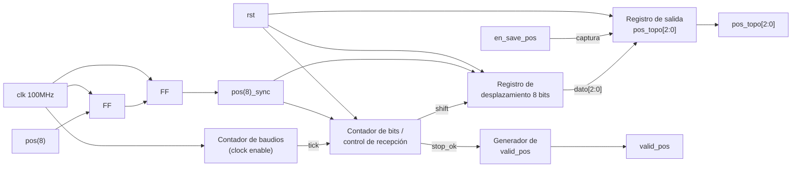

# M2: Show_Mole

## f) Relación con otros módulos

El módulo recibe la señal pos_topo[2:0] desde el registro UART despues de haber sido generado. Luego, la máquina de estados (FSM) se encarga de indicar cuando se puede encender la matriz de leds, mediante la señal en_topo. 

## g) Explicación de funcionamiento

El módulo Show_Mole opera como un decodificador combinacional de 3 a 8 bits con entrada de habilitación (Enable). Su función principal es traducir la posición codificada en binario pos_topo[2:0] a una representación en bus de 8 bits donde un solo bit se encuentra activo (one-hot), permitiendo encender un único LED de la matriz 4x2 a la vez.

## h) Diseño

El diseño de este módulo se puede subdividir fácilmente en una parte de control que activan o desactiva la matriz de leds que muestran la posición del topo, y por otro lado se tiene un decodificador 3 a 8 que convierte la información dada por pos_topo[2:0] en una señal que activa el led correspondiente. Los leds están distribuidos de la siguiente forma:

#### Mapeo Físico de la Matriz

| | Columna 0 | Columna 1 |
| :---: | :---: | :---: |
| **Fila 0** | **LED 0** (`000`) | **LED 1** (`001`) |
| **Fila 1** | **LED 2** (`010`) | **LED 3** (`011`) |
| **Fila 2** | **LED 4** (`100`) | **LED 5** (`101`) |
| **Fila 3** | **LED 6** (`110`) | **LED 7** (`111`) |

---

La siguiente tabla detalla la lógica de decodificación tipo one-hot con activación por señal de enable. 

**Nota:** L# indica el led que se enciende. 

| **en_topo** | **pos_topo[2]** | **pos_topo[1]** | **pos_topo[0]** | **L7** | **L6** | **L5**| **L4** | **L3** | **L2** | **L1** | **L0** | **Estado** |
| :---: | :---: | :---: | :---: | :---: | :---: | :---: | :---: | :---: | :---: | :---: | :---: | :--- |
| **0** | X | X | X | 0 | 0 | 0 | 0 | 0 | 0 | 0 | 0 | Apagados (Sin topo) |
| **1** | 0 | 0 | 0 | 0 | 0 | 0 | 0 | 0 | 0 | 0 | **1** | LED 0 encendido |
| **1** | 0 | 0 | 1 | 0 | 0 | 0 | 0 | 0 | 0 | **1** | 0 | LED 1 encendido |
| **1** | 0 | 1 | 0 | 0 | 0 | 0 | 0 | 0 | **1** | 0 | 0 | LED 2 encendido |
| **1** | 0 | 1 | 1 | 0 | 0 | 0 | 0 | **1** | 0 | 0 | 0 | LED 3 encendido |
| **1** | 1 | 0 | 0 | 0 | 0 | 0 | **1** | 0 | 0 | 0 | 0 | LED 4 encendido |
| **1** | 1 | 0 | 1 | 0 | 0 | **1** | 0 | 0 | 0 | 0 | 0 | LED 5 encendido |
| **1** | 1 | 1 | 0 | 0 | **1** | 0 | 0 | 0 | 0 | 0 | 0 | LED 6 encendido |
| **1** | 1 | 1 | 1 | **1** | 0 | 0 | 0 | 0 | 0 | 0 | 0 | LED 7 encendido |

# M3: press_btn

## f) Relación con otros módulos

EEl módulo press_btn recibe las señales Botones[7:0] provenientes de los ocho pulsadores físicos. Estas señales son procesadas mediante un sincronizador de dos etapas y un filtro anti-rebote para eliminar cambios no deseados producidos por el funcionamiento mecánico de los pulsadores.
Una vez filtradas, las señales se envían a un codificador de prioridad, el cual genera la posición del botón presionado mediante btn[2:0]. La señal btn_valid indica a la FSM que existe una pulsación válida.
La FSM utiliza btn[2:0] para comparar la posición del botón presionado con la posición actual del topo pos_topo[2:0]. De esta comparación se determina si el jugador presionó el botón correspondiente durante el tiempo permitido por Time_Logic.

## g) Explicación de funcionamiento

El módulo press_btn procesa las ocho entradas físicas Botones[7:0] para obtener una pulsación confiable y sincronizada con el reloj del sistema.
Primero, cada entrada pasa por un sincronizador de dos etapas, encargado de reducir el riesgo de metaestabilidad debido a que los pulsadores son señales asíncronas respecto al reloj.
Posteriormente, cada señal sincronizada pasa por un filtro anti-rebote. Este filtro comprueba que el estado del pulsador permanezca estable durante aproximadamente 10 ms antes de aceptar el cambio como una pulsación válida.
Finalmente, las ocho señales filtradas son procesadas por un codificador de prioridad 8:3, que convierte la posición del botón activo en un código binario de 3 bits. La salida btn[2:0] representa la posición del botón presionado, mientras que btn_valid indica si existe una pulsación válida. En caso de que varios botones se encuentren activos simultáneamente, el codificador da prioridad al botón de mayor índice. La FSM utiliza las señales btn y btn_valid para determinar si la posición presionada coincide con la posición del topo y, de esta manera, validar el acierto del jugador.

## h) Diseño

Este módulo se segmenta en los siguientes bloques:

1. **Sincronizador de 2 Etapas**: Este bloque tiene como función principal mitigar la metaestabilidad de los botones.

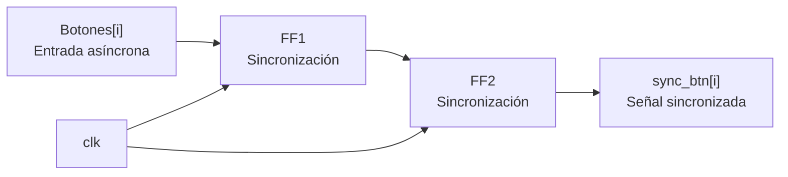

2. **Filtro Anti-rebote:** Cada una de las líneas (filas) entra a una unidad individual de filtrado. Para esto se realiza un cálculo aproximado de referencia para la temporización. Se utiliza un clk de 100 MHz para facilitar los cálculos.

        Cuentas necesarias = 10 ms / 10 ns = 1e^6 ciclos 

        Ancho del contador = log_2(1e^6 ) = 20 bits

Se añade el diagrama de estados para este submódulo.

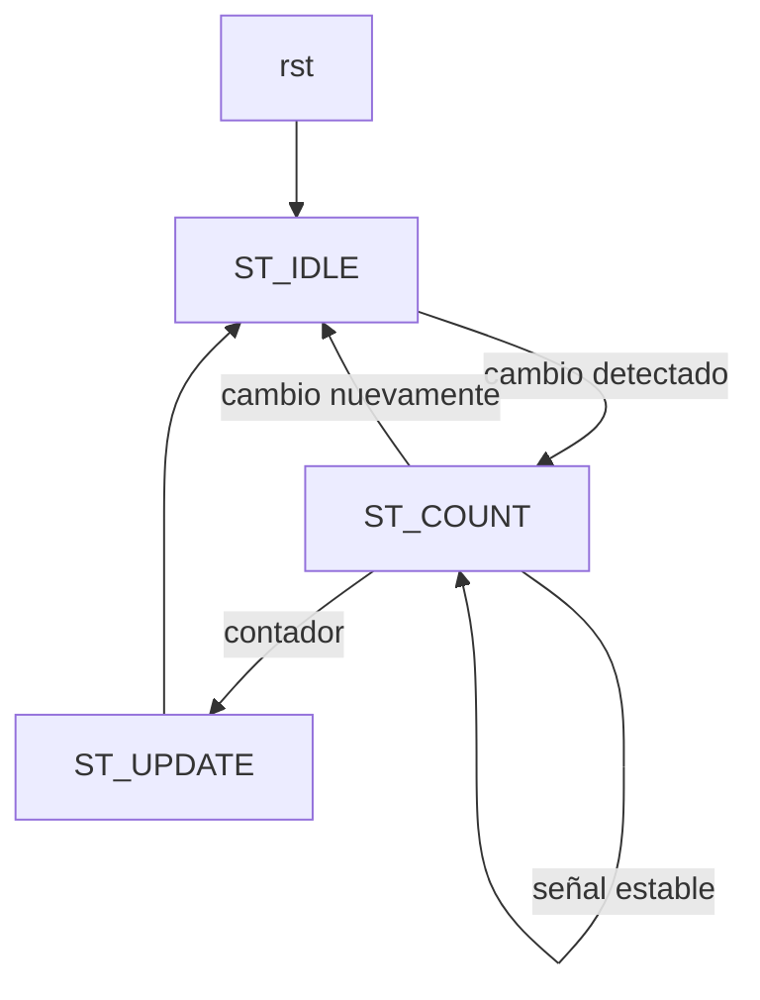

3. **Codificador de Prioridad:** toma el vector filtrado de 8 bits btn[7:0] (asumiendo lógica positiva donde '1' representa pulsador presionado) y genera la posición binaria btn[2:0]. Da prioridad al bit de mayor orden.

    **Tabla de Verdad (Prioridad al bit mayor):**

| `clean_btn[7]` | `clean_btn[6]` | `clean_btn[5]` | `clean_btn[4]` | `clean_btn[3]` | `clean_btn[2]` | `clean_btn[1]` | `clean_btn[0]` | `btn[2:0]` | `valid` |
| :---: | :---: | :---: | :---: | :---: | :---: | :---: | :---: | :---: | :---: |
| 0 | 0 | 0 | 0 | 0 | 0 | 0 | 0 | 3'b000 | 0 |
| 0 | 0 | 0 | 0 | 0 | 0 | 0 | **1** | 3'b000 | 1 |
| 0 | 0 | 0 | 0 | 0 | 0 | **1** | X | 3'b001 | 1 |
| 0 | 0 | 0 | 0 | 0 | **1** | X | X | 3'b010 | 1 |
| 0 | 0 | 0 | 0 | **1** | X | X | X | 3'b011 | 1 |
| 0 | 0 | 0 | **1** | X | X | X | X | 3'b100 | 1 |
| 0 | 0 | **1** | X | X | X | X | X | 3'b101 | 1 |
| 0 | **1** | X | X | X | X | X | X | 3'b110 | 1 |
| **1** | X | X | X | X | X | X | X | 3'b111 | 1 |

## i) Diagrama detallado del diseño

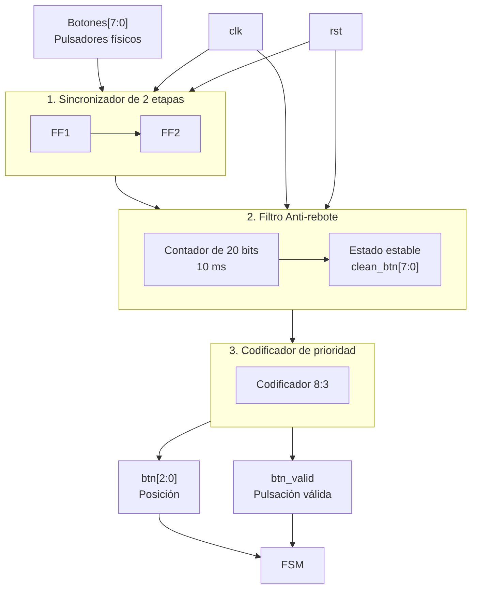

El diagrama muestra el funcionamiento interno del módulo press_btn. Las señales provenientes de los ocho pulsadores físicos Botones[7:0] ingresan primero al sincronizador de dos etapas, encargado de sincronizar las entradas asíncronas con el reloj del sistema. Luego, las señales pasan al filtro anti-rebote, que utiliza un contador para asegurar que cada cambio permanezca estable durante aproximadamente 10 ms antes de considerarlo válido.

Finalmente, las señales filtradas clean_btn[7:0] ingresan al codificador de prioridad 8:3, que determina la posición del botón presionado y genera btn[2:0]. La señal btn_valid indica a la FSM que existe una pulsación válida. Las señales clk y rst controlan los bloques secuenciales del módulo.

# M4: Time_Logic

## f) Relación con otros módulos

La FSM abre la ventana con el pulso inicio una vez que el módulo receptor_uart entregó `pos_topo[2:0]` del turno,
de modo que el tiempo de la trama serial no se le descuenta al jugador. Durante la ventana la FSM es la que evalúa `btn_golpe[7:0]` contra `pos_topo[2:0]`, por lo que M4 nunca observa las pulsaciones y se limita a medir el tiempo disponible. La FSM devuelve el pulso hit cuando el golpe es correcto, con lo cual M4 cierra el turno y reduce la duración del siguiente, y M4 responde con UP cuando la ventana se agota sin acierto, señal que la FSM interpreta como fallo y propaga al Contador Fallo. La señal nueva_partida, emitida por la FSM al salir del estado de fin de partida, devuelve la dificultad a su valor inicial.

## g) Explicación de funcionamiento

El módulo mantiene un registro de dificultad con la cantidad de intervalos de 100 ms que dura la ventana y un contador descendente que mide el turno en curso. Con el pulso inicio el contador se carga con el valor del registro de dificultad y el prescalador interno se reinicia para que el primer intervalo sea completo, luego de lo cual el contador descuenta una unidad por cada habilitación de 100 ms. Al llegar a cero se emite UP durante un ciclo de reloj, y si en cambio llega hit antes de ese momento el conteo se detiene y el registro de dificultad se decrementa mientras sea mayor que su valor mínimo. Cuando la FSM resuelve el turno como fallo por botón incorrecto no se requiere ninguna señal adicional, ya que el siguiente pulso inicio recarga el contador y descarta la cuenta anterior, y solo rst y nueva_partida devuelven el registro de dificultad a su valor inicial, de manera que la dificultad alcanzada se conserva dentro de la partida aunque el jugador falle.

## h) Diseño

Se escoge una resolución de 100 ms porque todas las duraciones exigidas son múltiplos exactos de ese valor, con lo cual la ventana completa se mide con un contador descendente de cuatro bits cargado entre 15 y 5 y no se acumula error de redondeo. La habilitación de 100 ms se genera con un prescalador cuyo módulo queda fijado por la frecuencia de la tarjeta,

$$N_{presc} = 100 \times 10^6 \cdot 0{,}1 = 10^7, \qquad 2^{23} < 10^7 \le 2^{24}$$

por lo que se implementa con un contador de 24 bits que activa la habilitación durante un solo ciclo, y de esta forma toda la temporización ocurre en el dominio del reloj de 100 MHz sin generar relojes derivados. El registro de dificultad es un contador descendente saturado en 5, y como el enunciado establece que un fallo no devuelve la ventana a su valor inicial, la reducción resulta monótona dentro de la partida y la cuenta de aciertos consecutivos produce la misma secuencia que la de aciertos acumulados, así que un solo registro la representa.

| Aciertos consecutivos | Carga del contador | Duración de la ventana |
|---|---|---|
| 0 | 15 | 1500 ms |
| 1 | 14 | 1400 ms |
| 2 | 13 | 1300 ms |
| 3 | 12 | 1200 ms |
| 4 | 11 | 1100 ms |
| 5 | 10 | 1000 ms |
| 6 | 9 | 900 ms |
| 7 | 8 | 800 ms |
| 8 | 7 | 700 ms |
| 9 | 6 | 600 ms |
| 10 o más | 5 | 500 ms |

## i) Diagrama detallado del diseño

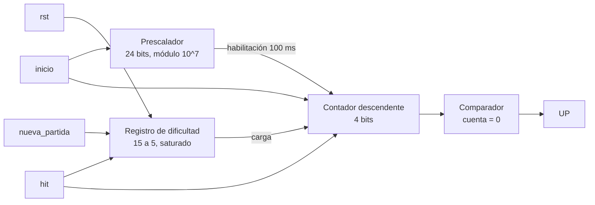

Tabla de verdad de la lógica de control, con prioridad de arriba hacia abajo:

| `rst` o `nueva_partida` | `ini` | `hit` | habilitación 100 ms | cuenta actual | Contador siguiente | Registro de dificultad siguiente | `UP` |
|---|---|---|---|---|---|---|---|
| 1 | X | X | X | X | 0 | 15 | 0 |
| 0 | 1 | X | X | X | dificultad | sin cambio | 0 |
| 0 | 0 | 1 | X | X | sin cambio (se detiene) | dificultad − 1 si dificultad > 5, si no sin cambio | 0 |
| 0 | 0 | 0 | 1 | 0 | sin cambio | sin cambio | 1 |
| 0 | 0 | 0 | 1 | ≠ 0 | cuenta − 1 | sin cambio | 0 |
| 0 | 0 | 0 | 0 | X | sin cambio | sin cambio | 0 |

Si hay reset o nueva partida, todo se pone en su estado inicial y la dificultad vuelve a quince, como menciona el enunciado. Si llega la
señal de inicio, el contador se carga con el valor guardado de dificultad. Si llega un acierto, el conteo se
detiene y la dificultad baja un paso, siempre que no esté ya en su valor mínimo. Si nada de eso pasa y llega la
habilitación de cada cien milisegundos, el contador baja uno, y si ya estaba en cero se activa la señal UP para
avisar que se acabó el tiempo. En cualquier otro caso todo se queda igual.

# M5: Hit_Counter

## f) Relación con otros módulos

El módulo recibe de la FSM el mismo pulso hit que consume Time_Logic para reducir la ventana y que Fail_Counter usa para reiniciar su cuenta de fallos consecutivos, de modo que las tres reacciones a un golpe correcto ocurren en el mismo ciclo de reloj y quedan consistentes entre sí. Su salida `acierto[7:0]` alimenta directamente los dos displays de aciertos del módulo Marcador, que solo debe decodificar cada dígito a siete segmentos y multiplexarlos. La FSM lo pone en cero con nueva_partida al iniciar una partida nueva luego del tercer fallo consecutivo, y el reinicio manual llega por rst.

## g) Explicación de funcionamiento

El módulo es un contador BCD de dos dígitos que avanza una única vez por cada pulso hit. El dígito de unidades, ubicado en `acierto[3:0]`, cuenta de cero a nueve y al desbordarse vuelve a cero y habilita el avance del dígito de decenas, ubicado en `acierto[7:4]`, de forma que la salida siempre representa un valor decimal válido. Al llegar a 99 el contador se satura y conserva su valor ante nuevos aciertos, con lo cual el marcador nunca despliega un valor fuera del ámbito especificado ni vuelve a cero a mitad de partida. Las entradas rst y nueva_partida tienen prioridad sobre el incremento y devuelven ambos dígitos a cero.

## h) Diseño

Se lleva la cuenta directamente en BCD y no en binario natural porque el destino del dato son dos displays de siete segmentos independientes, y un contador binario obligaría a intercalar un convertidor binario a decimal del tipo double dabble entre el contador y el marcador. Con la representación BCD cada dígito se resuelve con un contador de cuatro bits y un comparador con el valor nueve, y el acarreo entre dígitos es simplemente la coincidencia del dígito de unidades con ese valor durante un pulso hit. La saturación se implementa inhibiendo el incremento cuando ambos dígitos valen nueve, y el pulso hit actúa como habilitación y no como reloj, con lo cual el módulo permanece en el dominio del reloj principal y la lógica queda descrita sin ramas incompletas que infieran latches.

| acierto[7:4] | acierto[3:0] | Siguiente acierto[7:4] | Siguiente acierto[3:0] |
|---|---|---|---|
| 0 a 9 | 0 a 8 | sin cambio | acierto[3:0] + 1 |
| 0 a 8 | 9 | acierto[7:4] + 1 | 0 |
| 9 | 9 | 9 | 9 |

## i) Diagrama detallado del diseño

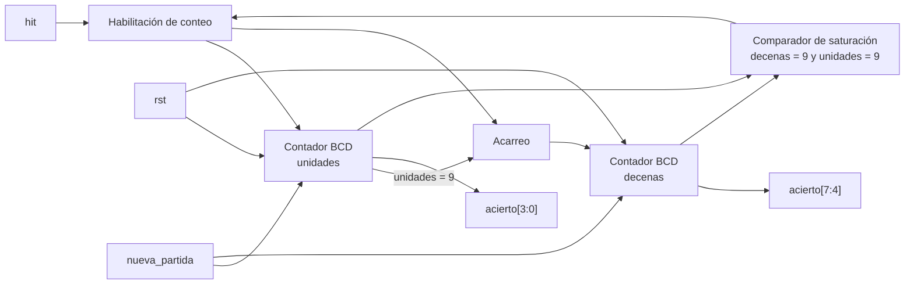

Tabla de verdad de la lógica de control, con prioridad de arriba hacia abajo:

| `rst` o `nueva_partida` | `hit` | `acierto[7:4]` | `acierto[3:0]` | Siguiente `acierto[7:4]` | Siguiente `acierto[3:0]` |
|---|---|---|---|---|---|
| 1 | X | X | X | 0 | 0 |
| 0 | 0 | X | X | sin cambio | sin cambio |
| 0 | 1 | 0 a 9 | 0 a 8 | sin cambio | `acierto[3:0]` + 1 |
| 0 | 1 | 0 a 8 | 9 | `acierto[7:4]` + 1 | 0 |
| 0 | 1 | 9 | 9 | 9 | 9 |

Si hay reset o nueva partida, ambos dígitos vuelven a cero. Si no llega ningún acierto, el contador se queda igual.
Si llega un acierto y el número todavía no llegó a noventa y nueve, el dígito de las unidades sube uno, y si ese
dígito ya estaba en nueve, pasa a cero y el dígito de las decenas sube uno. Si el contador ya llegó a noventa y
nueve, se queda ahí aunque sigan llegando aciertos, para no pasarse del valor que puede mostrar el marcador.

# M6: fail_counter

## f) Relación con otros módulos

El módulo recibe de la FSM el pulso `miss` cada vez que un turno se resuelve como fallo, ya sea porque el jugador presionó un botón incorrecto o porque `time_logic` reportó `UP` al agotarse la ventana, de modo que M6 no distingue entre ambas causas y solo cuenta el evento. También recibe el mismo pulso `hit` que consumen `time_logic` y `hit_counter`, con el cual pone en cero la cuenta de fallos consecutivos sin tocar el acumulado. Su salida `fallo[7:0]` alimenta los dos displays de fallos del módulo `marcador`, que solo debe decodificar cada dígito a siete segmentos, y su salida `fin_partida` avisa a la FSM que se alcanzó el tercer fallo consecutivo para que esta transite al estado de fin de partida. La FSM devuelve `nueva_partida` al arrancar una partida nueva, lo cual pone en cero ambas cuentas.

## g) Explicación de funcionamiento

El módulo mantiene dos cuentas independientes que avanzan con el mismo pulso `miss`. La primera es un contador BCD de dos dígitos que acumula los fallos de la partida y se despliega en el marcador, donde el dígito de unidades ocupa `fallo[3:0]` y el de decenas `fallo[7:4]`, con saturación en 99 para que nunca se muestre un valor fuera del ámbito especificado. La segunda es un contador de fallos consecutivos de dos bits que llega hasta tres, no se despliega y existe únicamente para determinar el final de la partida, por lo que se pone en cero ante cualquier pulso `hit` mientras el acumulado permanece intacto. Cuando esa cuenta consecutiva alcanza el valor tres se activa `fin_partida`, señal que se mantiene hasta que `rst` o `nueva_partida` reinicien el módulo, de manera que la FSM dispone de una condición estable y no de un pulso que pueda perderse.

## h) Diseño

La cuenta acumulada se lleva directamente en BCD por la misma razón que en `hit_counter`, ya que su destino son dos displays de siete segmentos independientes y una cuenta binaria obligaría a intercalar un convertidor del tipo double dabble antes del marcador. Se decide alojar el contador de fallos consecutivos en este módulo y no dentro de la FSM porque así el control path conserva únicamente la lógica de transición entre estados y todos los elementos de conteo quedan en el datapath, lo cual mantiene la FSM pequeña y verificable. Los pulsos `hit` y `miss` son mutuamente excluyentes dentro de un mismo turno porque la FSM resuelve cada turno de una sola manera, aun así se le asigna prioridad a `hit` en la descripción para que la cuenta consecutiva quede definida ante cualquier condición y no se infieran latches. Ambos contadores usan los pulsos como habilitación y no como reloj, con lo cual el módulo permanece en el dominio del reloj de 100 MHz.

Contador acumulado de fallos, transición ante un pulso `miss`:

| `fallo[7:4]` | `fallo[3:0]` | Siguiente `fallo[7:4]` | Siguiente `fallo[3:0]` |
|---|---|---|---|
| 0 a 9 | 0 a 8 | sin cambio | `fallo[3:0]` + 1 |
| 0 a 8 | 9 | `fallo[7:4]` + 1 | 0 |
| 9 | 9 | 9 | 9 |

Contador de fallos consecutivos y generación de `fin_partida`:

| `rst` o `nueva_partida` | `hit` | `miss` | Cuenta actual | Cuenta siguiente | `fin_partida` |
|---|---|---|---|---|---|
| 1 | X | X | X | 0 | 0 |
| 0 | 1 | X | X | 0 | 0 |
| 0 | 0 | 1 | 0 a 1 | cuenta + 1 | 0 |
| 0 | 0 | 1 | 2 | 3 | 1 |
| 0 | 0 | 1 | 3 | 3 | 1 |
| 0 | 0 | 0 | X | sin cambio | sin cambio |

## i) Diagrama detallado del diseño

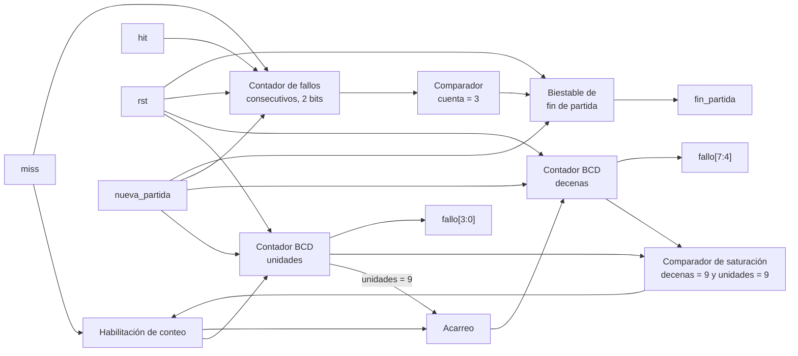

# M7: estado_juego

## f) Relación con otros módulos

El módulo recibe de la FSM la palabra `estado[1:0]`, que codifica en cuál de las situaciones de la partida se encuentra el sistema, y es el único bloque que traduce esa información a algo visible para el jugador por medio de `led_estado`. Como el estado de fin de partida debe sostenerse al menos 2 s antes del reinicio automático, el módulo mide ese intervalo con su propia base de tiempo y devuelve `fin_espera` a la FSM, que es la señal que habilita la transición hacia la partida nueva. No tiene relación directa con `time_logic`, `hit_counter` ni `fail_counter`, ya que toda la coordinación pasa por la FSM, y tampoco comparte líneas con el módulo `marcador` porque este atiende los displays de siete segmentos y no el LED de estado.

## g) Explicación de funcionamiento

El módulo decodifica `estado[1:0]` en tres condiciones visibles. Con la partida activa el LED permanece encendido de forma fija, con la partida terminada el LED parpadea, y en la condición de reposo posterior a un reinicio manual el LED permanece apagado, de modo que el jugador distingue sin ambigüedad si puede jugar o si la partida acaba de terminar. Al entrar en el estado de fin de partida arranca un contador que mide 2 s sobre la base de tiempo interna y al vencer activa `fin_espera` durante un ciclo de reloj, señal que la FSM usa para reiniciar el juego automáticamente, mientras que si la FSM abandona ese estado antes por un reinicio manual el contador se descarta. La misma base de tiempo genera el parpadeo, de forma que el LED cambia de nivel cada 200 ms y el jugador percibe una indicación claramente distinta del encendido fijo.

## h) Diseño

Se decide usar tres condiciones visibles y no dos porque un LED simplemente apagado se confunde con un sistema sin alimentación, mientras que el parpadeo identifica el fin de partida de forma inequívoca y cumple el requisito de que el estado sea claramente distinguible. La base de tiempo interna es una habilitación de reloj de 100 ms obtenida con un prescalador de 24 bits sobre el reloj de 100 MHz, igual que en `time_logic`, con lo cual no se generan relojes derivados. Esa resolución cubre las dos necesidades del módulo con un solo contador, ya que el intervalo de fin de partida corresponde a veinte habilitaciones y el semiperíodo del parpadeo a dos, de manera que basta un contador de cinco bits y un biestable de conmutación. Se decide medir los 2 s en este módulo y no en la FSM para que el control path no incorpore contadores largos, criterio que se aplicó también en `fail_counter`.

Decodificación de `estado[1:0]`:

| `estado[1:0]` | Condición | `led_estado` | Contador de 2 s |
|---|---|---|---|
| 00 | Reposo tras reinicio | 0 | detenido en cero |
| 01 | Partida activa | 1 | detenido en cero |
| 10 | Fin de partida | parpadeo a 2,5 Hz | habilitado |
| 11 | No utilizado | 0 | detenido en cero |

## i) Diagrama detallado del diseño

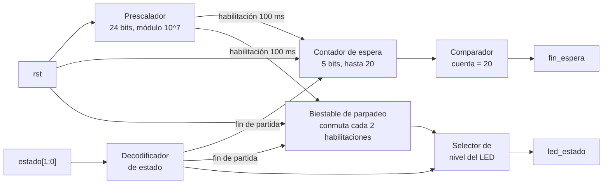

Tabla de verdad de la lógica de control, con prioridad de arriba hacia abajo:

| `rst` | `estado[1:0]` = fin de partida | habilitación 100 ms | Contador de espera | Contador siguiente | `fin_espera` | Biestable de parpadeo |
|---|---|---|---|---|---|---|
| 1 | X | X | X | 0 | 0 | 0 |
| 0 | 0 | X | X | 0 | 0 | 0 |
| 0 | 1 | 0 | X | sin cambio | 0 | sin cambio |
| 0 | 1 | 1 | < 20 | cuenta + 1 | 0 | conmuta cada 2 habilitaciones |
| 0 | 1 | 1 | 20 | sin cambio | 1 | conmuta cada 2 habilitaciones |

Si hay reset, el contador de espera y el parpadeo vuelven a cero. Si el estado no es de fin de partida, el contador se mantiene en cero y no pasa nada más. Si sí es fin de partida pero todavía no llega la habilitación de cada cien milisegundos, todo se queda igual. Cuando llega esa habilitación, el contador sube uno mientras no llegue a veinte, y el parpadeo sigue cambiando cada dos veces que llega la habilitación. Al llegar a veinte se activa la señal de fin de espera, que le avisa a la FSM que ya pasaron los dos segundos.

# M8: Máquina de Estados FSM

Objetivo: controlar el flujo de datos del sistema digital, entregando señales de control a los diferentes módulos dependiendo de las entradas que reciba el sistema.

## Entradas:
- reset: Reinicia el sistema al estado inicial.
- sol_pos: Solicitud de nueva posición del topo.
- valid_pos: Se recibe una nueva posición del topo.
- bot_pos: Señal que confirma que apretó el botón correspondiente a la posición del topo.
- window_exp: Señal que indica que expiró la ventana de tiempo.
- cont_fallo: Señal que indica que se llega al máximo de fallos (3 fallos).

## Salidas:
Estado 000

- rst_dificultad: Reinicia el nivel de dificultad del juego.
- rst_aciertos: Reinicia el contador de aciertos acumulados a cero.
- rst_fallos: Reinicia el contador de fallos a cero.
- rst_window: Reinicia la ventana de tiempo del juego. 
Estado 001

- en_numAleatorios: Permite activar el sistema de generación de posiciones aleatorios.
- 
Estado 010

- en_save_pos: Habilita registrar/guardar la posición del topo que se recibe vía UART.
- 
Estado 100

- add_acierto: Incrementa en +1 el contador de aciertos.
- rst_fallo: Reinicia el contador de fallos.
- inc_dificultad: Incrementa el nivel de dificultad, reduciendo la ventana de tiempo.
- 
Estado 101

- add fallo: Incrementa en +1 el contador de fallos.

## Descipción general:

Esta FSM actúa como el controlador central de un juego interactivo de velocidad y reacción con comunicación serial. Su diseño sigue una arquitectura de máquina de Moore, donde las salidas de control se activan en función del estado en el que se encuentre el sistema para gobernar la ruta de datos. El ciclo de la partida comienza en el estado de inicio, donde el controlador limpia los contadores de aciertos y fallos, restaura el nivel de dificultad base y reinicia el temporizador del sistema. A partir de ahí, la máquina avanza hacia la fase de generación del desafío: habilita un módulo que produce una nueva posición aleatoria y, tras enviar la solicitud, pasa a un estado de espera por la interfaz UART. En cuanto la posición es recibida y validada, habilita su guardado en memoria y transiciona inmediatamente al estado de juego. Durante la fase de juego, el controlador monitorea la respuesta del jugador. Si el usuario presiona la posición correcta a tiempo, el sistema avanza al estado de acierto, donde incrementa la puntuación, limpia los fallos acumulados, aumenta el nivel de dificultad para la siguiente ronda y regresa a generar un nuevo punto aleatorio. Por el contrario, si el jugador presiona un botón equivocado o si la ventana de tiempo expira, la FSM se mueve al estado de fallo e incrementa el contador de errores. En este punto de fallo, el sistema evalúa la condición de la partida: si el conteo de errores aún no alcanza el límite permitido, le da otra oportunidad al jugador retornando a la generación de posición. Sin embargo, si el contador sobrepasa el límite de errores, la máquina conmuta al estado final. En este último estado, el controlador bloquea la ejecución y detiene la partida a la espera de una señal de reinicio manual que restablezca todo el flujo desde el principio.

## Diagrama de Estados:

