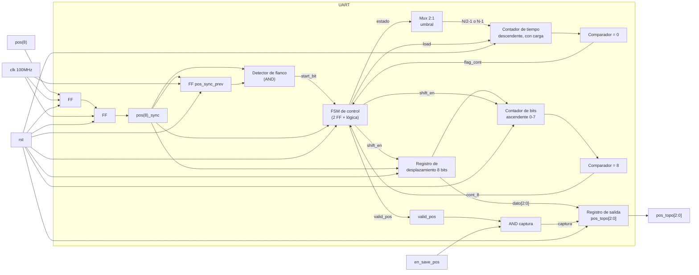

# M1: Receptor UART

> **Nota de implementación (post-diseño):** el transmisor UART del subsistema discreto (74xx +
> reloj 555) no resultó confiable en la práctica. `pos(8)` descrito abajo ya no llega desde un pin
> externo de la FPGA: el LFSR discreto (funcional) se conecta directo a la FPGA por 3 líneas
> paralelas (`pos_topo_lfsr[2:0]`, puerto de `top`), y un nuevo módulo `t_uart` arma la trama 8N1
> dentro de la FPGA y la entrega en loopback interno a este receptor, que no cambió. El
> comportamiento y las tablas de este documento siguen aplicando tal cual para `r_uart`; ver
> `src/design/t_uart.sv` para el transmisor.

## f) Relación con otros módulos

`pos(8)` proviene del subsistema discreto, conectado por GPIO, y llega de forma serial siguiendo el protocolo UART. Al provenir de un reloj independiente al de la FPGA, este módulo resuelve primero la metaestabilidad mediante un sincronizador de dos etapas. La FSM general del sistema (M8), al entrar al estado `001` (`en_numAleatorios`), solicita al subsistema discreto una nueva posición; ese pulso de solicitud no forma parte de este módulo. Una vez que el subsistema discreto responde con la trama serial, este módulo la recibe y decodifica de forma autónoma, sin esperar ninguna señal de la FSM, y levanta `valid_pos` en cuanto detecta el bit de inicio, recibe los 8 bits de datos y confirma el bit de parada. La FSM permanece en el estado `010` monitoreando `valid_pos`; al recibirlo, activa `en_save_pos` para que la posición quede retenida en un registro estable, y transiciona hacia el estado de juego. `pos_topo[2:0]` se entrega tanto a la FSM (para comparar contra el botón presionado) como al módulo Show_Mole (M2), que la usa para encender el LED correspondiente. `rst` reinicia todos los elementos secuenciales del módulo a un estado conocido.

## g) Explicación de funcionamiento

`pos(8)` ingresa a un sincronizador de dos etapas para eliminar el riesgo de metaestabilidad. La señal ya sincronizada (`pos(8)_sync`) alimenta un detector de flanco de bajada, que compara el valor actual contra el valor del ciclo anterior y genera el pulso `start_bit` en el instante en que la línea pasa de `1` a `0`; ese pulso marca el inicio de una trama.

Un contador de tiempo descendente (`time_cntr`) es cargado por la FSM de control al detectar `start_bit`, con el valor `N/2 − 1` (donde `N = f_clk / baudrate` = 10417 para 9600 baudios y 100MHz de reloj), ubicándolo en el centro del bit de inicio. Al llegar a cero, la FSM evalúa `pos(8)_sync` en ese instante para confirmar que se trata de un bit de inicio válido y no de un glitch; de ser válido, recarga el contador con `N − 1` para ubicarse en el centro del primer bit de datos.

Desde ahí, cada vez que `time_cntr` vuelve a llegar a cero, se desplaza el bit muestreado de `pos(8)_sync` hacia un registro de desplazamiento de 8 bits y se incrementa un contador de bits, mientras el contador de tiempo se recarga con `N − 1` para el siguiente bit. Al completar el octavo bit, ese mismo tick recarga el contador de tiempo para medir el período del bit de parada. Al cumplirse ese último período, la FSM evalúa `pos(8)_sync`: si es `1`, la trama es válida, se transfieren los 3 bits menos significativos del registro de desplazamiento a `pos_topo[2:0]` y se genera el pulso `valid_pos`; si es `0`, la trama se descarta sin generar el pulso. En ambos casos el módulo regresa al estado de reposo. Si `en_save_pos` está activo en el ciclo en que se genera `valid_pos`, el valor de `pos_topo[2:0]` se retiene en un registro de salida estable, de modo que la FSM dispone de una posición constante durante toda la ventana de juego del turno.

## h) Diseño

Se optó por un sincronizador de dos etapas en lugar de uno de una sola etapa porque `pos(8)` es completamente asíncrona respecto al reloj de la FPGA y una sola etapa no ofrece un margen de resolución de metaestabilidad suficiente a 100MHz.

El muestreo se realiza mediante un único contador de tiempo descendente, recargable, que nace exactamente en el flanco de bajada detectado por `start_bit` y no corre de forma libre. Este contador se carga con dos posibles umbrales según el punto del proceso: `N/2 − 1` únicamente al confirmar el bit de inicio, y `N − 1` para cada bit subsiguiente, incluyendo el bit de parada. La selección de umbral se resuelve con un multiplexor 2:1 controlado combinacionalmente por el estado actual de la FSM, de modo que no se requiere ningún ciclo de reloj adicional para decidir el valor correcto. La señal `load`, generada por la lógica de siguiente estado, ordena al contador tomar ese valor en el ciclo correspondiente; se activa al detectar `start_bit`, al confirmar el bit de inicio, y en cada tick dentro del muestreo de datos, incluido el que completa el octavo bit. En los tres casos la transición de estado y la recarga del contador ocurren en el mismo flanco de reloj, sin ciclos de latencia adicionales, dado que la magnitud de un ciclo a 100MHz (10ns) es insignificante frente al período de bit (~104µs). Con este mecanismo el muestreo cae en el centro de cada bit por construcción, maximizando el margen de tolerancia entre el reloj del oscilador 555 del subsistema discreto y el reloj de la FPGA, ya que ambos relojes son independientes y solo coinciden en la velocidad nominal acordada, no en fase.

La detección de `start_bit` requiere un flip-flop adicional (`pos_sync_prev`) que retiene `pos(8)_sync` un ciclo de reloj, junto con una compuerta que compara el valor actual contra el retrasado. Sin este bloque no existe forma de que la FSM detecte el inicio de una trama.

No se valida el bit de paridad porque el formato acordado en la sección 3.2 es 8N1 (sin paridad); el bit de parada sí se verifica como comprobación mínima de integridad de trama. Se separa la señal de dato decodificado (`pos_topo[2:0]`, que se actualiza en cuanto llega una trama válida) del registro retenido que consume la FSM, habilitado por `en_save_pos`, para que la llegada asíncrona de una trama nueva del lado discreto nunca altere la posición vigente durante un turno en curso.

Al derivar las tablas de salida se observa que la habilitación del registro de desplazamiento y la habilitación del contador de bits resultan idénticas en todos los casos, por lo que se fusionan en una sola señal (`shift_en`) que habilita simultáneamente ambos bloques.

Tabla de estados del contador de recepción (`CON_U`), simplificada:

| Estado | Condición de entrada | Acción | Estado siguiente |
|---|---|---|---|
| `IDLE` | `start_bit` = 0 | esperar | `IDLE` |
| `IDLE` | `start_bit` = 1 (flanco de bajada) | cargar `time_cntr` con `N/2-1` | `START` |
| `START` | `flag_cont` = 1, `pos_sync` = 0 | confirmar bit de inicio válido, cargar `time_cntr` con `N-1` | `DATO` |
| `START` | `flag_cont` = 1, `pos_sync` = 1 | glitch, descartar | `IDLE` |
| `DATO` | `flag_cont` = 1, `cont_8` = 0 | shift + incremento, recargar `time_cntr` con `N-1` | `DATO` |
| `DATO` | `flag_cont` = 1, `cont_8` = 1 | octavo bit muestreado, recargar `time_cntr` con `N-1` | `STOP` |
| `STOP` | `flag_cont` = 1, `pos_sync` = 1 | bit de parada válido, `pos_topo` = dato[2:0], pulso `valid_pos` | `IDLE` |
| `STOP` | `flag_cont` = 1, `pos_sync` = 0 | bit de parada inválido, descartar trama, sin pulso `valid_pos` | `IDLE` |

Para llevar el control de recepción a una implementación directa en HDL se codifican sus 4 estados con 2 bits (`Q1 Q0`) y se derivan las tablas de verdad de siguiente estado y de salidas a partir de las señales de datapath: `pos(8)_sync` (línea ya sincronizada), `start_bit` (pulso de detección de flanco), `flag_cont` (pulso de expiración del contador de tiempo, uno por período de bit correspondiente) y `cont_8` (bandera del contador de bits de datos, en 1 cuando ya se muestrearon los 8 bits).

**Codificación de estados**

| Estado | `Q1` | `Q0` |
|---|---|---|
| `IDLE` | 0 | 0 |
| `START` | 0 | 1 |
| `DATO` | 1 | 0 |
| `STOP` | 1 | 1 |

**Tabla de verdad de siguiente estado**

| `Q1` | `Q0` | `start_bit` | `flag_cont` | `pos_sync` | `cont_8` | `Q1'` | `Q0'` | `load` | Comentario |
|---|---|---|---|---|---|---|---|---|---|
| 0 | 0 | 0 | X | X | X | 0 | 0 | 0 | sin flanco de inicio, permanece en `IDLE` |
| 0 | 0 | 1 | X | X | X | 0 | 1 | 1 | flanco de bajada detectado, pasa a `START`, carga `N/2-1` |
| 0 | 1 | X | 0 | X | X | 0 | 1 | 0 | espera a que `time_cntr` llegue a cero |
| 0 | 1 | X | 1 | 0 | X | 1 | 0 | 1 | bit de inicio confirmado en el centro del bit, pasa a `DATO`, carga `N-1` |
| 0 | 1 | X | 1 | 1 | X | 0 | 0 | 0 | glitch: la línea subió antes del muestreo, se descarta y regresa a `IDLE` |
| 1 | 0 | X | 0 | X | 0 | 1 | 0 | 0 | espera al siguiente tick para muestrear el bit de datos |
| 1 | 0 | X | 1 | X | 0 | 1 | 0 | 1 | se desplaza un bit de datos, aún no completa los 8, recarga `N-1` |
| 1 | 0 | X | 1 | X | 1 | 1 | 1 | 1 | octavo bit de datos muestreado, pasa a `STOP`, recarga `N-1` para el bit de parada |
| 1 | 1 | X | 0 | X | X | 1 | 1 | 0 | espera al tick del bit de parada |
| 1 | 1 | X | 1 | 1 | X | 0 | 0 | 0 | bit de parada válido, trama aceptada, regresa a `IDLE` |
| 1 | 1 | X | 1 | 0 | X | 0 | 0 | 0 | bit de parada inválido, trama descartada, regresa a `IDLE` |

**Tabla de verdad de salidas** (`shift_en` es de Moore, depende solo del estado y de `flag_cont`; `valid_pos` es de Mealy, depende también de `pos_sync` en el estado `STOP`, ya que indica si la trama fue válida)

| `Q1` | `Q0` | `flag_cont` | `pos_sync` | `shift_en` | `valid_pos` |
|---|---|---|---|---|---|
| 0 | 0 | X | X | 0 | 0 |
| 0 | 1 | X | X | 0 | 0 |
| 1 | 0 | 0 | X | 0 | 0 |
| 1 | 0 | 1 | X | 1 | 0 |
| 1 | 1 | 0 | X | 0 | 0 |
| 1 | 1 | 1 | 1 | 0 | 1 |
| 1 | 1 | 1 | 0 | 0 | 0 |

**Sincronizador de dos etapas** (cada etapa es un flip-flop tipo D, su tabla de verdad es la del flip-flop D estándar y no requiere lógica combinacional adicional):

| `D` | `Q` (estado actual) | `Q+` (siguiente flanco de `clk`) |
|---|---|---|
| 0 | X | 0 |
| 1 | X | 1 |

**Detector de flanco de bajada (`start_bit`)**, requiere un flip-flop adicional (`pos_sync_prev`) que retiene `pos(8)_sync` un ciclo, más una compuerta combinacional:

| `pos_sync_prev` | `pos_sync` (actual) | `start_bit` | Comentario |
|---|---|---|---|
| 0 | 0 | 0 | línea estable en 0 |
| 0 | 1 | 0 | flanco de subida, no interesa |
| 1 | 0 | 1 | flanco de bajada detectado |
| 1 | 1 | 0 | línea estable en 1 |

**Mux de umbral (selección del valor de carga del contador de tiempo)**, controlado combinacionalmente por el estado actual:

| `Q1 Q0` (estado actual) | `sel_umbral` | Umbral seleccionado |
|---|---|---|
| 00 (`IDLE`) | 0 | `N/2 − 1` |
| 01 (`START`) | 1 | `N − 1` |
| 10 (`DATO`) | 1 | `N − 1` |
| 11 (`STOP`) | 1 | `N − 1` (no se recarga dentro de este estado) |

**Contador de tiempo (`time_cntr`)**, descendente, con carga controlada por `load` y umbral seleccionado por el mux (`N = f_clk / baudrate` = 10417 para 9600 baudios y 100MHz):

| Condición | `time_cntr'` | `flag_cont` |
|---|---|---|
| `rst` = 1 | 0 | 0 |
| `load` = 1 | umbral seleccionado por el mux | 0 |
| `load` = 0, `time_cntr` > 0 | `time_cntr` − 1 | 0 |
| `load` = 0, `time_cntr` = 0 | sin cambio | 1 |

**Lógica de captura hacia el registro de salida** (combina `valid_pos` interno con `en_save_pos` externo, proveniente de la FSM del sistema M8):

| `valid_pos` | `en_save_pos` | captura hacia `pos_topo` (registro de salida) |
|---|---|---|
| 0 | X | 0 |
| 1 | 0 | 0 |
| 1 | 1 | 1 |

## i) Diagrama esquemático detallado del diseño

