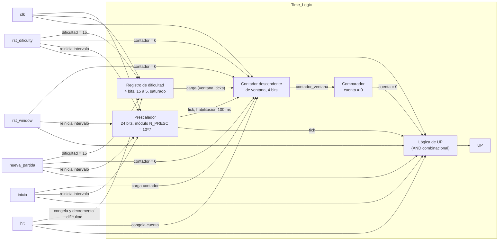

# M4: Time_Logic

## f) Relación con otros módulos

La FSM abre la ventana con el pulso inicio una vez que el módulo receptor_uart entregó `pos_topo[2:0]` del turno,
de modo que el tiempo de la trama serial no se le descuenta al jugador. Durante la ventana la FSM es la que evalúa `btn_golpe[7:0]` contra `pos_topo[2:0]`, por lo que M4 nunca observa las pulsaciones y se limita a medir el tiempo disponible. La FSM devuelve el pulso hit cuando el golpe es correcto, con lo cual M4 cierra el turno y reduce la duración del siguiente, y M4 responde con UP cuando la ventana se agota sin acierto, señal que la FSM interpreta como fallo y propaga al Contador Fallo. La señal `rst_window` acompaña cada resolución de turno (tanto acierto como fallo) para limpiar el contador de ventana de cara a la siguiente ronda, mientras que `rst_dificulty` y `nueva_partida`, emitidas por la FSM únicamente al iniciar una partida, devuelven la dificultad a su valor inicial.

## g) Explicación de funcionamiento

El módulo mantiene un registro de dificultad con la cantidad de intervalos de 100 ms que dura la ventana y un contador descendente que mide el turno en curso. Con el pulso inicio el contador se carga con el valor del registro de dificultad y el prescalador interno se reinicia para que el primer intervalo sea completo, luego de lo cual el contador descuenta una unidad por cada habilitación de 100 ms. Al llegar a cero se emite UP durante un ciclo de reloj, y si en cambio llega hit antes de ese momento el conteo se detiene y el registro de dificultad se decrementa mientras sea mayor que su valor mínimo. Cuando la FSM resuelve el turno como fallo por botón incorrecto no se requiere ninguna señal adicional para el registro de dificultad, ya que el siguiente pulso inicio recarga el contador y descarta la cuenta anterior; `rst_window` es la señal que efectivamente limpia el contador de ventana en ese instante, mientras que `rst_dificulty` y `nueva_partida` son las únicas que devuelven el registro de dificultad a su valor inicial, de manera que la dificultad alcanzada se conserva dentro de la partida aunque el jugador falle.

## h) Diseño

Se escoge una resolución de 100 ms porque todas las duraciones exigidas son múltiplos exactos de ese valor, con lo cual la ventana completa se mide con un contador descendente de cuatro bits cargado entre 15 y 5 y no se acumula error de redondeo. La habilitación de 100 ms se genera con un prescalador cuyo módulo queda fijado por la frecuencia de la tarjeta,

$$N_{presc} = 100 \times 10^6 \cdot 0{,}1 = 10^7, \qquad 2^{23} < 10^7 \le 2^{24}$$

por lo que se implementa con un contador de 24 bits que activa la habilitación durante un solo ciclo, y de esta forma toda la temporización ocurre en el dominio del reloj de 100 MHz sin generar relojes derivados. El prescalador se reinicia ante `rst_dificulty`, `rst_window`, `nueva_partida` o `inicio`, además de reiniciarse solo al completar su propia vuelta; así el primer intervalo de 100 ms contado después de cualquiera de esos eventos es siempre completo y no arrastra una fracción de cuenta del ciclo anterior.

El registro de dificultad es un contador descendente saturado en 5, y como el enunciado establece que un fallo no devuelve la ventana a su valor inicial, la reducción resulta monótona dentro de la partida y la cuenta de aciertos consecutivos produce la misma secuencia que la de aciertos acumulados, así que un solo registro la representa. Por esa misma razón el registro de dificultad solo escucha `rst_dificulty` y `nueva_partida`: son las dos únicas condiciones asociadas al arranque de una partida nueva. El contador de ventana, en cambio, también debe limpiarse al cierre de cada turno individual (tanto en acierto como en fallo) para que la siguiente ronda no herede la cuenta anterior, y esa limpieza intermedia es exactamente lo que aporta `rst_window`, señal que la FSM activa en los estados `HIT` y `FAILURE` sin tocar la dificultad alcanzada.

| Aciertos consecutivos | Carga del contador | Duración de la ventana |
|---|---|---|
| 0 | 15 | 1500 ms |
| 1 | 14 | 1400 ms |
| 2 | 13 | 1300 ms |
| 3 | 12 | 1200 ms |
| 4 | 11 | 1100 ms |
| 5 | 10 | 1000 ms |
| 6 | 9 | 900 ms |
| 7 | 8 | 800 ms |
| 8 | 7 | 700 ms |
| 9 | 6 | 600 ms |
| 10 o más | 5 | 500 ms |

## i) Diagrama detallado del diseño

Tabla de verdad de la lógica de control, con prioridad de arriba hacia abajo:

| `rst_dificulty` o `nueva_partida` | `rst_window` | `inicio` | `hit` | habilitación 100 ms | cuenta actual | Contador siguiente | Registro de dificultad siguiente | `UP` |
|---|---|---|---|---|---|---|---|---|
| 1 | X | X | X | X | X | 0 | 15 | 0 |
| 0 | 1 | X | X | X | X | 0 | sin cambio | 0 |
| 0 | 0 | 1 | X | X | X | dificultad | sin cambio | 0 |
| 0 | 0 | 0 | 1 | X | X | sin cambio (se detiene) | dificultad − 1 si dificultad > 5, si no sin cambio | 0 |
| 0 | 0 | 0 | 0 | 1 | 0 | sin cambio | sin cambio | 1 |
| 0 | 0 | 0 | 0 | 1 | ≠ 0 | cuenta − 1 | sin cambio | 0 |
| 0 | 0 | 0 | 0 | 0 | X | sin cambio | sin cambio | 0 |

Si hay `rst_dificulty` o `nueva_partida`, todo se pone en su estado inicial y la dificultad vuelve a quince, como menciona el enunciado. Si en cambio solo llega `rst_window`, el contador de ventana se limpia entre rondas pero la dificultad alcanzada se conserva, ya que esta señal acompaña cada cierre de turno (acierto o fallo) sin implicar el fin de la partida. Si llega la señal de inicio, el contador se carga con el valor guardado de dificultad. Si llega un acierto, el conteo se detiene y la dificultad baja un paso, siempre que no esté ya en su valor mínimo. Si nada de eso pasa y llega la habilitación de cada cien milisegundos, el contador baja uno, y si ya estaba en cero se activa la señal UP para avisar que se acabó el tiempo. En cualquier otro caso todo se queda igual.