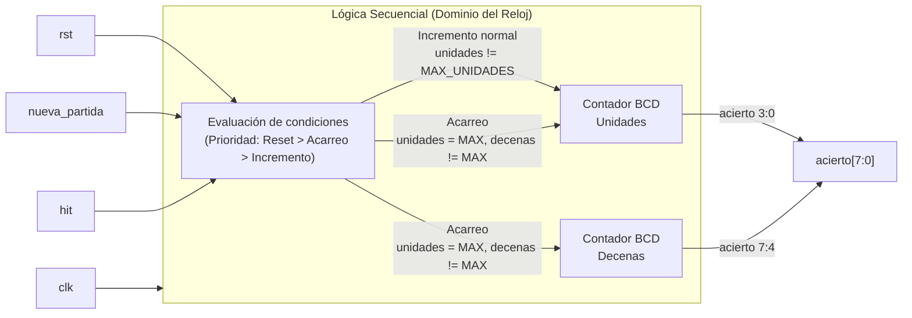

# M5: Hit_Counter

## f) Relación con otros módulos

El módulo recibe de la FSM el mismo pulso `hit` que consume Time_Logic para reducir la ventana y que Fail_Counter usa para reiniciar su cuenta de fallos consecutivos, de modo que las tres reacciones a un golpe correcto ocurren en el mismo ciclo de reloj y quedan consistentes entre sí. Su salida `acierto[7:0]` alimenta directamente los dos displays de aciertos del módulo Marcador, que decodifica cada dígito a siete segmentos y los multiplexa. El circuito es completamente síncrono y opera bajo el dominio del reloj principal (`clk`). La FSM puede reiniciar la cuenta con `nueva_partida` al iniciar una partida nueva luego del tercer fallo consecutivo, y el reinicio manual llega por `rst`.

## g) Explicación de funcionamiento

El módulo es un contador BCD de dos dígitos parametrizable (por defecto, avanza hasta 99) que se incrementa una única vez por cada pulso `hit`. El dígito de unidades, ubicado en `acierto[3:0]`, cuenta de cero al límite establecido por `MAX_UNIDADES` (típicamente nueve). Al desbordarse, vuelve a cero y habilita el acarreo para el dígito de decenas, ubicado en `acierto[7:4]`, de forma que la salida siempre representa un valor BCD válido. Al llegar al límite máximo definido por `MAX_ACIERTO`, el contador se satura y conserva su valor ante nuevos aciertos, garantizando que el marcador no despliegue valores fuera de rango ni se reinicie a mitad de partida. Las entradas `rst` y `nueva_partida` son síncronas, tienen prioridad sobre el incremento, y devuelven ambos dígitos a cero.

## h) Diseño

Se lleva la cuenta directamente en BCD utilizando parámetros dinámicos (`MAX_ACIERTO % 10` para unidades y `MAX_ACIERTO / 10` para decenas) para evitar el uso de convertidores binario-a-decimal (como el algoritmo double dabble) antes del marcador. Cada dígito se resuelve con un contador de cuatro bits. El acarreo entre dígitos ocurre mediante la coincidencia del dígito de unidades con su límite máximo durante un pulso `hit`, siempre y cuando las decenas aún no hayan alcanzado el tope. La saturación se implementa bloqueando el incremento cuando ambos dígitos alcanzan el valor máximo estipulado. El pulso `hit` actúa estrictamente como señal de habilitación (`enable`) dentro de un bloque secuencial comandado por el reloj, evitando la inferencia de *latches*.

| rst / nueva_partida | hit | unidades == MAX_UNIDADES | decenas == MAX_DECENAS | Acción |
|---|---|---|---|---|
| 1 | X | X | X | unidades <= 0, decenas <= 0 |
| 0 | 0 | X | X | Sin cambio |
| 0 | 1 | Sí | No | unidades <= 0, decenas <= decenas + 1 (Acarreo) |
| 0 | 1 | No | X | unidades <= unidades + 1 (Incremento normal) |
| 0 | 1 | Sí | Sí | Sin cambio (Saturación) |

## i) Diagrama detallado del diseño

