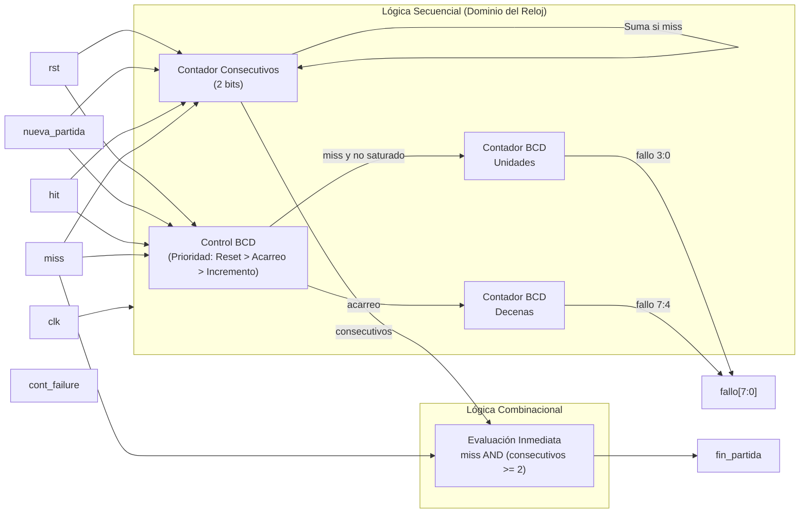

# M6: fail_counter

## f) Relación con otros módulos

El módulo recibe de la FSM el pulso `miss` cada vez que un turno se resuelve como fallo, ya sea por botón incorrecto o por agotamiento de la ventana de tiempo. También recibe el pulso `hit` de la FSM, con el cual pone en cero la cuenta de fallos consecutivos sin afectar el contador acumulado. El circuito es completamente síncrono y opera bajo el dominio del reloj principal (`clk`). Su salida `fallo[7:0]` alimenta directamente los dos displays de fallos del módulo `marcador`. Su salida `fin_partida` se genera de forma combinacional para avisar a la FSM en el mismo ciclo de reloj que se alcanzó el tercer fallo consecutivo. La FSM devuelve `nueva_partida` al arrancar un juego nuevo, lo cual pone en cero ambas cuentas, al igual que el reinicio manual por `rst`. 

## g) Explicación de funcionamiento

El módulo mantiene dos cuentas independientes comandadas por el reloj. La primera es un contador BCD parametrizable que acumula los fallos totales de la partida. El dígito de unidades ocupa `fallo[3:0]` y el de decenas `fallo[7:4]`, con un límite de saturación definido por los parámetros `MAX_UNIDADES` y `MAX_DECENAS` para evitar desplegar valores fuera de rango. La segunda cuenta es un registro interno de fallos consecutivos de dos bits que llega hasta tres. Esta cuenta se reinicia ante cualquier pulso `hit` o señal de nueva partida. 

La salida `fin_partida` se calcula asíncronamente (fuera del bloque secuencial) evaluando si ocurre un `miss` en el mismo momento en que la racha ya es de dos o tres fallos, garantizando que la señal esté lista en el ciclo exacto del fallo fatal y evitando que la FSM requiera un ciclo adicional o un cuarto fallo para transitar a fin de partida.

## h) Diseño

La cuenta acumulada se lleva directamente en BCD y su acarreo/saturación se evalúa dinámicamente frente a los topes paramétricos establecidos. El pulso `miss` habilita el incremento. Los pulsos `hit` y `miss` son mutuamente excluyentes en un turno, pero `hit`, `rst` y `nueva_partida` tienen prioridad absoluta para reiniciar los registros. Se separó el cálculo de `fin_partida` del bloque `always_ff` para eliminar la latencia de un ciclo de reloj detectada en versiones previas del diseño.

Lógica secuencial del contador de fallos consecutivos:

| rst / nueva_partida / hit | miss | consecutivos actuales | Siguiente consecutivos |
|---|---|---|---|
| 1 | X | X | 0 |
| 0 | 0 | X | Sin cambio |
| 0 | 1 | 0 o 1 | consecutivos + 1 |
| 0 | 1 | 2 o 3 | 3 |

Lógica combinacional de fin de partida:

| miss | consecutivos | fin_partida |
|---|---|---|
| 0 | X | 0 |
| 1 | 0 o 1 | 0 |
| 1 | 2 o 3 | 1 |

## i) Diagrama detallado del diseño

