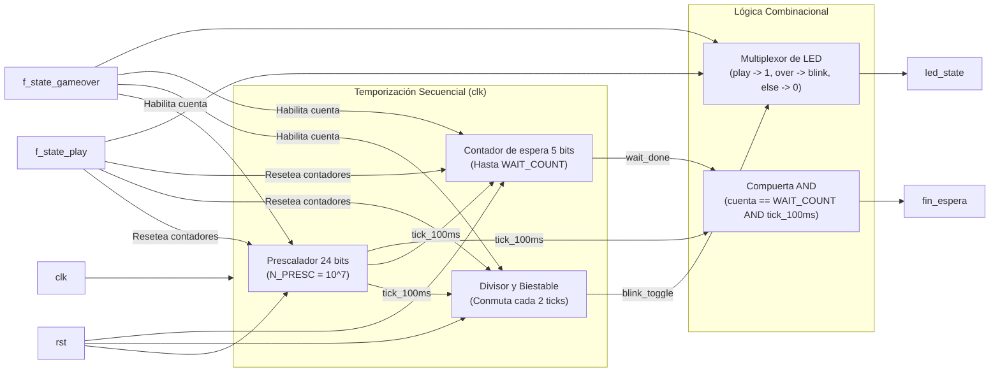

# M7: estado_juego

## f) Relación con otros módulos

El módulo recibe de la FSM las señales `f_state_play` y `f_state_gameover`, que indican respectivamente si la partida se encuentra activa y si la partida ha terminado; ambas señales son mutuamente excluyentes por diseño de la FSM. Es el único bloque que traduce esa información a una indicación visual para el jugador por medio de la salida `led_state`. Como el estado de fin de partida debe sostenerse al menos 2 s antes del reinicio automático, el módulo mide ese intervalo con su propia base de tiempo referenciada al reloj principal (`clk`) y devuelve un pulso `fin_espera` a la FSM para habilitar la transición hacia la nueva partida. No tiene relación directa con `time_logic`, `hit_counter` ni `fail_counter`, ya que toda la coordinación pasa por la FSM, y no comparte líneas con el módulo `marcador`.

## g) Explicación de funcionamiento

El módulo decodifica la pareja de señales `(f_state_play, f_state_gameover)` en tres condiciones. Con `f_state_play` en alto, el LED permanece encendido de forma fija. Con `f_state_gameover` en alto, el LED parpadea a 2,5 Hz. Con ambas señales en bajo (reposo), el LED permanece apagado. 

Al activarse `f_state_gameover`, un prescalador genera una habilitación (`tick`) cada 100 ms y arranca un contador que mide 20 ticks (2 segundos, ajustables por el parámetro `WAIT_COUNT`). Al vencerse, activa `fin_espera` durante un único ciclo de reloj para que la FSM reinicie el juego. Para garantizar que los 2 s sean exactos, el prescalador se mantiene forzado a cero durante la partida activa y el reposo, de modo que cada cuenta de fin de partida arranca su primer tick de 100 ms limpiamente desde cero. La combinación en la que `f_state_play` y `f_state_gameover` están ambas en alto se resuelve como una condición de apagado seguro.

## h) Diseño

La lógica utiliza parámetros adaptables (`N_PRESC` para la base de tiempo y `WAIT_COUNT` para el límite de espera). La decodificación se reduce a un selector combinacional de nivel del LED entre tres fuentes (fijo, parpadeo, apagado). La base de tiempo interna de 100 ms se obtiene con un prescalador de 24 bits sobre el reloj de 100 MHz, operando como señal de habilitación (`clock enable`) sin generar relojes derivados. Un contador de 5 bits maneja la espera, y un biestable con un divisor intermedio cambia el estado del parpadeo cada dos habilitaciones (200 ms) para generar el periodo de 400 ms. 

**Tabla de verdad de decodificación:**

| `f_state_play` | `f_state_gameover` | Condición | `led_state` | Contadores internos |
|---|---|---|---|---|
| 0 | 0 | Reposo tras reinicio | 0 | Forzados a cero |
| 1 | 0 | Partida activa | 1 | Forzados a cero |
| 0 | 1 | Fin de partida | Parpadeo a 2,5 Hz | Habilitados |
| 1 | 1 | Condición no válida | 0 (apagado seguro) | Forzados a cero |

**Tabla de verdad de la lógica de fin de espera**, sincronizada al reloj principal:

| `f_state_gameover` (y no play) | `tick_100ms` | Cuenta actual (`wait_cnt`) | Siguiente cuenta | `fin_espera` |
|---|---|---|---|---|
| 0 | X | X | 0 | 0 |
| 1 | 0 | < WAIT_COUNT | Sin cambio | 0 |
| 1 | 1 | < WAIT_COUNT | Cuenta + 1 | 0 |
| 1 | 0 | == WAIT_COUNT | Sin cambio | 0 |
| 1 | 1 | == WAIT_COUNT | Sin cambio | 1 (pulso de 1 ciclo) |

## i) Diagrama detallado del diseño

