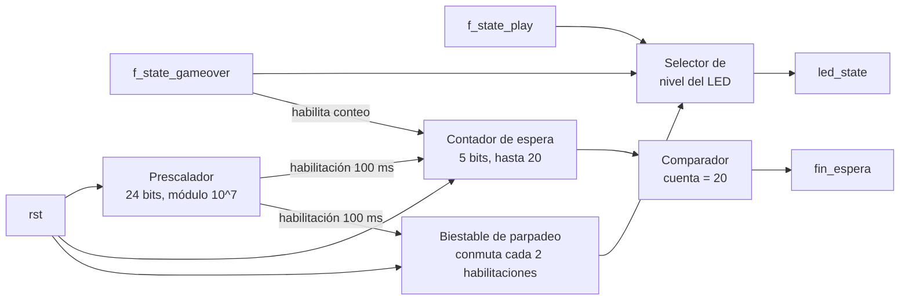

# M7: State

## f) Relación con otros módulos

El módulo recibe de la FSM las señales `f_state_play` y `f_state_gameover`, que indican respectivamente si la partida se encuentra activa y si la partida ha terminado; ambas señales son mutuamente excluyentes por diseño de la FSM, de modo que M7 solo necesita reaccionar a su combinación para determinar la condición vigente. Es el único bloque que traduce esa información a algo visible para el jugador por medio de `led_state`. Como el estado de fin de partida debe sostenerse al menos 2 s antes del reinicio automático, el módulo mide ese intervalo con su propia base de tiempo interna y devuelve `fin_espera` a la FSM, señal que habilita la transición hacia la partida nueva. No tiene relación directa con `time_logic`, `hit_counter` ni `fail_counter`, ya que toda la coordinación pasa por la FSM, y tampoco comparte líneas con el módulo `marcador` porque este atiende los displays de siete segmentos y no el LED de estado.

## g) Explicación de funcionamiento

El módulo decodifica la pareja de señales `(f_state_play, f_state_gameover)` en tres condiciones visibles. Con `f_state_play` en alto el LED permanece encendido de forma fija, con `f_state_gameover` en alto el LED parpadea, y con ambas señales en bajo (condición de reposo posterior a un reinicio manual) el LED permanece apagado, de modo que el jugador distingue sin ambigüedad si puede jugar o si la partida acaba de terminar. Al activarse `f_state_gameover` arranca un contador que mide 2 s sobre la base de tiempo interna y, al vencer, activa `fin_espera` durante un ciclo de reloj, señal que la FSM usa para reiniciar el juego automáticamente. La misma base de tiempo genera el parpadeo, de forma que el LED cambia de nivel cada 200 ms y el jugador percibe una indicación claramente distinta del encendido fijo. La combinación en la que `f_state_play` y `f_state_gameover` están ambas en alto no ocurre bajo el funcionamiento normal de la FSM; el módulo la resuelve como una condición de apagado seguro, manteniendo el LED apagado y el contador de espera detenido en cero, de manera que toda combinación de entradas queda completamente definida.

## h) Diseño

Se decide usar tres condiciones visibles y no dos porque un LED simplemente apagado se confunde con un sistema sin alimentación, mientras que el parpadeo identifica el fin de partida de forma inequívoca y cumple el requisito de que el estado sea claramente distinguible. La lógica combinacional de decodificación se reduce a un selector de nivel del LED entre tres fuentes (nivel fijo, parpadeo, apagado), ya que las señales `f_state_play` y `f_state_gameover` llegan a M7 ya resueltas por la FSM y no requieren decodificación adicional. La base de tiempo interna es una habilitación de reloj de 100 ms obtenida con un prescalador de 24 bits sobre el reloj de 100 MHz, igual que en `time_logic`, con lo cual no se generan relojes derivados. Esa resolución cubre las dos necesidades del módulo con un solo contador, ya que el intervalo de fin de partida corresponde a veinte habilitaciones y el semiperíodo del parpadeo a dos, de manera que basta un contador de cinco bits y un biestable de conmutación. Se decide medir los 2 s en este módulo y no en la FSM para que el control path no incorpore contadores largos, criterio que se aplicó también en `fail_counter`. La combinación `f_state_play = 1` y `f_state_gameover = 1` se incluye explícitamente en la tabla de verdad como caso de apagado seguro, aunque no debería producirse bajo el funcionamiento normal del sistema, porque en una descripción HDL toda combinación de entradas debe tener una salida definida para evitar que la herramienta de síntesis infiera un latch.

**Tabla de verdad de decodificación:**

| `f_state_play` | `f_state_gameover` | Condición | `led_state` | Contador de 2 s |
|---|---|---|---|---|
| 0 | 0 | Reposo tras reinicio | 0 | detenido en cero |
| 1 | 0 | Partida activa | 1 | detenido en cero |
| 0 | 1 | Fin de partida | parpadeo a 2,5 Hz | habilitado |
| 1 | 1 | Condición no válida | 0 (apagado seguro) | detenido en cero |

**Tabla de verdad de la lógica de control**, con prioridad de arriba hacia abajo:

| `rst` | `f_state_play` | `f_state_gameover` | habilitación 100 ms | Contador de espera | Contador siguiente | `fin_espera` | Biestable de parpadeo |
|---|---|---|---|---|---|---|---|
| 1 | X | X | X | X | 0 | 0 | 0 |
| 0 | 1 | 1 | X | X | 0 | 0 | 0 |
| 0 | 1 | 0 | X | X | 0 | 0 | 0 |
| 0 | 0 | 0 | X | X | 0 | 0 | 0 |
| 0 | 0 | 1 | 0 | X | sin cambio | 0 | sin cambio |
| 0 | 0 | 1 | 1 | < 20 | cuenta + 1 | 0 | conmuta cada 2 habilitaciones |
| 0 | 0 | 1 | 1 | 20 | sin cambio | 1 | conmuta cada 2 habilitaciones |

Si hay reset, el contador de espera y el parpadeo vuelven a cero. Si `f_state_play` y `f_state_gameover` están ambas en alto, o ambas en bajo, el LED permanece apagado y el contador se mantiene en cero. Si `f_state_gameover` está en alto pero todavía no llega la habilitación de cada cien milisegundos, todo se queda igual. Cuando llega esa habilitación, el contador sube uno mientras no llegue a veinte, y el parpadeo sigue cambiando cada dos veces que llega la habilitación. Al llegar a veinte se activa la señal de fin de espera, que le avisa a la FSM que ya pasaron los dos segundos.

## i) Diagrama detallado del diseño

