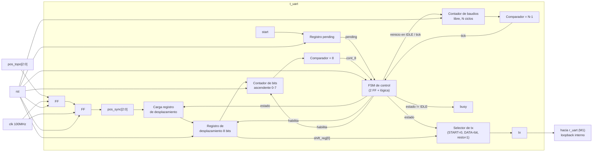

# M9: t_uart

## f) Relación con otros módulos

`pos_topo[2:0]` proviene del generador pseudoaleatorio del subsistema discreto, conectado por tres líneas paralelas directamente a la FPGA. Al provenir de un dominio de reloj independiente, este módulo resuelve primero la metaestabilidad mediante un sincronizador de dos etapas, igual en principio al de `r_uart`, pero aplicado a un bus de 3 bits en lugar de una sola línea serial. La FSM general del sistema (M8) dispara la transmisión con el mismo pulso que activa al circuito discreto (`en_numRandom`, estado `001`); ese pulso llega a este módulo como `start`. A partir de ahí, `t_uart` arma la trama 8N1 de forma autónoma y la entrega por `tx` en loopback interno hacia `r_uart` (M1), que la recibe sin ningún cambio respecto a su diseño original, ya que el formato de trama (8N1, 9600 baudios) se mantiene idéntico al acordado con el subsistema discreto. La salida `busy` indica que el módulo está armando o enviando una trama; no se conecta a ninguna otra señal de control en el sistema actual, aunque queda disponible para depuración o para una futura señal de bloqueo hacia la FSM. `rst` reinicia todos los elementos secuenciales del módulo a un estado conocido.

## g) Explicación de funcionamiento

`pos_topo[2:0]` ingresa a un sincronizador de dos etapas para eliminar el riesgo de metaestabilidad, igual que en `r_uart`, resultando en `pos_sync[2:0]`. Cuando llega `start`, el módulo no reacciona de inmediato: levanta un registro interno llamado `pending`, que retiene la solicitud hasta el instante en que realmente puede consumirse. Mientras el módulo está en `IDLE` y `pending` está en alto, se carga el registro de desplazamiento con la trama completa (`{5'b0, pos_sync}`, los 5 bits altos en cero y `pos_sync[2:0]` en los 3 bits bajos) y la máquina de estados pasa a `START`.

Un contador de baudios, libre dentro de cada estado de transmisión, cuenta `N` ciclos de reloj (`N = f_clk / baudrate` = 10417 para 9600 baudios y 100MHz) y genera un pulso `tick` al llegar al final de la cuenta; ese contador se reinicia a cero cada vez que el módulo está en `IDLE` y también cada vez que ocurre un `tick`, de modo que cada bit transmitido dura exactamente un período de baudio completo. Durante el estado `START`, `tx` se fuerza en `0` (el bit de inicio del protocolo); al cumplirse el `tick` de ese período, la máquina pasa a `DATA`. Durante `DATA`, `tx` reproduce el bit menos significativo del registro de desplazamiento (`shift_reg[0]`) y, en cada `tick`, el registro se desplaza un bit hacia la derecha mientras un contador de bits (0 a 7) avanza en paralelo; al completar el octavo bit la máquina pasa a `STOP`. En `STOP`, `tx` se mantiene en `1` (el bit de parada) durante un período de baudio completo, y al cumplirse ese `tick` la máquina regresa a `IDLE`, quedando lista para la siguiente solicitud. La señal `busy` es simplemente `1` en cualquier estado distinto de `IDLE`.

Si llega un nuevo `start` mientras el módulo todavía está armando o enviando la trama anterior, `pending` ya está en alto y permanece así; en cuanto la máquina regresa a `IDLE`, la nueva solicitud se consume de inmediato sin que la FSM del sistema tenga que reintentar ni esperar indefinidamente por `valid_pos`.

## h) Diseño

Se reutiliza el esquema de sincronizador de dos etapas de `r_uart` porque `pos_topo[2:0]` es asíncrona respecto al reloj de la FPGA por la misma razón: proviene de un dominio de reloj independiente (en este caso, el LFSR discreto en vez de la línea serial). La diferencia es que aquí se sincroniza un bus completo de 3 bits en lugar de una sola línea, y el valor de reposo tras `rst` se fija en `000` y no en `1`, porque no existe una convención de "línea en reposo" para un dato paralelo como sí la hay para una línea serial UART.

No se incluye ningún detector de flanco de bajada, a diferencia de `r_uart`, porque no hay ninguna señal externa cuyo flanco marque el inicio de una trama: es este mismo módulo el que decide cuándo empieza a transmitir, en el instante en que `pending` está en alto y el estado es `IDLE`.

El contador de tiempo tampoco necesita el multiplexor de dos umbrales (`N/2-1` para centrarse a mitad del bit de inicio, `N-1` para el resto) que tiene `r_uart`. Ese mecanismo existe en el receptor porque debe muestrear una señal ajena en el punto de máximo margen frente al desfase de fase entre relojes independientes. Un transmisor no muestrea nada: solo necesita sostener cada bit durante exactamente un período de baudio, así que basta un contador libre de `N` ciclos por bit, reiniciado a cero al entrar a `IDLE` y en cada `tick`, sin lógica de selección de umbral ni de recentrado.

El registro `pending` es el único bloque sin análogo directo en `r_uart`, y resuelve dos condiciones de carrera propias de ser un transmisor disparado por pulso:

1. **`start` puede llegar un ciclo después de liberar `rst`.** La FSM del sistema entra a `REQ_POS` inmediatamente tras el reset y activa `en_numRandom` (que llega aquí como `start`) casi de inmediato, antes de que el sincronizador de dos etapas haya tenido tiempo de reflejar el valor real de `pos_topo`. Al retener la solicitud en `pending` y consumirla solo cuando el estado es `IDLE`, `pos_sync` ya está asentado en el momento de la carga real del registro de desplazamiento.
2. **`start` puede llegar mientras el módulo todavía arma o envía la trama anterior.** En vez de perder ese pulso, `pending` lo conserva y la transmisión se dispara en cuanto el módulo regresa a `IDLE`, evitando que la FSM del sistema quede esperando `valid_pos` de forma indefinida.

La salida `tx` es de Moore en sentido estricto: depende únicamente del estado actual y, en `DATA`, del bit vigente del registro de desplazamiento, que es en sí mismo un elemento de estado. Esto contrasta con `valid_pos` en `r_uart`, que es de Mealy porque depende también de una entrada externa (`pos_sync`) evaluada en el estado `STOP`. La razón de esta diferencia es de fondo: un receptor debe decidir si una trama externa fue válida a partir de lo que observa en la línea, mientras que un transmisor conoce de antemano, por construcción, el contenido exacto de la trama que está armando.

Al derivar las tablas de siguiente estado se observa que la carga del registro de desplazamiento y la transición de `IDLE` a `START` comparten la misma condición (`pending` en alto durante `IDLE`), por lo que ambas ocurren en el mismo flanco de reloj sin ciclos de latencia adicionales, igual que ocurre con `load` en `r_uart`.

**Codificación de estados**

| Estado | `Q1` | `Q0` |
|---|---|---|
| `IDLE`  | 0 | 0 |
| `START` | 0 | 1 |
| `DATA`  | 1 | 0 |
| `STOP`  | 1 | 1 |

**Tabla de verdad de siguiente estado**

| `Q1` | `Q0` | `pending` | `tick` | `cont_8` | `Q1'` | `Q0'` | Comentario |
|---|---|---|---|---|---|---|---|
| 0 | 0 | 0 | X | X | 0 | 0 | sin solicitud pendiente, permanece en `IDLE` |
| 0 | 0 | 1 | X | X | 0 | 1 | solicitud pendiente, carga la trama y pasa a `START` |
| 0 | 1 | X | 0 | X | 0 | 1 | espera a que se cumpla el período del bit de inicio |
| 0 | 1 | X | 1 | X | 1 | 0 | expiró el bit de inicio, pasa a `DATA` |
| 1 | 0 | X | 0 | X | 1 | 0 | espera al siguiente tick para desplazar el próximo bit |
| 1 | 0 | X | 1 | 0 | 1 | 0 | se desplaza un bit de datos, aún no completa los 8 |
| 1 | 0 | X | 1 | 1 | 1 | 1 | octavo bit desplazado, pasa a `STOP` |
| 1 | 1 | X | 0 | X | 1 | 1 | espera al tick del bit de parada |
| 1 | 1 | X | 1 | X | 0 | 0 | expiró el bit de parada, regresa a `IDLE` |

**Tabla de verdad de salidas** (Moore puro: `tx` depende del estado y, en `DATA`, del bit vigente del registro de desplazamiento; `busy` depende solo del estado)

| `Q1` | `Q0` | Estado | `shift_reg[0]` | `tx` | `busy` |
|---|---|---|---|---|---|
| 0 | 0 | `IDLE`  | X | 1 | 0 |
| 0 | 1 | `START` | X | 0 | 1 |
| 1 | 0 | `DATA`  | 0 | 0 | 1 |
| 1 | 0 | `DATA`  | 1 | 1 | 1 |
| 1 | 1 | `STOP`  | X | 1 | 1 |

**Sincronizador de dos etapas** (bus de 3 bits; cada etapa es un banco de flip-flops tipo D, reposo en `000` porque no aplica la convención de línea serial en alto):

| `rst` | `D[2:0]` | `Q+[2:0]` (siguiente flanco de `clk`) |
|---|---|---|
| 1 | X | 000 |
| 0 | `pos_topo` / `pos_ff1` | `pos_ff1` / `pos_sync` |

**Registro `pending`**, con prioridad de arriba hacia abajo:

| `rst` | `start` | `state == IDLE && pending` | `pending'` | Comentario |
|---|---|---|---|---|
| 1 | X | X | 0 | reset |
| 0 | 1 | X | 1 | nueva solicitud levanta `pending` |
| 0 | 0 | 1 | 0 | la solicitud se consumió al salir de `IDLE` |
| 0 | 0 | 0 | sin cambio | ninguna condición aplica |

**Contador de baudios (`baud_cntr`) y `tick`**, libre dentro de cada bit, sin selección de umbral:

| `rst` | `state == IDLE` | `tick` | `baud_cntr'` |
|---|---|---|---|
| 1 | X | X | 0 |
| 0 | 1 | X | 0 |
| 0 | 0 | 1 | 0 |
| 0 | 0 | 0 | `baud_cntr` + 1 |

`tick = (baud_cntr == N - 1)`

**Contador de bits (`bit_cntr`)**, ascendente 0 a 7:

| `rst` | `state==START && next_state==DATA` | `state==DATA && tick` | `bit_cntr'` |
|---|---|---|---|
| 1 | X | X | 0 |
| 0 | 1 | X | 0 |
| 0 | 0 | 1 | `bit_cntr` + 1 |
| 0 | 0 | 0 | sin cambio |

**Registro de desplazamiento (`shift_reg`)**, carga paralela seguida de desplazamiento hacia la derecha, LSB primero:

| `rst` | `state==IDLE && pending` | `state==DATA && tick` | `shift_reg'` |
|---|---|---|---|
| 1 | X | X | `8'b0` |
| 0 | 1 | X | `{5'b0, pos_sync}` (carga) |
| 0 | 0 | 1 | `{1'b0, shift_reg[7:1]}` (desplaza) |
| 0 | 0 | 0 | sin cambio |

## i) Diagrama esquemático detallado del diseño

