# Informe técnico — Proyecto 1: Whack-a-mole

EL3313 Taller de Diseño Digital, II Semestre 2026

## 1. Fundamentación teórica (investigación previa)

Esta sección desarrolla los doce temas de investigación previa exigidos por el enunciado del
proyecto, conectando cada concepto con la parte del diseño de este *whack-a-mole* híbrido
(protoboard 74xx + FPGA) donde se aplica.

### 1.1 Modelado de comportamiento y de estructura en diseño digital

En HDL (Hardware Description Language) existen dos formas complementarias de describir un
circuito. El **modelado estructural** describe el circuito como una interconexión de componentes
más simples ya definidos (instancias de módulos, compuertas), de forma análoga a un esquemático:
se declara *qué* bloques existen y *cómo* se conectan sus puertos, pero no *cómo* calculan su
salida. El **modelado de comportamiento** (o *behavioral*), en cambio, describe la función que debe
cumplir el bloque en términos de su comportamiento observable ante los estímulos de entrada —
asignaciones dentro de bloques `always`/`always_comb`/`always_ff`, expresiones aritméticas y
lógicas, sentencias condicionales — dejando que la herramienta de síntesis infiera la red de
compuertas y biestables que lo implementa.

En este proyecto ambos estilos conviven. `top.sv` es predominantemente **estructural**: instancia
y conecta los módulos `fsm`, `time_logic`, `press_btn`, `hit_counter`, `fail_counter`,
`show_mole`, `marcador`, `r_uart` y `state`, sin describir lógica propia más allá del cableado.
Cada uno de esos módulos hijos, en cambio, se describe de forma **conductual**: por ejemplo
`fsm.sv` (`docs/../src/design/fsm.sv`) define el comportamiento de la máquina de estados mediante
un `case` sobre la variable `state` dentro de un `always_comb`, sin indicar explícitamente qué
compuertas resultan de ello. El subsistema discreto en protoboard, por el contrario, solo puede
describirse de forma estructural en el sentido físico: cada 74xx es un componente ya fabricado
cuya interconexión (y no su contenido interno) es lo que el grupo diseña.

### 1.2 Síntesis lógica en ASIC y en FPGA

La síntesis lógica es el proceso automatizado que traduce una descripción en HDL (típicamente a
nivel RTL — *Register Transfer Level*) a una **netlist**: una lista de compuertas y biestables
interconectados que implementa el comportamiento descrito. El flujo pasa por: (1) análisis y
elaboración del HDL, (2) optimización lógica independiente de tecnología (simplificación booleana,
eliminación de lógica redundante), y (3) *technology mapping*, donde esas ecuaciones booleanas se
traducen a los elementos que realmente existen en la tecnología destino.

La diferencia clave entre ambos flujos está en ese último paso. En un **ASIC**, el *mapping* elige
compuertas de una librería de celdas estándar (`AND2`, `NAND3`, `DFF`, etc.) caracterizadas
eléctricamente para un proceso de fabricación específico; el resultado es un layout físico
custom que se manda a fabricar, sin posibilidad de corrección tras la fabricación. En una
**FPGA**, el *mapping* no genera compuertas nuevas: reparte la lógica entre los recursos
programables que el chip ya trae de fábrica (LUTs, biestables, bloques de memoria, DSPs) y genera
además la configuración de las interconexiones programables entre ellos. Por eso el flujo FPGA
agrega dos pasos que el flujo ASIC no tiene de la misma forma: **place & route** (ubicar cada
elemento lógico en una celda física del arreglo y trazar las rutas entre ellas usando la matriz de
conmutación) y la generación de un **bitstream**, el archivo binario que configura las celdas de
memoria SRAM de la FPGA en cada encendido. En este proyecto, ese flujo (síntesis → *place &
route* → *bitstream*) es exactamente el que ejecuta `make bitstream` sobre la tarjeta Basys3
(ver `src/fpga/build_bitstream.tcl`).

### 1.3 Tecnología de FPGAs

Una FPGA (*Field-Programmable Gate Array*) es un circuito integrado cuya función lógica se
configura después de fabricado, en el campo, en vez de quedar fija en el silicio. Su arquitectura
típica es una matriz de **bloques lógicos configurables** (CLB, *Configurable Logic Block*)
embebidos en una red de interconexión programable:

- **LUT (*Look-Up Table*)**: una memoria SRAM pequeña de 2^K bits que implementa cualquier función
  booleana de K entradas simplemente almacenando, en cada dirección, el valor de salida
  correspondiente a esa combinación de entradas. Es el elemento combinacional universal de la
  FPGA — reemplaza a las compuertas individuales de un ASIC.
- **Biestables (flip-flops)**: uno o más por *slice*, disponibles para registrar la salida de la
  LUT y así construir lógica secuencial sin usar recursos combinacionales adicionales.
- **Multiplexores de configuración**: seleccionan, entre varias opciones cableadas físicamente, cuál
  usa el diseño actual (por ejemplo, si la salida de una LUT pasa o no por el biestable).
- **Matriz de conmutación (*switch matrix*) e interconexión programable**: red de buses y
  interruptores configurables que conectan la salida de un CLB con la entrada de otro,
  permitiendo que un mismo arreglo físico implemente topologías de circuito arbitrarias.
- **Bloques dedicados**: bloques de memoria (BRAM), multiplicadores/DSP y buffers de reloj
  globales (BUFG) que aceleran funciones comunes sin gastar LUTs.

Toda esta configuración —el contenido de cada LUT y el estado de cada interruptor de la matriz de
conmutación— se almacena en celdas SRAM que se cargan desde el bitstream en cada encendido; por
eso una FPGA "olvida" su configuración al apagarse y debe reprogramarse, a diferencia de un ASIC.
La Basys3 usada en este proyecto integra una FPGA Xilinx Artix-7, que sigue esta misma
arquitectura de CLBs de dos *slices*, LUTs de 6 entradas y una red de interconexión jerárquica.

### 1.4 Máquinas de estado finito: Moore vs. Mealy

Una máquina de estados finitos (FSM) es un modelo secuencial cuyo comportamiento depende tanto de
las entradas actuales como de un **estado interno**, almacenado en biestables, que resume la
historia relevante de entradas pasadas. En cada flanco de reloj la FSM evalúa una función de
**siguiente estado** a partir del estado actual y las entradas, y produce salidas mediante una
función de **salida**.

La diferencia entre los dos modelos clásicos está exactamente en esa función de salida:

- **Máquina de Moore**: la salida depende **únicamente del estado actual**, `salida = f(estado)`.
  Esto implica que la salida solo puede cambiar en un flanco de reloj (cuando cambia el estado), lo
  que la hace más lenta en reaccionar a un cambio de entrada, pero elimina el riesgo de generar
  glitches combinacionales en la salida y facilita el análisis de tiempos, porque la salida no
  depende de una ruta combinacional que incluya entradas externas.
- **Máquina de Mealy**: la salida depende **del estado actual y de las entradas presentes**,
  `salida = f(estado, entradas)`. Puede reaccionar en el mismo ciclo en que cambia una entrada
  (una transición completa antes), lo que en general produce máquinas con menos estados para el
  mismo comportamiento, pero la salida puede generar glitches si la entrada cambia de forma
  asíncrona respecto al resto del sistema.

La FSM central de este proyecto (`fsm.sv`) es de tipo **Moore**: dentro del bloque
`always_comb`, todas las señales de salida (`en_numRandom`, `en_save_pos`, `add_hit`,
`add_failure`, `rst_window`, `f_state_play`, `f_state_gameover`, etc.) se asignan según un `case
(state)` que solo examina la variable de estado, nunca directamente las entradas `valid_pos`,
`hit` o `window_exp` dentro de la misma rama de asignación de salida — esas entradas solo se usan
para decidir `next_state`. Esto es deliberado: como la salida `en_numRandom` habilita al
subsistema discreto y las salidas de conteo (`add_hit`, `add_failure`) alimentan contadores
síncronos, se prefiere que permanezcan estables durante todo un estado y cambien solo en los
flancos de reloj, evitando pulsos espurios de habilitación si `hit` o `miss` tuvieran un glitch
combinacional aguas arriba.

**Diagrama de estados (Moore) — señales de salida asociadas a cada estado, no a las transiciones:**

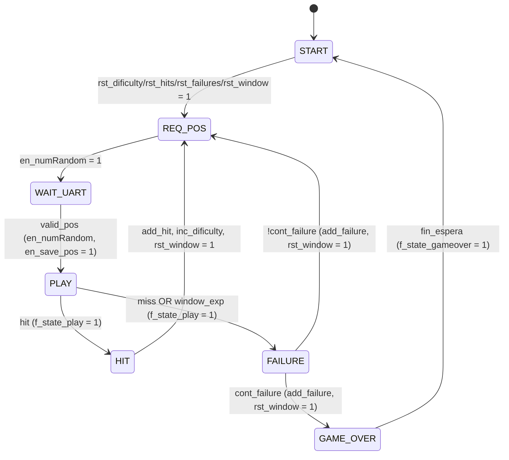

Nótese que, en la notación Moore estándar, las etiquetas sobre las flechas son solo condiciones de
transición (entradas), mientras que las salidas —escritas aquí entre paréntesis junto a cada
estado— pertenecen al estado en sí y se mantienen fijas mientras la FSM permanece en él. En una
FSM de Mealy equivalente, salidas como `add_hit` aparecerían directamente sobre la transición
`PLAY → HIT`, es decir, se activarían en el mismo ciclo en que `hit` se vuelve verdadera en vez de
esperar al estado siguiente.

### 1.5 Tiempo de *setup* y tiempo de *hold*

Todo biestable disparado por flanco tiene una ventana de tiempo alrededor del flanco de reloj
activo durante la cual su entrada de datos `D` debe permanecer **estable** para garantizar que la
salida `Q` capture correctamente el valor:

- **Tiempo de *setup* ($t_{su}$)**: intervalo mínimo que `D` debe mantenerse estable **antes** del
  flanco de reloj.
- **Tiempo de *hold* ($t_h$)**: intervalo mínimo que `D` debe mantenerse estable **después** del
  flanco de reloj.

Si alguno de los dos se viola, la salida del biestable puede entrar en un estado **metaestable**:
un nivel de tensión intermedio, indefinido lógicamente, que eventualmente colapsa hacia `0` o `1`
de forma impredecible y en un tiempo variable, en vez de asentarse de inmediato en el valor
esperado. Estas cotas son las que acotan, en un diseño síncrono, cuánto puede demorar la lógica
combinacional entre dos biestables (violación de *setup*, "camino largo") y cuánto puede demorar
como mínimo (violación de *hold*, "camino corto"). Por eso son centrales para el diseño digital:
determinan la frecuencia máxima de operación confiable de un circuito síncrono y, en el caso del
*hold*, incluso pueden causar fallas independientes de la frecuencia de reloj, ya que un camino
demasiado corto entre dos registros viola *hold* sin importar qué tan lento se reloje el sistema.
En este proyecto, estas cotas las garantiza automáticamente la herramienta de *place & route* de
la FPGA (análisis estático de tiempos) para toda la lógica interna a 100 MHz; el diseño del
subsistema discreto en protoboard, en cambio, no cuenta con esa verificación automática, por lo
que las frecuencias de trabajo (9600 baudios) se eligen con margen suficiente para que estas
restricciones nunca se acerquen a ser críticas.

### 1.6 Tiempos de propagación y de contaminación, ruta crítica

En un bloque combinacional, la salida no cambia instantáneamente cuando cambia la entrada:

- **Tiempo de propagación ($t_{pd}$)**: el tiempo **máximo** que tarda la salida en alcanzar su
  valor final y estable tras un cambio en la entrada.
- **Tiempo de contaminación ($t_{cd}$)**: el tiempo **mínimo** que la salida tarda en empezar a
  cambiar (dejar de ser válida) tras un cambio en la entrada.

Entre dos biestables consecutivos, unidos por lógica combinacional, estos tiempos se combinan con
$t_{su}$ y $t_h$ del biestable destino para dar las dos condiciones que el diseño debe cumplir:

$$T_{clk} \geq t_{pcq} + t_{pd} + t_{su} \qquad\qquad t_{ccq} + t_{cd} \geq t_h$$

donde $t_{pcq}$/$t_{ccq}$ son los tiempos de propagación/contaminación del propio flip-flop
origen (reloj → Q). La primera desigualdad es la que impone un límite superior a la frecuencia de
reloj: define la **ruta crítica**, el camino combinacional de mayor $t_{pd}$ entre cualquier par
de registros del diseño, y de ahí la **frecuencia máxima de operación**:

$$f_{max} = \frac{1}{t_{pcq} + t_{pd,\text{ruta crítica}} + t_{su}}$$

En sistemas complejos, la ruta crítica no siempre es obvia a priori: puede atravesar varios
niveles de lógica y varios módulos, por lo que las herramientas de síntesis/implementación la
identifican automáticamente mediante análisis estático de tiempos (STA) y reportan el *slack*
(margen) de cada camino. Un diseño con muchos niveles de lógica combinacional entre registros —por
ejemplo, una cadena larga de comparadores o sumadores sin registrar— alarga la ruta crítica y baja
$f_{max}$; segmentar esa lógica con registros intermedios (*pipelining*) es la técnica estándar
para subir la frecuencia máxima a costa de más latencia en ciclos.

### 1.7 Asignación de relojes y entradas habilitadoras (*clock enables*)

El enunciado exige que todo el subsistema FPGA opere con un único reloj de entrada de 100 MHz, pero
distintas partes del sistema deben avanzar a ritmos muy diferentes: la lógica de juego reacciona a
pulsadores en microsegundos, mientras que la ventana de tiempo se cuenta en cientos de milisegundos
y el marcador se refresca a un ritmo perceptible para el ojo humano. La mala práctica para resolver
esto sería generar relojes derivados con divisores libres (contadores cuya salida se usa como reloj
de otro bloque): eso crea dominios de reloj adicionales dentro de la misma FPGA, con todos los
problemas de *skew*, enrutamiento no dedicado y cruce de dominios de reloj (CDC) que ello implica,
además de que la herramienta de síntesis ya no puede cerrar el análisis de tiempos de forma directa
sobre esa señal.

La alternativa recomendada, y la que usa este proyecto, es mantener un **único reloj físico** de
100 MHz para todos los biestables del diseño, y generar en su lugar señales de **clock enable**:
una señal que vale `1` solo durante el ciclo de reloj en que un bloque debe actualizar su estado, y
`0` en el resto, de modo que ese biestable ignore los demás flancos. `time_logic.sv` implementa
exactamente este patrón: un prescalador (`contador_presc`) cuenta ciclos de 100 MHz hasta alcanzar
`N_PRESC` (el equivalente a 100 ms) y en ese ciclo genera un pulso `tick` de un ciclo de duración;
`ventana_ticks` y `contador_ventana` solo se actualizan cuando `tick` vale `1`
(`else if (tick & (contador_ventana != 0)) contador_ventana <= contador_ventana - 1;`), pese a que
sus biestables siguen disparados por el mismo `posedge clk` de 100 MHz que el resto del sistema.
De esta forma toda la FPGA comparte una sola red de reloj (más fácil de cerrar en tiempos y sin
riesgo de metaestabilidad interna), mientras cada bloque avanza a la cadencia que necesita mediante
su propio `enable`.

### 1.8 Rebotes, ruido y metaestabilidad; sincronizador de dos etapas

**Rebotes (*bounce*).** Un pulsador o interruptor mecánico no transiciona limpiamente entre niveles
al presionarse o soltarse: el contacto metálico rebota físicamente varias veces antes de asentarse,
produciendo una ráfaga de transiciones rápidas (típicamente de algunos a varios milisegundos de
duración) donde un sistema digital, muestreando a alta frecuencia, vería múltiples flancos en vez
de uno solo. Las técnicas para cancelarlo se dividen en:

- **Analógicas**: un filtro RC pasabajos en la línea del pulsador, a veces combinado con un
  disparador Schmitt para restaurar flancos limpios, que atenúa las transiciones rápidas del rebote
  dejando pasar solo el cambio de nivel sostenido.
- **Digitales**: un contador o temporizador que solo acepta el nuevo nivel como válido si se
  mantiene estable durante una ventana de tiempo mínima (por ejemplo, unos pocos milisegundos),
  descartando cualquier transición anterior a ese plazo. Es el enfoque de `debounce.sv` en este
  proyecto: un contador de `N=21` bits solo actualiza la salida `db_out` cuando el propio contador
  alcanza su valor máximo (`q_reg[N-1]`) sin que la entrada haya cambiado de estado en el ínterin
  (`q_reset = dff1 ^ dff2` reinicia el contador ante cualquier cambio).

**Metaestabilidad y entradas asíncronas.** Los ocho pulsadores externos y el botón de reinicio son
señales generadas por el jugador, sin ninguna relación de fase con el reloj de 100 MHz de la FPGA:
son **entradas asíncronas**. Si una de estas señales cambia justo dentro de la ventana de *setup*/
*hold* de un biestable interno, ese biestable puede entrar en metaestabilidad (ver §1.5) y, peor
aún, esa salida indefinida puede propagarse de forma distinta a distintos bloques que la consumen
en el mismo ciclo, produciendo inconsistencias internas.

La solución estándar es el **sincronizador de dos etapas** (*double flip-flop synchronizer*): dos
biestables en cascada, ambos gobernados por el reloj del dominio destino, donde solo la salida del
segundo se considera válida para el resto del sistema. El primer biestable es el que puede volverse
metaestable, pero dispone de un ciclo de reloj completo para resolverse hacia `0` o `1` antes de que
el segundo lo muestree; la probabilidad de que la metaestabilidad sobreviva ambas etapas
decrece exponencialmente con el tiempo disponible y se vuelve despreciable para propósitos
prácticos. El costo es una latencia de dos ciclos de reloj entre el cambio real de la entrada y su
valor sincronizado. `debounce.sv` integra esta técnica directamente: `dff1`/`dff2` son exactamente
ese sincronizador de dos etapas (`dff1 <= btn_in; dff2 <= dff1;`), aplicado *antes* de la lógica de
filtrado de rebotes, de modo que un mismo módulo resuelve ambos problemas —asincronía mecánica y
metaestabilidad eléctrica— para cada uno de los ocho pulsadores.

### 1.9 Registro de desplazamiento discreto (serie-paralelo / paralelo-serie)

Un registro de desplazamiento (*shift register*) es una cadena de biestables tipo D conectados en
cascada, donde la salida de cada etapa alimenta la entrada de dato de la siguiente, y todos
comparten la misma línea de reloj. En cada flanco activo, el contenido completo se desplaza una
posición. Con integrados discretos de la familia 74xx existen dos variantes según cómo se accede al
contenido:

- **Serie-a-paralelo (S/P)**: los bits entran uno a uno por una sola línea de dato serie (`SER`), y
  tras N flancos de reloj las N salidas paralelas (`Q0`...`QN-1`) contienen la palabra completa
  recibida. Es la función que necesita un **receptor** serie: reconstruir un dato paralelo a partir
  de bits que llegan uno por uno.
- **Paralelo-a-serie (P/S)**: el registro admite, además del desplazamiento, una **carga paralela**
  síncrona que copia de golpe un valor de N bits (por ejemplo, `74LS165`) a las N etapas; luego,
  conmutando a modo desplazamiento, esos N bits salen uno a uno por una única línea serie en
  flancos de reloj sucesivos. Es la función que necesita un **transmisor** serie: convertir un dato
  ya disponible en paralelo en un flujo de bits secuencial.

En comunicación serial discreta, ambas modalidades trabajan en conjunto en los dos extremos del
enlace: el lado que transmite usa un registro P/S para empaquetar el dato paralelo en una trama
serie, y el lado que recibe usa un registro (o su equivalente descrito en HDL, como en `r_uart.sv`
de este proyecto) para recomponer esos bits seriales en una palabra paralela. El subsistema
discreto de este proyecto usa esta idea en `docs/Diseño.md` (nivel 4, M5): un registro tipo P/S
que carga la posición generada por el LFSR (§1.10) y la desplaza bit a bit hacia la FPGA siguiendo
el reloj de baudios generado por el 555 (M1).

### 1.10 Generación de números pseudoaleatorios con LFSR

Un **LFSR** (*Linear Feedback Shift Register*) es un registro de desplazamiento cuya entrada serie
no viene de una fuente externa, sino de una función XOR (lineal, sobre GF(2)) aplicada a un
subconjunto fijo de sus propias etapas, llamado los *taps*. En cada flanco de reloj el registro se
desplaza y la nueva etapa de entrada toma el valor de esa combinación XOR, de modo que el registro
recorre una secuencia determinista de estados que, sin conocer la estructura de realimentación,
resulta indistinguible de una secuencia aleatoria — de ahí "pseudo"-aleatorio.

**Polinomio de realimentación y período máximo.** Los *taps* se representan formalmente como un
polinomio sobre GF(2), $p(x) = x^n + c_{n-1}x^{n-1} + \dots + c_1 x + 1$, donde cada coeficiente
$c_i=1$ indica que la etapa $i$ participa en la realimentación. Un registro de $n$ etapas tiene
$2^n$ estados posibles, pero el estado *todo ceros* es un punto fijo (la XOR de puros ceros es
cero, así que el registro nunca sale de ahí), por lo que el período máximo alcanzable es
$2^n - 1$. Ese máximo solo se logra si $p(x)$ es un **polinomio primitivo** sobre GF(2); en ese
caso el LFSR se llama de **longitud máxima** y recorre los $2^n-1$ estados no nulos exactamente una
vez antes de repetirse. Para $n=4$, un polinomio primitivo conocido es
$p(x) = x^4 + x + 1$ (taps en las etapas 4 y 1), que da período $2^4-1=15$; el LFSR de este
proyecto usa en cambio los taps en las etapas 3 y 4 ($D_1 = Q_3 \oplus Q_4$, documentado en
`docs/Diseño.md` nivel 4, M3), que corresponde al polinomio equivalente $x^4+x^3+1$, también
primitivo, y produce igualmente el período máximo de 15 estados — verificado de forma explícita en
la tabla de secuencia de ese documento.

**LFSR discreto vs. descrito en HDL.** Con integrados discretos (74LS74 + 74LS86 en este proyecto),
el LFSR es literalmente lo que su nombre indica: una cadena física de flip-flops con una compuerta
XOR de realimentación cableada; los *taps* quedan fijados por el cableado y modificarlos exige
recablear el circuito. Descrito en HDL para una FPGA, el mismo comportamiento se reduce a una
asignación de un par de líneas de código (por ejemplo `lfsr <= {lfsr[2:0], lfsr[3]^lfsr[2]};`), sin
costo de componentes adicionales, y los *taps* se cambian editando una constante y volviendo a
sintetizar — con la ventaja adicional de que la longitud del registro (y por tanto el rango de
valores generados) es trivial de ajustar en HDL, mientras que en discreto implica agregar o quitar
flip-flops físicos.

### 1.11 Decodificador y su uso para seleccionar 1 de N líneas

Un decodificador de $k$ a $2^k$ líneas toma una palabra binaria de $k$ bits y activa exactamente
**una** de sus $2^k$ salidas — la que corresponde numéricamente al valor de esa palabra — dejando
todas las demás inactivas. El **74LS138** es el ejemplo estándar de 3 a 8 líneas: sus salidas
`Y0`...`Y7` son activas en bajo, y cuenta además con tres entradas de habilitación (`E1`, `E2`
activas en bajo, `E3` activa en alto) que deben cumplirse simultáneamente para que el decodificador
opere; si no se cumplen, todas las salidas permanecen inactivas (en alto) sin importar el valor de
las entradas de selección. Este comportamiento equivale, en lógica de dos niveles, a implementar
cada salida $Y_i$ como la AND de las variables de entrada en su forma directa o negada según el
valor de $i$ en binario (un minitérmino), lo que hace del decodificador el bloque natural para
convertir cualquier función booleana en suma de minitérminos, o —como en este proyecto— para
activar un único indicador físico a partir de un código binario.

En el subsistema discreto de este proyecto (`docs/Diseño.md`, M4), el 74LS138 recibe directamente
`pos[2:0]` desde el LFSR y activa el LED correspondiente a la posición del topo, con sus tres
entradas de habilitación fijas al estado activo de forma permanente (el bloque debe estar
habilitado en todo momento) y aprovechando la polaridad activa en bajo de sus salidas para que sea
el propio integrado quien absorba la corriente del LED en vez de entregarla.

### 1.12 Protocolo de comunicación serial asíncrona UART

UART (*Universal Asynchronous Receiver/Transmitter*) es un protocolo de comunicación serial punto a
punto sin línea de reloj compartida entre transmisor y receptor. Cada trama tiene el siguiente
formato:

| Campo | Duración | Función |
|---|---|---|
| Bit de inicio (*start bit*) | 1 bit, siempre en `0` | Marca el comienzo de la trama; su flanco de bajada es la única referencia temporal que el receptor usa |
| Bits de datos | típicamente 5–9 bits, LSB primero | Contienen el dato a transmitir |
| Bit de paridad (opcional) | 0 o 1 bit | Detección simple de errores de un bit |
| Bit(s) de parada (*stop bit*) | 1 o 2 bits, siempre en `1` | Devuelve la línea a su nivel de reposo y da margen antes de la siguiente trama |

Entre tramas, la línea permanece en reposo en nivel alto; el flanco de bajada que marca el inicio
del *start bit* es lo único que el receptor necesita detectar para sincronizarse: a partir de ese
instante, cuenta sus propios intervalos de tiempo (derivados de su propio reloj) del tamaño de un
bit, y muestrea la línea en el centro de cada intervalo sucesivo. El **baud rate** es la cantidad de
símbolos (bits) transmitidos por segundo; ambos extremos deben acordarlo de antemano porque no hay
ninguna señal de reloj física compartida que se lo indique al receptor durante la trama.

Que dos dispositivos sin reloj compartido puedan comunicarse de forma confiable depende de que
ese acuerdo previo de velocidad sea preciso: cada dispositivo genera su reloj de bit de forma
completamente local (en este proyecto, un 100 MHz dividido internamente en la FPGA vs. un
oscilador NE555 discreto en el protoboard), y cualquier diferencia entre esas dos frecuencias
nominalmente iguales hace que el punto de muestreo del receptor se desplace, bit a bit, respecto al
centro real del bit transmitido. Como el receptor solo se resincroniza en cada nuevo *start bit*,
ese desfase se acumula a lo largo de toda la trama y es mayor en el bit más alejado del flanco de
sincronización — el bit de parada. La tolerancia de error de reloj admisible se deriva justamente
de exigir que ese desfase acumulado, en el bit más lejano, sea menor a medio período de bit (para
no cruzar hacia el bit vecino); con una trama 8N1 (1 inicio + 8 datos + 1 parada) ese análisis da
un límite teórico de aproximadamente 1/19 ≈ 5,3 % de error relativo entre los dos relojes (deducido
en detalle en `docs/Diseño.md`, nivel 4, M1), consistente con la práctica de la industria de acotar
el error combinado de los dos extremos de un enlace UART típico a 2–3 % para dejar margen de
diseño. Este proyecto fija su velocidad en 9600 baudios —una tasa estándar, fácil de generar con un
555 dentro de esa tolerancia usando resistencias de precisión al 1 %— precisamente para que ese
margen se cumpla sin necesidad de calibración activa entre los dos dominios de reloj.

---

## Referencias

- [Configurable Logic Block — ScienceDirect Topics](https://www.sciencedirect.com/topics/computer-science/configurable-logic-block)
- [Xilinx Artix-7 architecture — CSE UNL](https://cse.unl.edu/~jfalkinburg/cse_courses/2022/436/lecture/lecture32.html)
- [FPGA Clock Design Scheme: Best Practices — DEV Community](https://dev.to/carolineee/fpga-clock-design-scheme-best-practices-and-implementation-guide-3bke)
- [Mastering Clock Management in Xilinx 7 Series FPGAs — Kite Metric](https://kitemetric.com/blogs/mastering-clock-management-in-xilinx-7-series-fpgas)
- [Linear feedback shift register, 4-bit maximal length — UOBabylon](https://www.uobabylon.edu.iq/eprints/paper_1_17528_649.pdf)
- [Maximum Length Linear Feedback Shift Registers — Peter Fischer, Uni Heidelberg](https://sus.ziti.uni-heidelberg.de/Lehre/WS_DST/LFSR.pdf)
- [Determining Clock Accuracy Requirements for UART Communications — Analog Devices](https://www.analog.com/en/resources/technical-articles/determining-clock-accuracy-requirements-for-uart-communications.html)
- [UART Baud Rate: How Accurate Does It Need to Be? — All About Circuits](https://www.allaboutcircuits.com/technical-articles/the-uart-baud-rate-clock-how-accurate-does-it-need-to-be/)
- [Understanding Digital Circuit Timing: Setup Time, Hold Time, Contamination Delay & Clock Skew — JLCPCB](https://jlcpcb.com/blog/digital-circuit-timing-basics)
- [Lesson 12: Setup and Hold Time — Nandland](https://nandland.com/lesson-12-setup-and-hold-time/)
- [Clock Domain Crossing Techniques & Synchronizers — EDN](https://www.edn.com/synchronizer-techniques-for-multi-clock-domain-socs-fpgas/)

## 2. Presentación de resultados

Cada módulo de `src/design/` tiene su testbench en `src/sim/`. Se corren con `make sim TB=<módulo>`
o todos de una con `make test`, y las formas de onda de aquí abajo salen de
`make dump TB=<módulo> SIGS=...`, que exporta el `.vcd` a SVG directo, sin pasar por una captura de
pantalla de GTKWave.

Antes de poder correr todo limpio tocó arreglar varios testbenches que se habían quedado atrás.
Ese detalle, y los bugs de diseño reales que sí aparecieron, van en la sección 3.

### 2.1 M1 y M1b, receptor y transmisor UART

`r_uart.sv` recibe la trama serial 8N1 y saca `pos_topo`/`valid_pos`. `tb_r_uart.sv` le manda cuatro
tramas, una válida con `8'h05`, otra válida con `8'hFA` para confirmar que solo importan los 3 bits
bajos, una con stop bit malo que debe descartarse sin activar `valid_pos`, y una válida pero con
`en_save_pos=0` que no debe capturar nada. Los cuatro casos pasan.

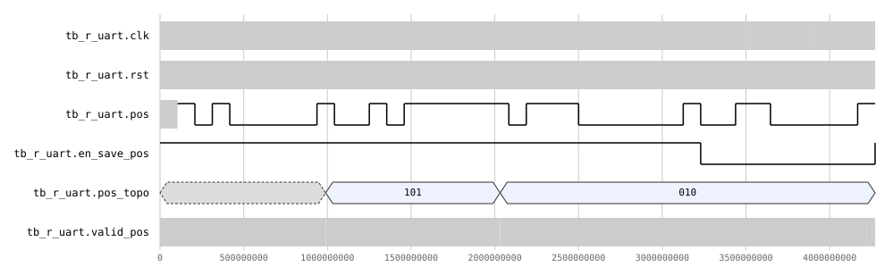

`t_uart.sv` es el transmisor que se agregó para el loopback interno, porque el transmisor discreto
real no daba confianza para simular todo el sistema. Arma tres tramas, posiciones 5, 2 y 7, y
muestrea `tx` al centro de cada bit. 32 checks entre las tres tramas y el reposo inicial, todos
pasan.

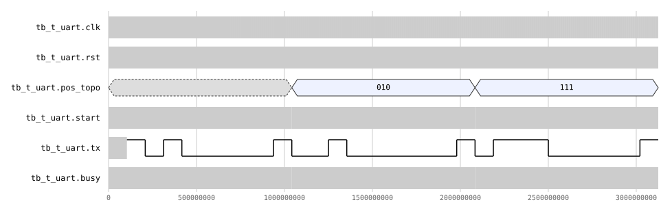

### 2.2 M2, despliegue del topo

`show_mole.sv` es puramente combinacional. Prende el LED de `pos_topo` mientras `en_topo` esté en
alto y los apaga todos si no. Su testbench no tiene asserts, solo recorre las 8 posiciones con
`en_topo` en 0 y en 1, así que acá no hay PASS/FAIL que reportar, la forma de onda se revisa a ojo.

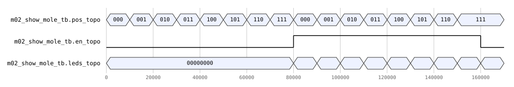

### 2.3 M3, botones

`press_btn.sv` junta `debounce`, `encoder_8_to_1` y `check_btn`. El testbench presiona y mantiene un
botón y espera que `valid` se active solo cuando ese botón corresponde a `pos_topo`. Botón correcto,
botón incorrecto, ningún botón, botón correcto en otra posición, los cuatro casos pasan.

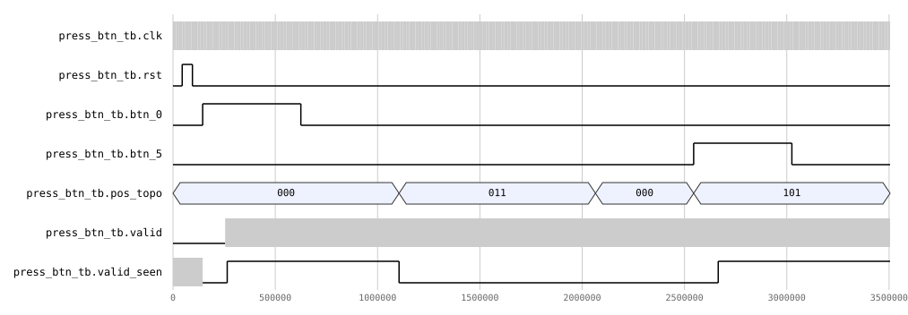

### 2.4 M4, lógica de tiempo

Acá el testbench achica todo para simular rápido, `CLK_FREQ_TB=1000`, ventana inicial de 3 ticks,
piso de 1. Se revisa `ventana_ticks` y `contador_ventana` con `$display` en vez de asserts. Sin
ningún acierto la ventana expira y prende `UP`. Cada acierto baja `ventana_ticks` en 1. Y un tercer
acierto seguido, ya con la ventana en el piso, no la baja más allá del mínimo.

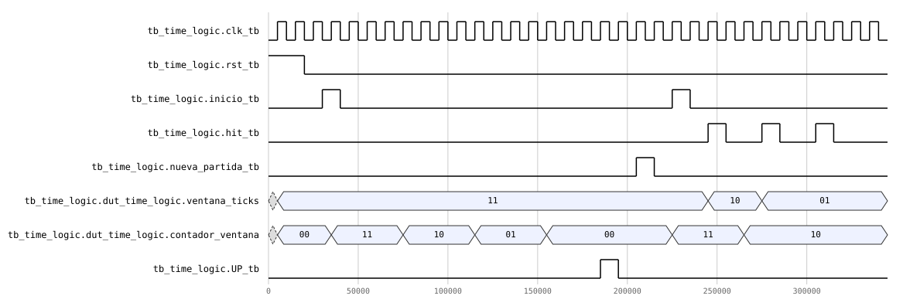

### 2.5 M5, contador de aciertos

Acarreo BCD en el décimo acierto, satura en 99, y si llega `nueva_partida` o `rst` justo con un
`hit` gana el reset.

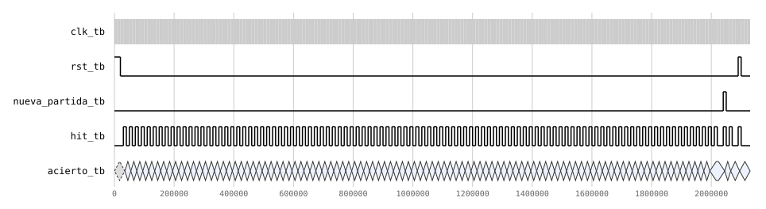

### 2.6 M6, contador de fallos

Misma idea que M5 pero con `miss`, más la racha de consecutivos y `fin_partida` al tercer fallo
seguido. Un `hit` en medio rompe la racha sin tocar el acumulado de `fallo`, y `nueva_partida`/`rst`
limpian todo, `fin_partida` incluido.

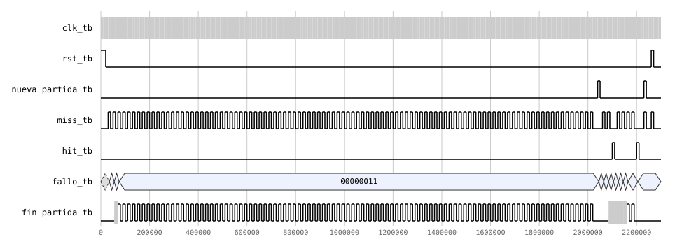

### 2.7 M7, estado de juego

Los cuatro estados de `f_state_play`/`f_state_gameover`, reposo, partida activa con el LED fijo, la
combinación inválida que apaga todo por seguridad, y fin de partida con parpadeo más `fin_espera` a
los 2s, acelerado con `N_PRESC=10` para simular. De 13 checks falla 1, el pulso de `fin_espera` sale
un tick tarde. Se explica en 3.4.

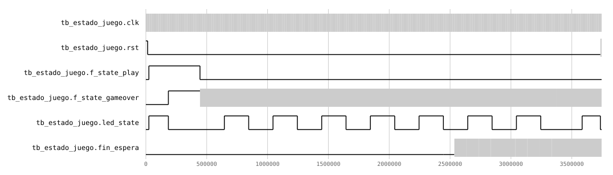

### 2.8 M8, la FSM

Recorre los siete estados. Camino feliz hasta un acierto, fallo por botón incorrecto, ventana que
expira, hit y miss al mismo tiempo con hit ganando la prioridad, la racha hasta GAME_OVER y la
vuelta a START, y el reset. 9 checks, todos pasan.

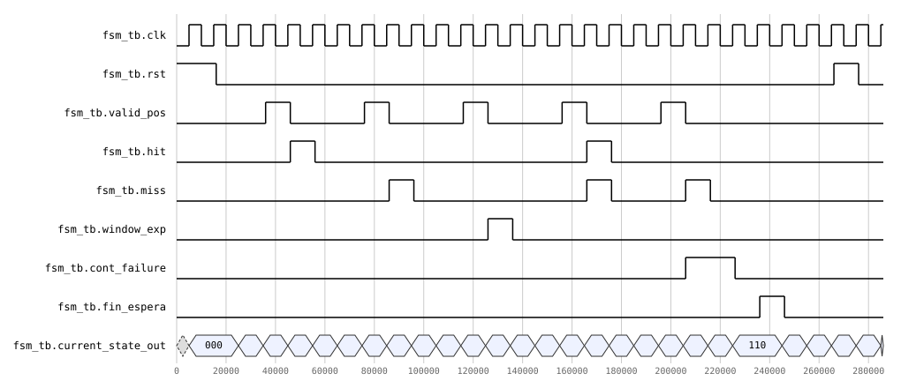

### 2.9 Integración completa

`tb_top.sv` junta todo, incluyendo `r_uart`/`t_uart` en loopback ya que el transmisor discreto no
sirve para esto. Corre acierto normal, fallo, tres fallos seguidos hasta GAME_OVER y el reinicio
automático, ventana que expira sin tocar nada, y el multiplexado de los 4 dígitos del marcador. Las
12 verificaciones pasan, después de arreglar el parámetro de `time_logic.sv` que se cuenta en 3.2.
Antes fallaban 3 de las 12, todas por lo mismo.

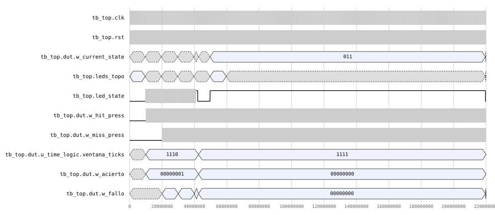

## 3. Análisis e interpretación de resultados

### 3.1 Testbenches que se habían quedado atrás

Para que `make test` compilara sin errores tocó arreglar varios testbenches. Probablemente porque
en algún punto se le ampliaron los puertos a `fsm.sv` y se separó el reset de `time_logic.sv` en
`rst_dificulty`/`rst_window`, y ese cambio no llegó a todos los testbenches que ya existían.

- `tb_show_mole.sv` instanciaba `m02_show_mole`, que no existe, el módulo se llama `show_mole`. No
  compilaba.
- `tb_state.sv` igual, instanciaba `estado_juego` en vez de `state`. Tampoco compilaba.
- `tb_time_logic.sv` le conectaba un puerto `rst` que ya no existe, ahora son `rst_dificulty` y
  `rst_window` por separado.
- `tb_fsm.sv` usaba conexión implícita, `fsm dut(.*)`, y ni siquiera declaraba `fin_espera`, la
  entrada nueva de la FSM.
- `press_btn_tb.sv` no seguía la convención `tb_*.sv`, así que el Makefile ni lo veía en
  `make list`.
- Ya arreglados esos, `press_btn_tb.sv` (ya renombrado `tb_press_btn.sv`) compilaba pero fallaba 2
  de 4 casos. El reset se pone en 1 para el pulso inicial y nunca se vuelve a bajar, queda pegado
  toda la simulación. De paso, `valid` ya es un pulso de un ciclo desde el fix de miss fantasma, y
  el testbench lo seguía leyendo como si fuera nivel, justo al final de la ventana de espera cuando
  el pulso ya había pasado.
- `tb_fsm.sv` también probaba el reset como si fuera asíncrono. `fsm.sv` lo tiene síncrono desde
  hace unos commits.
- `tb_r_uart.sv` y `tb_t_uart.sv` dumpeaban a `dump.vcd` en vez del nombre que espera `make dump`, y
  `tb_state.sv` a `estado_juego.vcd`.

Nada de esto tocó `src/design/`, son puros arreglos del lado del testbench.

### 3.2 VENTANA_INICIAL no daba los 1.5s del enunciado

Los tres fallos que tenía `tb_top.sv`, la dificultad que no bajaba tras un acierto, que no volvía a
su valor inicial en la partida nueva, y la ventana que no expiraba a tiempo, resultaron ser el mismo
bug. `VENTANA_INICIAL` en `time_logic.sv` estaba en 5000, no en 1500.

Con `TICK=100` eso da 50 ticks de ventana inicial en vez de los 15 que pide el enunciado. El
decremento en sí funcionaba bien, `ventana_ticks` sí bajaba de a 1 por acierto, solo el punto de
partida estaba mal. Y de ahí sale el tercer fallo también, con 50 ticks la ventana tardaba unos
50000 ciclos en expirar y el caso 4 de `tb_top.sv` solo esperaba 25000 antes de darse por vencido.

Se corrigió a `VENTANA_INICIAL = 1500`. Con ese cambio los tres casos pasan solos, porque el
testbench ya estaba escrito asumiendo el valor correcto.

### 3.3 El LED de fin de partida parpadeaba al doble

`state.sv` dice en su propio comentario que el parpadeo conmuta cada 2 ticks de 100ms, 2.5Hz, pero
el `always_ff` de `blink_toggle` lo hacía cada tick, 5Hz. `tb_state.sv` estaba escrito para el
comportamiento documentado y por eso sus primeros dos checks de parpadeo fallaban.

El enunciado no pide una frecuencia específica, solo que el LED de fin de partida se distinga del
LED fijo de partida activa, así que esto no incumple nada, era solo el módulo contradiciendo su
propio comentario. Se agregó `blink_div` para contar los ticks de a 2 y que quede como dice el
comentario original.

### 3.4 fin_espera llega un tick tarde

Con el punto anterior arreglado seguía fallando otro check, el pulso de `fin_espera` en el tick 20.
Instrumentando la simulación con `$display` se vio que el problema es otro. En el mismo ciclo en
que `wait_cnt` llega a `WAIT_COUNT`, el prescalador también se resetea a 0, porque ambos comparten
la misma condición de tick. Entonces `tick_100ms` ya cayó a 0 justo cuando `wait_done` se vuelve 1,
y `fin_espera = tick_100ms && wait_done` no puede darse en ese ciclo exacto.

El pulso sí llega, pero un tick completo después, cuando el prescalador vuelve a tocar su máximo y
`wait_done` ya se mantenía en 1. No rompe nada, `tb_top.sv` pasa completo con este comportamiento
porque la FSM solo necesita ver el pulso una vez. Tampoco incumple el enunciado, que pide mínimo 2s,
un tick de más sigue cumpliendo eso. Quedó documentado sin corregir porque no se pidió arreglarlo.
Si se quiere el pulso exacto en el tick 20, hay que registrar `fin_espera` usando `wait_cnt` antes
de que se actualice, en vez de comparar contra `wait_done` ya actualizado el mismo ciclo en que
`tick_100ms` cae.

## 4. Conclusiones y aprendizaje obtenido

_Pendiente._
